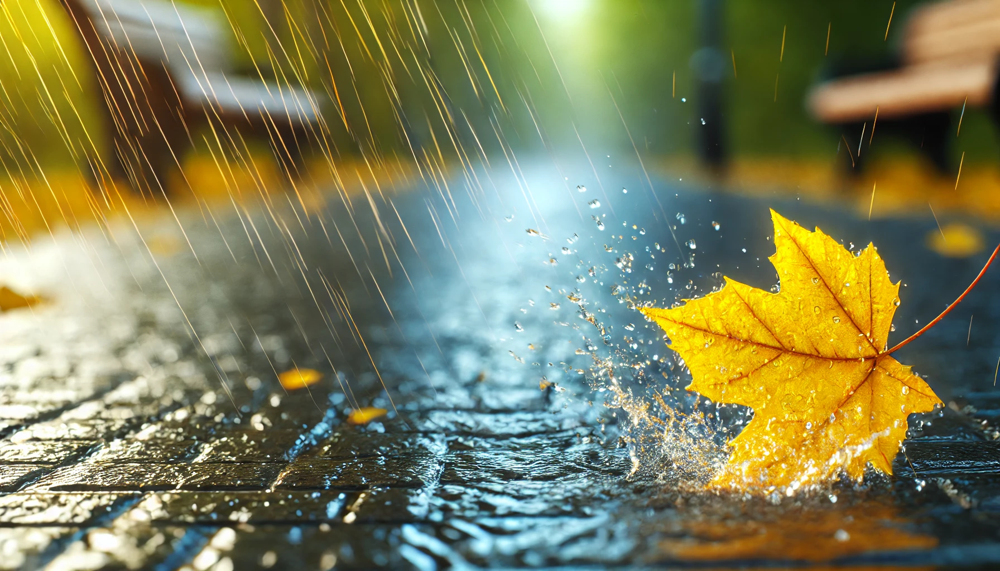

# 【随笔】秋风秋雨

如果是在武汉，早就该经历冷飕飕的深秋寒风了。记忆中总是在10.1假期左右，还能穿着衬衫在阳光下不留神就汗流浃背，然后转瞬一夜北风起，温度能骤降二十度上下。穿上厚外套与毛衣，都依然抵挡不住早晚寒冷的秋风冷雨。等到风过、雨停，温度却再也回不去了。

郁达夫说：

> 一层秋雨一层凉。

在江南，乃至长江沿岸都是如此。可是，在这岭南之南，等到11月都快过完了，这场风雨才显露出那么一点秋风秋雨的意思。满地落叶是不可能的，偶尔几篇黄叶被风吹下，来不及被清洁工打扫。就那么倔强地躺在人行道上，被学生们踩着自行车风驰电掣地一次又一次碾过，渐渐碎得不成样子，默默昭告着秋天的到来。

大部分人都还穿着T-恤，但天确确实实地凉下来了，路上偶尔也会遇到几个穿着夹克的行人。下了好几天的雨，今天终于停了下来，虽然天依旧阴沉沉的，空气中弥漫着秋天清冷的感觉，但附近的几所学校都忙不迭地重启了之前被大雨中断了的运动会。高音喇叭里的进行曲、口令、鼓声、号角声换着花样地不绝于耳，但都压不住背景里年轻学子们鼎沸的喧闹与呼喊。

毕竟还是这青春的热血，在任何时候都滋滋地热气腾腾，无论秋冬。

于是乎，想起了一些悲秋的诗词歌赋，又想起自己曾经过的那些挥洒过自己青春热血的校园运动会，接着，不禁起了毛泽东那些无论秋冬，豪迈依旧的诗词：

> 人生易老天难老，岁岁重阳。今又重阳，战地黄花分外香。
>
> 一年一度秋风劲，不似春光。胜似春光，寥廓江天万里霜。
>
> ——《采桑子·重阳》

> 天高云淡，望断南飞雁。
>
> **不到长城非好汉，屈指行程二万。**
>
> 六盘山上高峰，红旗漫卷西风。
>
> 今日长缨在手，何时缚住苍龙？
>
> ——《清平乐•六盘山》

> 独立寒秋，湘江北去，
>
> 橘子洲头。
>
> 看万山红遍，层林尽染；
>
> 漫江碧透，百舸争流。
>
> 鹰击长空，鱼翔浅底，
>
> 万类霜天竞自由。
>
> 怅寥廓，问苍茫大地，
>
> 谁主沉浮？
>
> 携来百侣曾游，
>
> 忆往昔峥嵘岁月稠。
>
> 恰同学少年，风华正茂；
>
> 书生意气，挥斥方遒。
>
> 指点江山，激扬文字，
>
> 粪土当年万户侯。曾记否，
>
> 到中流击水，浪遏飞舟？
>
> ——《沁园春·长沙》

还是那秋风秋雨，却未必总能愁煞人啊！

