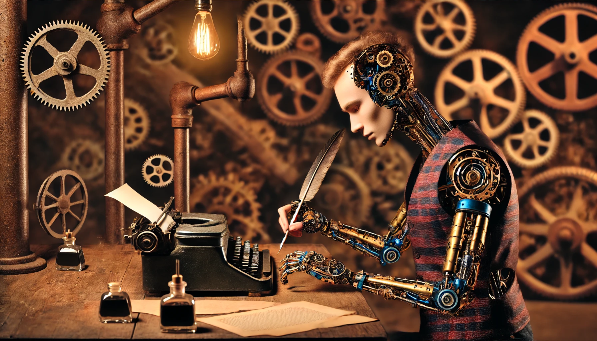

# 【生命⋅修行】写作水平的退化

[Paul Graham](https://paulgraham.com/)在[10月时写过一篇短文，提到说由于AI的出现，人类的写作能力会严重地两极分化](https://paulgraham.com/writes.html)。和菜头还为此也写过[一篇文章应和与批评](https://mp.weixin.qq.com/s/Zx0ntJdoosp6xBRNYrmjmQ)。

说到和菜头，真的很佩服。博客时代就耳闻过他的鼎鼎大名。然后，至今还在那里吭哧吭哧地写啊，写啊！然后我也跟着看啊，看啊。看着看着，自己也开始写了起来。虽然自己所写的东西，大部分有点像[娜塔莉·戈德堡](https://zh.wikipedia.org/wiki/%E5%A8%9C%E5%A6%B2%E8%8E%89%C2%B7%E9%AB%98%E6%9F%8F)在[《写出我心》](https://m.douban.com/book/subject/26822680/)说过的那种「堆肥」。但是，有和菜头先生在你面前持续地写啊写啊，不由得会有一种幻觉——或许，我也能这么写啊，写啊，一直写很多年呢？

虽然我知道这只是幻觉，但和菜头先生确确实实成为了我这段时间里，身边的一个榜样。尽管内心时常会升起类似这样的怀疑：

> 这样写下去有什么用呢？

虽然无法回答，但还是继续写到了现在……

然而，即便我如此这般地在坚持写啊写，但Pual Graham所说的写作能力下降，却依然肉眼可见地在我身上发生了。主要发生在与工作相关的写作上，尤其是电子邮件。因为必须要用英语，而GPT的英语明显比我当下的水平更好，于是在工作中，我几乎完全依赖于GPT为我起草、撰写各种需要的正式、非正式沟通文字。

郁闷的是，截至目前为止，越来越不需要我动手修改调整GPT写的文稿。更多的情况是，他理解错了我的意思，而我重新下达指令即可。

英文写作水平似乎没有因此提高，但中文输出水平却显著地被负面影响了！

原因很神奇，GPT的文字理解能力实在远远超过了大部分普通人。我不再需要字斟句酌地把脑子里的想法翻译成清晰、条理通顺的话语。只需要用意识流一样的文法，把所有信息堆给GPT，它就能把我的意思理解得大差不差。甚至会更有条理和逻辑。

这个习惯一旦养成，我发现在写中文邮件和材料时，自己也很难如往常一般字斟句酌把文字提炼再提炼了。或许自己本来就偏啰嗦，一股脑把自己思考的过程意识流扔个GPT，反而效率更高。此消彼长，中文写作能力——尤其是工作中常用的写作能力出现了显著的下降！

那么，思维能力也因此下降了吗？还真有可能！

但是，该如何阻止？或者说，有没有必要阻止呢？

又或者，在这个过程中是否存在有进化｜退化两条不一样的路径呢？

比如好像当年惯用搜索引擎之后，发现自己直接寻找答案的能力大幅下降。然而，基础的思维框架，却是可以超越各种工具加以训练的底层能力。

真是一个值得思考的问题。不管怎么说，每天花30多分钟到一个小时，坚持手写这500多字1000字，应该会有点用吧。多少为这件「无用」之事，增加了一点「有用」之资。

以下是Paul 的原文和GPT的翻译，供大家参考。

----

I'm usually reluctant to make predictions about technology, but I feel fairly confident about this one: in a couple decades there won't be many people who can write.

我通常不太愿意对科技发展作出预测，但这次我有点信心：再过几十年，能够写作的人会变得很少。

One of the strangest things you learn if you're a writer is how many people have trouble writing. Doctors know how many people have a mole they're worried about; people who are good at setting up computers know how many people aren't; writers know how many people need help writing.

如果你是个写作者，迟早会发现一件很奇怪的事情：有那么多人写作有困难。医生知道有多少人担心身上的痣；擅长设置电脑的人知道有多少人搞不定电脑；而写作者知道有多少人需要写作上的帮助。

The reason so many people have trouble writing is that it's fundamentally difficult. To write well you have to think clearly, and thinking clearly is hard.

写作难的根本原因在于它本质上就是一件难事。要写得好，你必须思考清晰，而清晰地思考并不容易。

And yet writing pervades many jobs, and the more prestigious the job, the more writing it tends to require.

然而，写作却无处不在，很多工作都离不开它。工作越体面、职位越高，往往对写作的要求就越多。

These two powerful opposing forces, the pervasive expectation of writing and the irreducible difficulty of doing it, create enormous pressure. This is why eminent professors often turn out to have resorted to plagiarism. The most striking thing to me about these cases is the pettiness of the thefts. The stuff they steal is usually the most mundane boilerplate — the sort of thing that anyone who was even halfway decent at writing could turn out with no effort at all. Which means they're not even halfway decent at writing.

这两股强大的对立力量——写作的普遍需求和写作本身的固有难度——创造了巨大的压力。这就是为什么我们常常会发现一些声名显赫的教授竟然剽窃了别人的作品。而最让我惊讶的是，这些剽窃的内容往往极其琐碎，甚至毫无价值——完全是那种一个写作能力还算过得去的人都能轻松写出来的东西。这意味着，这些教授连“还算过得去”都达不到。

Till recently there was no convenient escape valve for the pressure created by these opposing forces. You could pay someone to write for you, like JFK, or plagiarize, like MLK, but if you couldn't buy or steal words, you had to write them yourself. And as a result nearly everyone who was expected to write had to learn how.

直到最近，这种对立压力还没有方便的出口。你可以像肯尼迪那样雇人替你写，或者像马丁·路德·金那样剽窃，但如果你既买不到也偷不到文字，那你只能自己动手写。因此，过去几乎所有被要求写作的人都不得不学会写作。

Not anymore. AI has blown this world open. Almost all pressure to write has dissipated. You can have AI do it for you, both in school and at work.

但现在不一样了。AI打破了这个世界的规则。写作的压力几乎彻底消失了。不论是在学校还是在工作中，你都可以让AI代劳。

The result will be a world divided into writes and write-nots. There will still be some people who can write. Some of us like it. But the middle ground between those who are good at writing and those who can't write at all will disappear. Instead of good writers, ok writers, and people who can't write, there will just be good writers and people who can't write.

结果将是一个“能写”和“不能写”两极分化的世界。仍然会有一些人会写作，因为有些人就是喜欢写。但原本介于“写得好的人”和“完全不会写的人”之间的“写得还行的人”将消失。不再是“好写手、普通写手和不会写的人”共存，而是只有“好写手”和“不会写的人”。

Is that so bad? Isn't it common for skills to disappear when technology makes them obsolete? There aren't many blacksmiths left, and it doesn't seem to be a problem.

这真的有那么糟吗？当技术让某些技能变得过时，它们消失不是很正常吗？如今铁匠已经不多了，但似乎并没有什么问题。

Yes, it's bad. The reason is something I mentioned earlier: writing is thinking. In fact there's a kind of thinking that can only be done by writing. You can't make this point better than Leslie Lamport did:

不，这很糟糕。原因就在于我之前提到的：**写作即思考**。实际上，有一种思考只能通过写作完成。莱斯利·兰波特对此的表述堪称经典：

If you're thinking without writing, you only think you're thinking.

**如果你没有通过写作思考，那你只是以为自己在思考。**

So a world divided into writes and write-nots is more dangerous than it sounds. It will be a world of thinks and think-nots. I know which half I want to be in, and I bet you do too.

因此，一个“能写的人”和“不会写的人”两极分化的世界，实质上是一个“能思考的人”和“不会思考的人”分裂的世界。而这远比听起来更危险。我知道自己想要成为哪一半的人，我相信你也知道。

This situation is not unprecedented. In preindustrial times most people's jobs made them strong. Now if you want to be strong, you work out. So there are still strong people, but only those who choose to be.

这样的情景并非前所未有。在工业化之前，大多数人的工作都会让他们的身体变得强壮。如今如果你想强壮，就得去健身房。因此，依然有强壮的人，但只有那些选择变强壮的人。

It will be the same with writing. There will still be smart people, but only those who choose to be.

写作的未来也将如此。依然会有聪明的人，但只有那些选择聪明的人。

