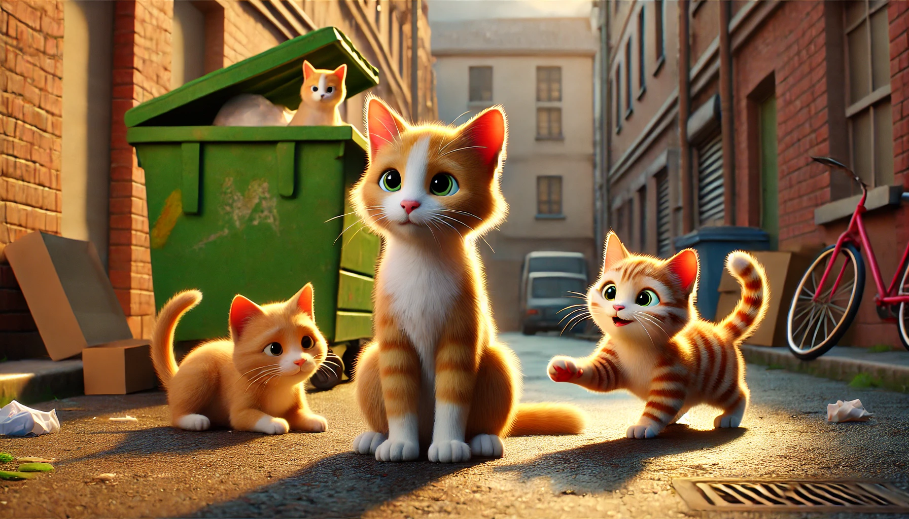

# 【随笔】三只小野猫

前天去扔垃圾时，看见垃圾桶旁边有两只小奶猫围着一个小盆子吃东西。后来和家里人说起来，阿宝和大鱼强烈地要求去看看。大宝听说其中一只是小橘猫，也念叨着想要去抓回来养。

我并不想再带一只小猫回家，养一只猫，那很可能是需要操心十多年的事情，而我们家已经有一只笨Cup需要我们操心了。

可是，今天晚上扔垃圾，阿宝却心心念念地一定要去看一看。

很遗憾，猫咪不在，在周围找了一圈也没有看到。帮忙收拾垃圾的大叔听说两个小朋友来猫咪，特地安慰说，如果看到就帮我们抓住装到泡沫箱里。

在附近转了一圈，我们又回到小区垃圾桶旁边。这时，我见另外两个收拾垃圾的阿姨拿出猫条来，知道他们一直在喂猫的，便搭话问她们猫咪的情况。原来，一共有三只小野猫。原来是一直是猫妈妈带着，就住在在垃圾桶附近，那个阿姨也常常喂它们。

可是，前几天猫妈妈在另外一栋楼下被发现已经中毒身亡了。

饿了几天的小猫咪便跑出来找吃的，她们就一直定期地来这里给投喂。最小那只身体很弱，昨天晚上有一个邻居带着它去了宠物医院，可能已经收留在家了。还有两只在这里，估计一个月左右大小，应该很快就能吃幼猫粮了。其中一个人说，这次过了，打算把猫咪带到她那边附近的院子里养起来呢。

听说猫妈妈不在了，我瞬间心软，决定答应阿宝收养小猫的请求。

我告诉她，我们家阿宝也想收养它们，便给小区的清洁工阿姨留下了微信，请她看到猫咪后告诉我们一声。

……

上楼没多久，她就给我们发来微信，说猫咪出来了。

我们带着一个纸箱子到了楼下，发现一只小猫已经长得有些大了，是一只黄白相间的花猫，活泼而警惕地在那里吃猫条。另一只小橘比花猫小一圈，蹲在黑暗里，显得要安静许多，也瘦弱许多。

可是，两只小猫都很警惕，不等我们靠近，就躲到垃圾箱背后的院墙缝隙里去了。

……

我和阿宝说，可能我们需要买一个抓猫笼。

不过，大宝说，明天白天她可以去试试。她说，抓住其中一只应该没问题的。

……

不知道明天会怎样。

