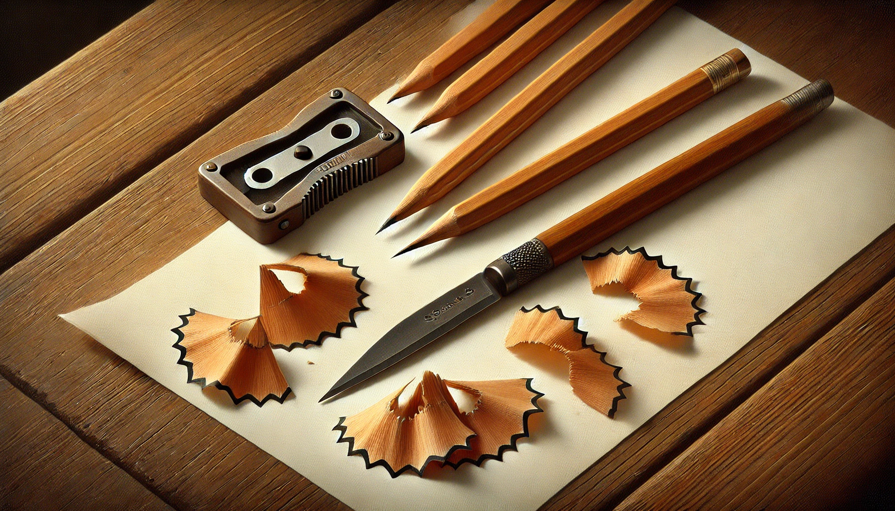

# 【生命•故事】（124）削铅笔

阿宝做完了作业，问我能不能帮她削铅笔。我点了点头，她把笔盒拿了出来，同时拿过来的，还有那个蓝色奶酪方块一般的削笔刀。

这种削笔刀简直太好用了，一段有一个孔，把铅笔塞进去；另一段有一个摇柄，只轻松一摇，从哗啦啦地响，到感觉开始空转，铅笔就削好了；铅笔屑装在铅笔刀下方的抽屉里，是透明的有机玻璃，可以看到装满了没有，装满后可以直接打开抽屉，把铅笔屑倒进垃圾桶里。又快又省力又干净。

我一口气把阿宝笔盒里的四支铅笔全都削好，意犹未尽。她一面收拾书包，我又把她桌上备用的铅笔一一削尖，竟然还有10多支，长短不一，排在桌面蔚为壮观。

想起在我们小时候，用的是一种铁皮的折叠铅笔刀，现在早已从小学生的文具序列里消失了；另外也有现在依然能见到那种塑料卷笔刀，比小刀简单，但不留神就会削断铅笔尖。

有一阵子，我很喜欢用折刀削铅笔。通常，我会拿一张废旧的草稿纸垫在课桌上，左手拿着铅笔，右手拿着小折刀，先从靠近油漆的部分，轻轻地一刀、一刀转着圈削，把油漆削落，露出里面白色的软木。等到白色软木的长度合适了，再开始继续转着圈，一刀一刀把它修成匀称的长圆锥型，同时把最前面的石墨笔芯露出来3、4毫米长。最后，把铅笔尖靠在纸上，用小刀把笔芯修得尖尖的。

所有的铅笔屑都在草稿纸上，可以直接倒进字纸篓里，不至于把教室或家里弄得一塌糊涂。但有时，我也会把石墨粉留下来专门装在某个地方另派用场——典型的正面用途，就是润滑锈住的钥匙孔。当然，还有些捣蛋的用途，具体干啥已经想不起来了，只记得那满手乌黑的感觉，怪别扭难受的。

我喜欢自己用折刀削好的铅笔那修长漂亮，每一支还各不相同的样子。不像用塑料卷笔刀削过后，那种清一色蠢蠢的短圆锥脑袋。

不过后来我发现，坐在自己附近的女孩Z也喜欢削铅笔。她总是得意地炫耀自己削好的铅笔多么漂亮，于是乎很长一段时间，我的铅笔就全都交给她来削了，自己乐得轻松——记得这是初中时候的事情。

等到读高中，就更少用铅笔了，用小刀削铅笔终于慢慢尘封，成为记忆。

