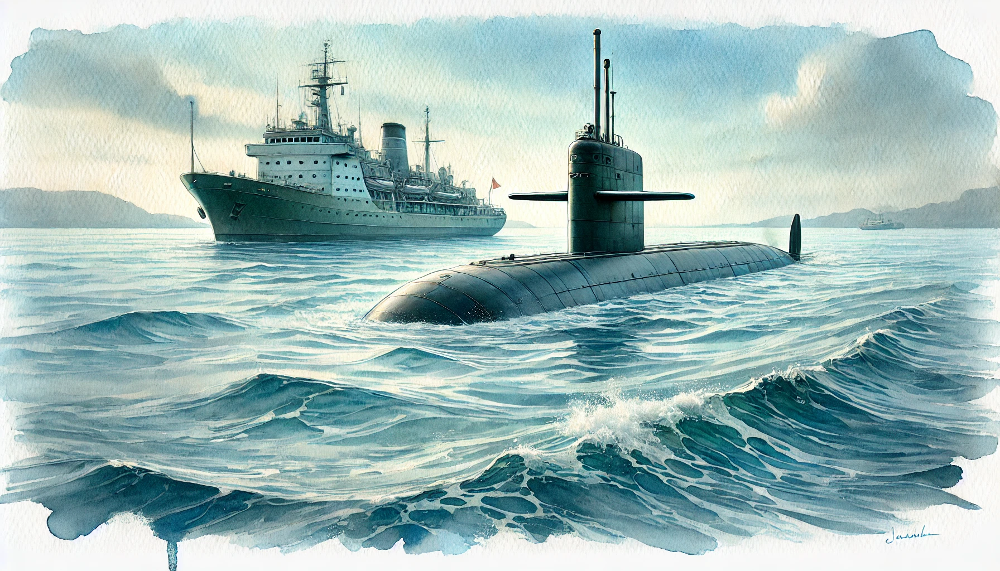

# 【生命⋅修行】有意无意

最近无意地中断了两件一直坚持的事情，一个「多邻国」的完美连胜，另一个是「公众号」的每日发文。

其实，多邻国中断的那天晚上曾经有过一闪念：

> 是不是今天没学「多邻国」？

但随即又想，不管怎样，睡觉更重要，便没有起身去查看。第二天，发现果然完美连胜被终结了，在前一天的日期上有一个大大的冰冻标志。我很有些生气、遗憾、甚至难过，就好像摔碎了什么心爱的瓷器一样。直到几天之后，我才仔细看了看，这一次的完美连胜，持续了8个月，之前还有两次连续5个月的记录。

写到这里，我甚至想起，有一次因为跨越时区，为了保持连胜记录，我专门又把手机的时区修改回去的经历。

而且前几个月，我曾经有一阵子一直小心翼翼地企图保持自己在「钻石排行榜」的位置，每天会花至少半小时学「多邻国」，直到订阅过期，没有足够多的「红心」可用……

无意之间，就打破了这么一个执念，那隐藏在「学习」后面的一些无谓的「虚荣」。

写作也是一样，本来是攒了个一天的提前量。每天写完，第二天早上5点左右定时发送。于是乎，有时周末或特别的原因耽搁了，就可以在之后一天当天写，当天发，然后再多写一篇定时第二天发送。

但这一次，耽搁一次之后，连续很多天都没能多写出一篇来。于是乎变成了当天写，当天发，直到昨晚，紧赶慢赶写完发出之后发现，发表时间已经是0:00，也就是说，这天断了——真正发出来已经是第二天！

可是，我为什么要每日发文呢？曾经很在意每天「日更」写作，但现在已经不再需要刻意「坚持」这件事情，但为什么自己又变成了想要「坚持」每天在公众号发表文章呢？

本质是写作，但渐渐的，注意力却放到每日的「发表」上去了呢。什么是本，什么是末。这一次的无意中断，让我窥破自己不知不觉的又一次错位。

……

