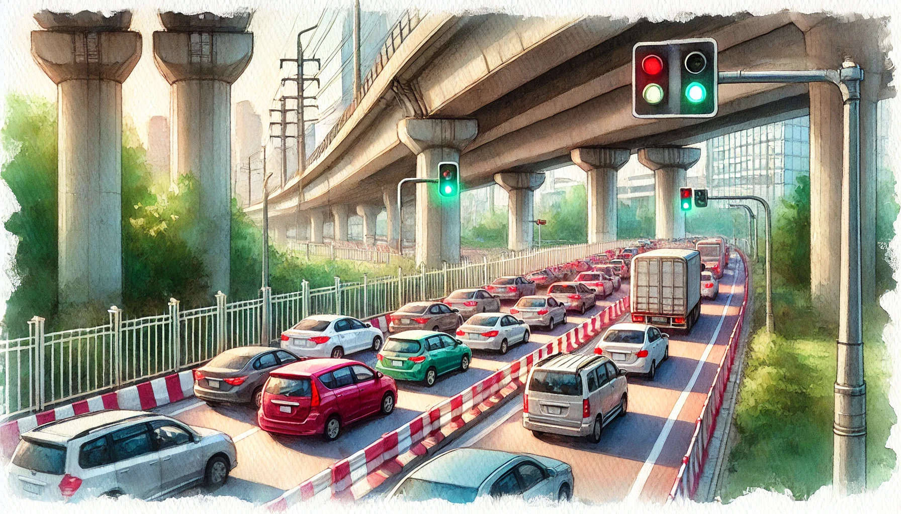

# 【生命⋅修行】行动

在《[纳瓦尔宝典](https://m.douban.com/book/subject/35876121/)》里，纳瓦尔提到[克里希那穆提](https://weread.qq.com/web/search/books?author=%E5%85%8B%E9%87%8C%E5%B8%8C%E9%82%A3%E7%A9%86%E6%8F%90&ii=83a32650715aa39283aa12a)的一个观点：

> 一切存在时刻处于一种内部变革的状态。人应当时刻准备好迎接彻底的改变。每当说「我打算尝试一个新东西」或者「我打算养成一个新习惯」时，我们其实都在畏缩。我们实际上是在说：「我要为自己争取更多的时间。」但我们应该做的是追随内心的渴望。如果你想认识一个漂亮姑娘，那就去认识她；如果你想喝饮料，那就去喝一杯；如果你真的想做一件事，那就去做好了。迅速采取行动，并对结果保持耐心。

「迅速行动」并「对结果耐心」，有点「但行好事，莫问前程」的意思。

那天晚上看到和菜头的[一篇文章](https://mp.weixin.qq.com/s/li4l0oo7nW03XZXpboZJYg)，刚看了开头，看他说：

> 从初中二年级开始，我的作文就经常是语文课上的范文。大学军训时，我的作文就顺利刊载在校报上。工作之后，我一个人承包了整个部门的所有文书工作，从一纸通知到年度总结报告。1999 年年底，我开始在 BBS 上发布文章，三年之后被媒体注意到，最多的时候一天需要满足三家报社或者杂志社的稿约，此外还成为一名 52 周每周更新的专栏作家。

我就忍不住了，唏嘘地和正在厨房忙活的大宝说：

> 完了，我是没希望了。和菜头初中时崭露头角，然后还刻苦写作了四十年。
>
> 我快五十岁了才开始，就算再写四十年也没用啊……

大宝说：

> 怎么？你想要放弃了吗？
>
> 就算到九十岁，达到和菜头现在的水平也不错啊？
>
> 关键是，只要你真的喜欢，就尽管一直做下去呗，至于在别人眼里达到什么水平，那是完全没有关系的事情。

她想了想，又说：

> 比如，我现在练太极拳，不管怎么练，现在也不可能再练成绝顶高手了。
>
> 但是，不妨碍我享受练拳过程中那点滴进步的乐趣啊！

我觉得她说得有道理，转头把菜头的那篇《[为什么才华不是依仗](https://mp.weixin.qq.com/s/li4l0oo7nW03XZXpboZJYg)》看完，原来他说的是，他有才华，但才华不重要，靠谱才重要。

然而，我没有才华，也不太靠谱。好在对我而言，这些都不太重要。

想要做什么，立即行动，行动就好！

