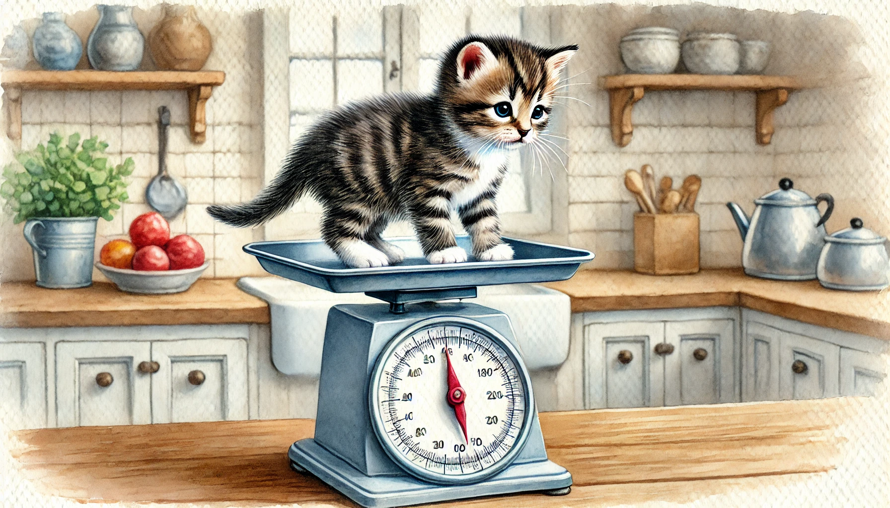

# 【随笔】时光飞逝

一周前的今天，在地铁口遇到小玉接它回家。

它已经算是被猫妈妈带得不错了，一身的小细毛被打理得油光水亮，既不瘦，看上去也没什么病。但那天，它依旧是满身的跳蚤，称一称体重，只有390克不到。可以轻松的一个巴掌把它整个托起。一对儿眼睛灰蒙蒙的，还没光彩，似乎还不太懂聚焦。不会跑不会跳，只能缓慢地跟着人，喵喵叫着爬来爬去，或者执着地找一个爬不动的小角落，待着不动。

放在纸盒子里呼呼大睡了一个白天，到晚上它竟然就懂得往纸盒子外蹦了。

眼见着它每天除了变着法的喵喵叫着求吃求喝，冲好的奶粉、泡软的猫奶糕、还有猫条它喜欢轮流来，除了浓汤猫罐头例外；喵喵叫着让人把它扔进猫砂盆拉屎拉尿；剩下的时间就是蜷缩在大宝为它精心制作的温暖小窝里呼呼大睡。

到前两天，我们忽然发现。小家伙除了吃喝拉撒和睡觉，清醒的时间肉眼看见的拉长了。它喜欢挥舞着小爪子，和Cup大战一场，弄得Cup只得无奈地一面后退，一面给它舔毛。实在不行，Cup也会轻轻用前爪和小玉来上个一下两下，意思意思。但小玉常常不肯善罢甘休，使劲跳起来试图击打Cup的脸，然后被Cup只轻轻一按，就整个翻倒在地上。

有时Cup在睡觉，它就一蹦一跳地追击我们的脚，小牙齿和爪子也开始具备点伤害力了。不时会隔着袜子和裤子把我弄疼。有时候抱着拖鞋啃得不亦乐乎。啃拖鞋——这是不是「中华田园猫」刻在基因里的技能呢？

我这才发现，几天功夫，小玉比之前整个大了一圈，眼睛也变得有神了。抓到秤上一称，已经460克咯，估计很快就能突破500克大关了。

……

时间过得真快，再看阿宝和大鱼，也同样每天每天都变化着。

阿宝开始越来越会控制自己的情绪，内心温柔的一面越来越多地展现出来。

而大鱼，自从上了幼儿园，总能带回来许多新学会的花样。此时的可爱，与之前大不一样，但依旧可爱得不行。

……

