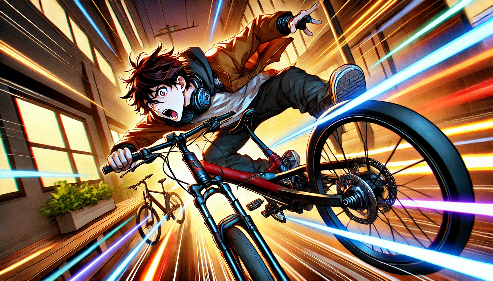

# 【随笔】摔跤

上午和伙伴约在他们公司见面，查了一下地址与导航，发现骑车只不过20多分钟路程。于是，我就骑上电动车出发了。

天气相当不错，甚至都有点晒。我自己穿了件薄羽绒，还把连帽衫的帽子戴在头盔外面挡风，却见有些快递小哥穿着T恤就从我身边疾驰而过。看着他们像一道道黄、绿色的闪电风驰电掣，我不由自主地得拧紧了右手的油（电）门。

小电动自行车呜呜地越开越开，但没过几秒钟，只感觉「咯噔」一下，车子猛地就停止了加速，开始匀速前进起来。我忽然想起，国标的电动自行车是有限速的。不过，感觉起来这速度绝对没有25公里 / 小时，估计时速15公里就顶天了。

于是乎，我就这么安心地开着。阳光正好，风也正好。

已经很久没有穿行在这个片区了。自从10多年前换到坂田去上班，就没太多体会过科技园这段路程的麻烦与困扰。然而，现在科技园到处都在修路，不一会儿就得在各种挡板之间钻来钻去，寻找自行车可以通行的道路，不时还得大着胆子占用一会儿机动车道。忽然，某一次刹车的时候，我感觉后轮横着漂移了一段，心中不禁一凛。

> 怎么会一刹车就失控呢？

我这才什么速度啊？我有些不太理解，稍微放慢了些速度。然而，不久之后，连续一段宽敞的路面，我又忍不住放松了警惕。忽然之间，没有任何先兆，车身失去了平衡，直接向右倾倒。

「扑通」一声，我被摔倒在地。

我颇为纳闷地爬起来，感觉自己右手腕、右手肘和右膝盖都有点被擦碰的疼痛感，但并不严重。我扶起车，关了电，回头看了一眼刚刚经过的路面，那里一个不起眼非常小的凹坑。

> 就这？
>
> 也能摔倒？

我猛然想起之前若干次，看到别人骑车摔倒时，自己也有同样的困惑和「鄙视」。没想到，今天轮到了我自己。

我推着车走了两步，又停下来检查了一下自行车，确实没啥毛病便又骑着上了路。

终于，不到6公里到路程，硬是花了我40多分钟才到。

或许，下次我还是应该坐地铁、骑「人力自行车」才是。

