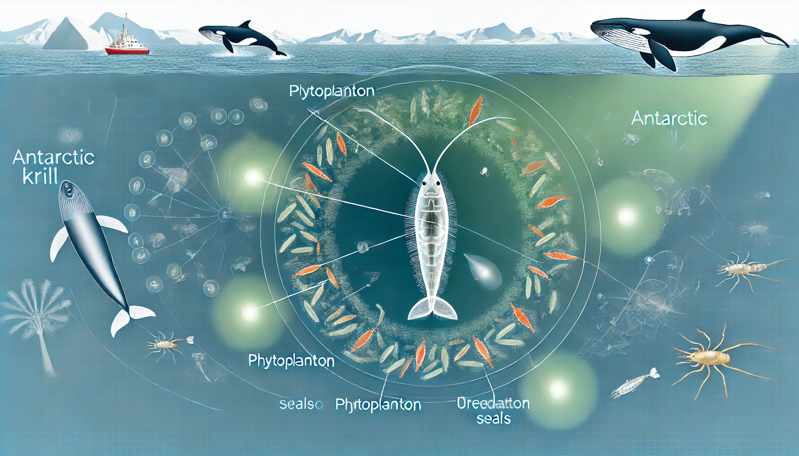

# 【随笔】好为人师

天气说阴就阴了，想起前几天阳光明媚、天气晴朗的时候，总有许多阿姨带着小BB在我练习金刚功的河边晒太阳。

有时候，呼呼啦啦会聚集好多人。我虽然闭着眼睛，心神却忍不住被她们的交谈牵动。有些阿姨明显更外向，其他阿姨和小孩还没出现时，她就不停地和孩子说着话，唱着歌。然后，远远地有其他来晒太阳的小孩出现，就开始和其他小朋友打招呼，显然，她知道每一个小孩子的名字，谁是哥哥，谁是弟弟，谁是姐姐，谁是妹妹一清二楚。

可能和我一样，因为喜欢这个角落的太阳，她们通常会在离我不到两米远的地方停下来，坐在椅子上一边逗小孩，一边聊天。就好像热闹的集市中，嘈杂的人声里总有某个人的声音能够盖过全场。我也几乎总是听见那位热情的阿姨在教导其他人：

> 今天有风，所以我只让孩子晒晒肩膀。不然容易生病。
>
> 你们家小孩穿太多了，这个天气穿两件就可以了。
>
> XX在学走路，不要穿鞋子。穿个袜子就可以了，有那种防滑袜。他现在脚部需要多接受刺激，我们这个孩子，每天会让他踩踩黄豆。

我只听见她全程都在输出，我也不知道其他人究竟是爱听还是不爱听。

虽然，我觉得自己也常常犯「好为人师」的毛病。也常常看年轻人不停抱怨，自己身边那些爱下指导棋，口口声声「为了你好」的长辈是如何如何的烦人。

然而，在这种群体带娃的场景下，不管她们互相之间是有意还是无意，客观上却起到了一种「外溢」性质的知识传播作用。人类社会，就是靠着这些我们所「不自觉」的机制，运转着呢。

身在其中的个体，比如我、比如那位热情的阿姨，或者觉得烦扰、或者觉得自嗨，其实只是整个系统中，被某种运作机制驱使着的一个小小节点而已。

就好像南极磷虾，它们在南极附近聚集、繁殖，每一只小虾都忙活着自己的生计，追寻着自己的快乐。但它们并不能意识到，自己只是整个地球生命体太阳能吸收转化机制中，重要一环的小小参与者而已。

天地苍茫，生命生生不息。我们这些个体在其中，焦虑也好，快乐也好，其实何其渺小啊！