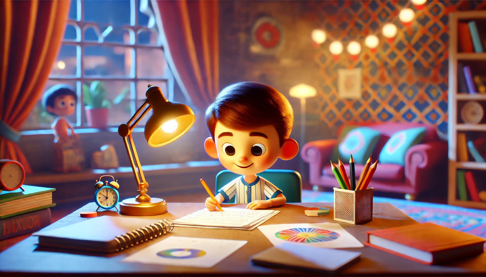

# 【随笔】为什么要写作业

随着阿宝读二年级，她越来越为作业所烦恼。有一天，在晚餐的桌边，她问我：

> 爸爸，我有两个问题：
>
> > 为什么我们要写作业？
> >
> > 为什么我们要上学？

我愣了一下，发现自己完全无法在几句话内给出一个清晰、明确的答案，只能告诉她，这一两句话有点说不清楚。之后，大宝私下里把我拉到一边，对我说：

> 我觉得，我们要重视阿宝提出的问题。

我说：

> 对，可我，真的不知道要怎样回答这个问题呢……

我虽然知道传说中，家庭作业这个东西的的来历，但真不知应该怎么样告诉阿宝。最重要的，我认为这个故事并不是问题答案的全部。然而，那天阿宝读初一的表哥和我们视频通话，我问他，阿宝这个问题我们应该怎么回答。他竟然侃侃而谈，讲出了这个传说中发明「家庭作业」的故事：

> 这位「伟大的发明家」是一位名叫Roberto Nevilis（中文名：罗伯特·纳维利斯）的意大利教师，在100多年前的1905年，这位慈祥、心软的老师，发现自己拿那些无法无天、淘气的孩子完全没有办法，自己又不忍心体罚他们。于是乎，开始给那些捣乱的孩子布置家庭作业。
>
> 谁曾想，做家庭作业的孩子们不仅仅不那么淘气了，连学习成绩也提高了。于是乎，「布置家庭作业」就开始在欧洲流行开来。
>
> 近代中国开始学习西方的现代教育制度，当时负责教育的长官（或许是某一任教育部长）便把这项「这么好」的方法，也一并学来，并推广到了所有的现代学校，一直流传至今。

简单来说，就是现在负责教育的官员、老师和大部份家长一致认为：

1. 做家庭作业有利于管教孩子；
2. 做家庭作业有利于提高孩子们的学习成绩。

于是，几乎所有上学的孩子，都要写家庭作业了。

那么，问题到此结束了吗？可我并不希望，阿宝和他表哥一样，只是记住了这个来自别处的答案。

所以，我想要这么回答阿宝：

## 第一、你问出了两个非常好的问题

学会问问题，是非常非常重要的事情。古希腊哲学家[亚里士多德](https://zh.wikipedia.org/zh-hans/%E4%BA%9A%E9%87%8C%E5%A3%AB%E5%A4%9A%E5%BE%B7)曾经说过：

> 提出一个好的问题，就意味着成功了一半。

为什么说你提出的这两个问题是好问题呢？有三个原因：

1. 这是你自己遇到的问题。和你自己密切相关。
2. 这是真实的问题。是你在生活中真的感到困惑的地方，而你没有忽视和放过它们。
3. 这些问题非常重要并且非常有价值。它们都和你将来一生中特别特别重要的一件事相关——学习与成长。越早弄明白它们，对你好处越大。

所以，仅凭这一点，你就应该好好奖励一下自己！

用来鼓励自己有一个非常好的开始，并且走在了正确的方向上。

## 第二、你走对了非常重要的前两步

在我印象中，你不是第一次问这个问题了。

说明：

1. 你反复思考过这个问题。
2. 在自己得不到答案的情况下，开始想办法从别处寻找答案。比如问爸爸妈妈……

这是非常重要的寻找问题答案的前两步，说明你正在前进中。

## 第三、来自爸爸的参考答案

其实，爸爸想过这个问题，觉得问题很重要，因此也没想好怎么回答。

所以，我先咨询了你的表哥，然后又自己上网查询了一下，并且还问了一下ChatGPT。我觉得，你首先可以听听表哥说过的那个故事——「作业是怎么被发明出来的？」

这个故事告诉你：

1. 做作业能帮助老师管教学生
2. 做作业能帮助提高学生的成绩

而且，GPT是这么说的：

> 宝贝，你知道吗，做作业就像给大脑做运动。平时上课时，老师会教我们一些知识，可是如果学了不去用，很快就会忘掉。就像你学会了一首新歌，如果一直不唱，就会渐渐记不清歌词。作业可以帮助我们巩固学到的东西，让我们的大脑记得更牢，变得更灵活。这样以后遇到问题，我们就会更容易想出答案，更好地理解生活中的很多事情。当你认真完成作业，慢慢地，你会发现自己的思考力越来越棒，这就是作业的用处呀！

了解了这些之后，你或许就已经有了自己的答案了。但是，爸爸鼓励你再继续向前一步，其实，就是回到第一步。

有没有比：「为什么我们要写作业」更好的问题？

比如：「为什么我要写作业？」——注意，这只是爸爸的例子，「我」和「我们」有什么区别呢？

然后，你一定可以思考出自己的答案。

爸爸忍不住啰嗦了，因为这个问题很重要，而回答这个问题也很重要。简单总结一下，如果你已经犯困了，记住这几句：

1. 你问了一个好问题。这很棒！
2. 你思考过了，并且问了人，这同样非常棒！
3. 爸爸的答案供你参考。
4. 鼓励你继续思考这个问题并找到你自己的答案。

----

以上，我真的觉得自己确实太啰嗦了，于是决定请GPT帮我修改一下，让文字更适合7岁的二年级小学生阅读。

以下，是GPT给出的文字：

> **为什么我们要写作业？**
>
> 
>
> 阿宝，有一天你问了我一个非常好的问题：“为什么我们要写作业？”
>
> 爸爸当时没能一下子回答你，因为这个问题其实挺重要的。后来，我和你的表哥聊了聊，他告诉我一个有趣的小故事：
>
> 
>
> > 很久以前，有一位叫罗伯特·纳维利斯的老师。他发现一些小朋友在课堂上特别调皮，但他不想体罚他们，所以想了一个办法，让他们带些学习任务回家做。这些小朋友因为做了作业，不但变乖了，成绩也变好了。后来，很多学校都开始让学生写作业，这样的习惯一直流传到现在。
>
> 
>
> 所以，**写作业最开始是为了让小朋友学得更好、更认真。**
>
> ----
>
> 但是爸爸不想只告诉你这个故事。我想让你知道，写作业对你来说还有更重要的意义：
>
> 1. **巩固知识，就像练习新歌**
>
> 上课的时候学到的东西，如果不用，很容易忘掉。就像你学了一首新歌，不常唱就记不住了。写作业可以帮你记住课堂上的内容，让你学得更牢。
>
> 2. **让大脑更灵活**
>
> 写作业就像给大脑做运动。练得多了，大脑会更聪明，遇到问题也更容易想出答案。
>
> 3. **培养认真和坚持的习惯**
>
> 认真完成作业能让你养成面对任务时专心和负责的好习惯，这对你以后做更大的事情很有帮助。

我觉得这些话确实可能更适合小孩子吧，只可惜它没能把我想传递的另一层重要意思表达出来，看来，只是简单扔给它是不够的吧，还得一而再，再而三的优化才行。于是，我说：

> 我的重点是不仅仅告诉他为什么写作业的答案，而是想鼓励他继续提出问题，并思考问题，自己寻找答案的这个框架，也就是：
>
> 1. 你问了一个好问题。这很棒！
>
> 2. 你思考过了，并且问了人，这同样非常棒！
>
> 3. 爸爸的答案供你参考。
>
> 4. 鼓励你继续思考这个问题并找到你自己的答案。
>
>    
>
>    你看看这部分怎么修改呢？——如果你有更好的，适合借住这个问题传递给孩子的思维框架，也可修改这个框架。

果然，这次，GPT给出的结果要好得多了：

> 这是一个很棒的目标！以下是为孩子优化后的框架，适合借用“为什么要写作业”这个问题，传递关于提问和思考的思维方式：
>
> 
>
> **1. 你问了一个好问题，爸爸为你感到骄傲！**
>
> 
>
> 阿宝，提出问题是一件非常重要的事情，因为它是思考和学习的开始。问问题的时候，说明你在思考生活中的事情，而不是只接受眼前看到的答案。这是很棒的能力！
>
> 比如，古希腊的哲学家亚里士多德曾经说过：“提出一个好的问题，就意味着成功了一半。”
>
> 
>
> 你问的“为什么要写作业”就是一个很棒的问题，因为：
>
> ​	•	这是你自己遇到的困惑，和你的生活密切相关。
>
> ​	•	你没有忽视问题，而是认真地去想。
>
> ​	•	这个问题很重要，它和学习、成长这些对你一生都非常重要的事情有关。
>
> 
>
> **2. 你已经走出了思考问题的第一步和第二步**
>
> 
>
> 首先，你想到了这个问题，并认真思考了。这是第一步。
>
> 接着，你找爸爸妈妈问答案，这就是第二步：向别人学习，寻找帮助。
>
> 
>
> 这两步非常重要！当你遇到问题时，能主动去思考和寻找答案，就已经迈出了学习和成长的关键一步。
>
> 
>
> **3. 爸爸的答案供你参考**
>
> 
>
> 关于“为什么要写作业”，爸爸问了表哥、查了资料，也问了ChatGPT。我总结了几种可能的答案，供你参考：
>
> ​	•	**历史原因**：作业是很久以前的老师发明的，用来帮助学生更好地学习。
>
> ​	•	**学习的用处**：作业能帮助我们记住课堂上学到的东西，就像唱一首新歌，要练习才能记得住。
>
> ​	•	**思考的锻炼**：写作业让我们的脑袋变得更灵活，碰到问题时能更容易想出办法。
>
> 
>
> 这些答案都可以帮助你理解作业的作用，但它们并不是唯一的答案哦！
>
> 
>
> **4. 爸爸鼓励你继续提问、思考，找到自己的答案**
>
> 
>
> 爸爸想告诉你：好的问题经常会带来更多问题。比如，你可以想一想：
>
> ​	•	“为什么我要写作业，而不是别的孩子？”
>
> ​	•	“作业真的对我有帮助吗？我学到了什么？”
>
> 
>
> 这些问题可以让你从不同的角度思考问题。当你找到自己的答案时，那个答案会对你来说更有意义。
>
> 
>
> **总结**
>
> 简单来说，阿宝，你正在变得越来越会思考问题了！
>
> ​	1.	提出问题很棒，你在学习和进步！
>
> ​	2.	认真思考、问别人答案，这说明你走在正确的方向上！
>
> ​	3.	爸爸的答案只是一个参考，继续问问题、思考下去，你会找到属于自己的答案！
>
> 
>
> 爸爸相信你一定能找到属于自己的独特想法。加油！

接下来，就只等小家伙有兴趣听我叨叨的时候和她讲咯……

