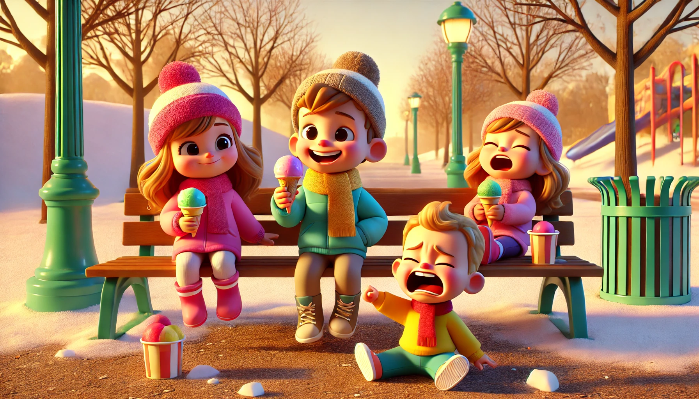

# 【随笔】冰淇淋的难题

阿宝和同学在小公园里一直玩到了黄昏时分，她忽然叫我过去，悄悄对我说：

> 爸爸，我想吃冰淇淋。

刚好，我正在给大宝视频，便问大宝：

> 阿宝想吃冰淇淋，你觉得可以吗？

大宝说：

> 当然不行了，昨天才吃了。怎么能整天吃呢？

我正想挂电话，却听见她又说：

> 其实也可以，买一赠一，正好可以她和同学一人一个。

我听大宝这么说，便去问阿宝和她的同学。她同学点头说也想吃，然后四处张望着，想要问一问她的爸爸。可是，她的爸爸和弟弟正巧不在附近。她嘟囔着：

> 可能我的弟弟也想吃。

我一面掏出手机下单，一面带着她们往肯德基走。可是，买一赠一的优惠券每天只能用一次……「抠搜」的本性又冒了出来。我对阿宝同学说：

> 要不，我先给你们俩买。你弟弟等见到他再说吧？

她说：

> 好，让我爸爸给弟弟买！

……

结果，等她俩愉快地吃着冰淇淋回到公园里没多久，就遇见了她的爸爸和弟弟。

果然，她弟弟嚷嚷着也要吃冰淇淋，可是他爸爸不让买。我都不记得自己有没有说给他弟弟也买一个。很快，我也不知怎么办才好，再买也不是，不买也不是，最后只好不吭声地待在一边，尴尬地看着她的爸爸一边拒绝弟弟，一边试图说服姐姐分他弟弟一点冰淇淋吃。

弟弟哭着说：

> 为什么姐姐就可以吃呢？

爸爸继续劝着姐姐，说不能一个人吃太多冰淇淋，好吃的要和弟弟分享，不分享以后弟弟也这么学姐姐，等等……终于，姐姐把最后一点冰淇淋留给了弟弟，弟弟停止了哭泣……

呼呼～

我是不是太小气了，其实应该一开始就买三个冰淇淋的呢？

