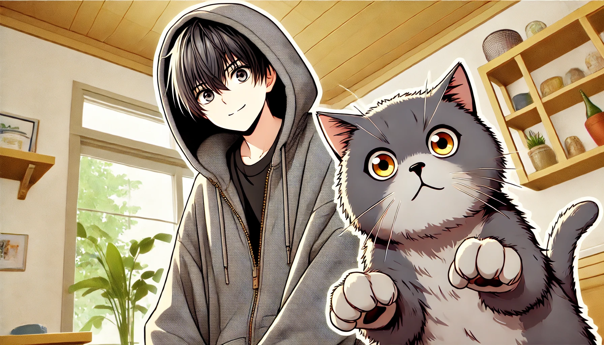

# 【随笔】天然呆的Cup猫

也不知是不是因为家里新来了小玉，Cup猫出现了些奇怪的变化。有一天晚上，大宝和孩子们都睡着啦，我独自一人落到最后。

关上了所有的灯，窗外的路灯从客厅的落地窗照进屋子，反衬得家里各位安静。我忽然想在客厅坐一会儿再去睡觉，于是乎一屁股坐在沙发上。Cup猫发现了我，悄悄蹦上沙发，试探着把前脚放在我的肚子上，踩啊踩啊，踩了起来。我索性啥也不干，就在黑暗中撸起猫来。想必Cup也觉得舒服，就干脆爬到了我肚子上，平平实实地趴好，安心地享受着我的抚摸，呼噜呼噜的。我估计现在胖Cup的体重可能得有7、8斤吧，靠在我肚子上暖融融的还怪舒服呢。

撸了一会儿，Cup继续往我胸口爬了两步，重新躺下。又过了一会儿，它再一次爬起来挪两步，把头枕在我下巴下面，感觉是要找一个贴得最紧密的姿势趴在我身上，使劲儿地打着呼噜。想来它是有点吃新来小猫咪的醋吧，以前不爱喝奶，不爱吃被泡水的猫粮。结果，现在常常抢小玉的奶喝，还常常抽机会就去把小玉泡软的小猫粮吃个精光。

这会儿，可算是逮着机会，单独和主人腻歪一会儿了……

我以为，这之后它会和我更亲密吧，谁知道，第二天，出现了一个奇怪的状况。

当时我穿着连帽衫在书房干活，不知是窗户的风太冷还是什么原因，我把帽子戴在了头上。中午推门从书房出来找吃的，正好看见Cup猫在客厅。它扭头看见了我，样子颇为惊恐，瞳孔收缩着，耳朵往后缩起，身上的毛炸了起来，一副随时想要逃跑的样子。我连忙放下帽子，对它说：

> 怎么了Cup，戴上帽子就不认识我了？

可是Cup猫依旧惊恐，警惕地想要找个地方躲起来。我以为只需要过一会儿就好，可是半小时之后，它依旧惶惶然地在客厅与卫生间之间窜来窜去，似乎始终没找到一个它觉得可以安心躲藏的地方。我打开厨房门，它犹豫极了。来陌生人时，它一向最喜欢躲藏的地方就是橱柜下的黑暗犄角旮旯，但此时，它最害怕的「陌生人」就守在厨房门口。

它尝试了两次，终于放弃了。躲到客厅落地窗旁，大鱼的玩具箱后面的角落里，无奈地看着窗外。

……

真奇怪，能有什么事情，又让Cup发生应激反应呢？因为我这件灰色的连帽衫，就连最亲近的主人也忽然不认识了吗？

看小玉机灵的样子，再看憨憨的Cup，我开始怀疑，会不会Cup猫这家伙，有近亲繁殖造成的智力缺陷？算算猫龄，它应该算是人类35岁左右的壮年，不至于老年痴呆才对。这么动辄不认识主人，可能只能算是「天然呆」吧！

