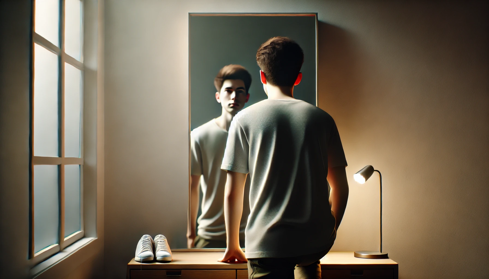

# 【生命⋅修行】外面没有别人

晚饭的时候，阿宝和大鱼拌起嘴来。弟弟不肯再让着姐姐，双方针锋相对你来我往好几句，最后阿宝气哼哼坐回到餐桌边。

我忍不住在一边说道：

> 其实，你不需要这么生气的……

然而，这个道理还没来得及和阿宝细讲，阿宝更生气了。哇哇地大哭起来，伤心地跑到妈妈那里，躲在妈妈怀里继续哭。由于哭得太难过，还弄丢了一直拿在手里玩的鱼眼珠。怎么找也找不到，我趴在餐桌下，仔细帮她寻摸了半天，也依然没有结果。这下子，更伤心了，结果大哭之中，另一个小鱼眼珠也掉到了地上。那么小两个个半透明的小珠子，落到白色的瓷砖地板上，瞬间就消失了。

阿宝继续哭，而我的道理没能讲完，不由得也有了一种「气」堵在胸口的感觉。

我深深吸一口气，忍住自己想要继续嘚不嘚输出道理的冲动，告诉大宝，自己此时的感受。

等阿宝跑到自己房间，大宝才悄悄问我：

> 你刚刚有啥感想啊？

我说：

> 我本来想告诉阿宝，为了别人的看法，自己大动情绪非常不知道。
>
> 本来不管弟弟说啥就好了，可是因为要管，变得自己生巨大的气。
>
> 然后爸爸在一边只是想指出这个事实，却因为不喜欢爸爸这么说，生更大的气。
>
> 结果，因为生气，还搞丢了自己喜欢的两个小鱼眼珠子，多么不划算啊！
>
> 可是，这个道理还没法和她说，说了她只会更大的脾气！

大宝说：

> 你可能想多了。
>
> 其实，你之所以这么想，只是因为：「这是你自己的问题！」
>
> 你所看到的这些，并不是阿宝的问题。是你容易被别人的看法影响情绪，然后被这情绪影响你的行为，然后造成一系列你所不想要面对的后果。
>
> 只是因为你有这个问题，所以，你才会从阿宝和弟弟的争吵中，看到这一切。然后还误以为，这是阿宝正在面对的问题。
>
> 阿宝所面对的，其实根本不是这么复杂的情形。

她顿了顿，又接着说：

> 这些，都是你说的。
>
> 上次我们觉得阿宝面临社交困扰时，你说我只是从阿宝身上看到了自己的问题，因为说的是我自己，我当时还并不觉得对。
>
> 事后想想，才觉得你说得有道理。
>
> 等事情发生在你身上，才清楚的看到，就是这么回事！
>
> 我们所看到的一切，其实，都「只是我们自己的问题！」

我笑了，好像真的就是这么回事儿呢。我说：

> 还真是旁观者清啊！

大宝问：

> 怎么样，现在还觉得堵着一口气吗？

我说：

> 没了，一想明白，气就顺了！

……

外面还真是没有别人，身边的人啊，事啊，都只是各式各样的镜子，照见的都是自己！