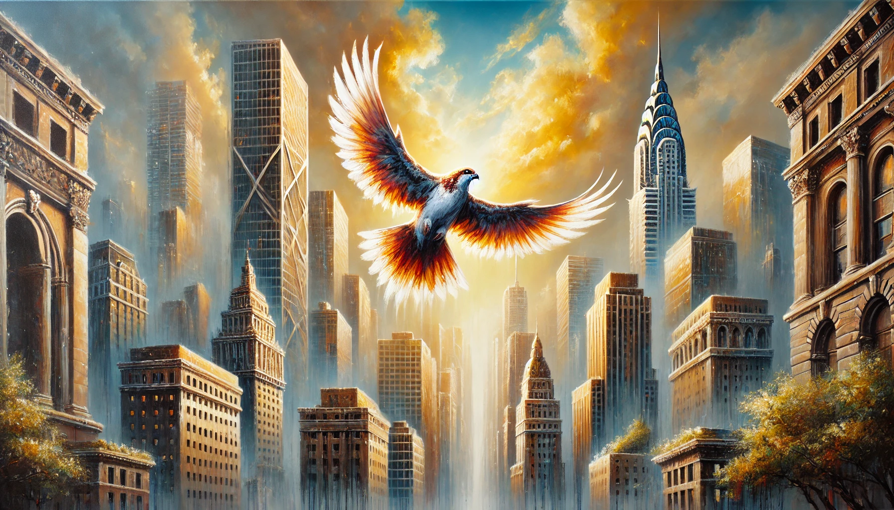

# 【随笔】生命的唏嘘

昨天，一个前同事群里本来还在八卦尹锡悦的，忽然之间有人连着扔出几个大楼的视频来。没多久，有人评论了一句：

> 这个拍视频的人，晚上要做恶梦的。

好奇心害死猫，我顺着评论，也点开了视频。

原来，是春笋大楼旁边的一栋高层住宅，不知何故燃着熊熊烈火。然后，就眼见着那个蜷缩在楼板边的女士，一翻身就跌落了下去。几十层高，伴随着一声尖叫，她就直接坠落下去。

……

后来，听说是重伤已经送去抢救。那么高，活下来的机会真的渺茫，希望真的没事吧🙏。

再后来，从各种通报中大致了解来龙去脉，更是不胜唏嘘。可以说，都是别人犯的各种错误，最严重的后果却要一个完全无辜的人和家庭来承受。

人人都会念叨：

> 谁也不知道，明天和意外，究竟哪一个先来……

可是几乎所有人都觉得，属于自己的，明天的太阳，一定会照常升起。

……

可能因为是和平时代，这意外惨剧格外触目惊心。但其实，在地球上，几乎每一秒钟，就有两个人死亡。然而，真正为此做好准备的人，又有几个呢？

家里有一本来自日本的绘本，里面讲爷爷写下了自己死后要做的事情，一些计划与想象。书中的小朋友看过自己爷爷的计划后，也想给自己写一本，但还没动笔就发现，相比死后要做的事情，脑子里有更多现在就想要做的事情……

……

所以，趁着生命还在，想做的事情赶紧做起来，才好为不知什么时候来临的死亡多做一点点准备吧。

