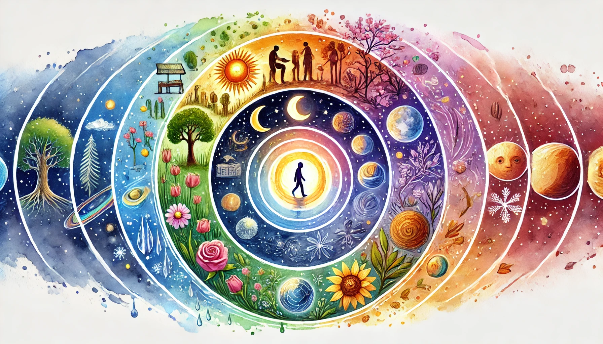

# 【生命⋅修行】状态的循环

最近这种感受很明显，那就是：自己状态每天都有一个明显的循环。

早上醒来，虽然总有点没睡够，对床恋恋不舍，但一旦起来——或者静坐片刻，或者直接爬起来，总是一个相对清明的状态。然后看到阿宝和大鱼，不管他们是已经醒来，还是在床上呼呼大睡，心中总是充满了柔情。想着：

> 真是天使般可爱的宝贝们啊！

到了晚上临睡，心情就已经变得疲惫和焦躁了。偏偏心里还装着许多事情，如同一个破麻袋，塞满了枝枝丫丫的各种垃圾，这里被戳破个口子，那里被顶出个窟窿。再看阿宝和大鱼：

> 怎么作业还没做完？
>
> 怎么还不去刷牙洗脸？
>
> 怎么还缠着我这这那那！！！

于是乎，家里就会听见我在这个屋子或那个屋子里，一会儿吼阿宝，一会儿吼大鱼。把两个娃娃弄得哭哭啼啼。早上的父慈子孝，温柔亲呢早已不知逃去了哪个地方。

……

每天都是如此！

放到更长的周期里，会发现自己不知不觉越来越容易熬夜。从一开始可以早早和全家人一起上床睡觉；到渐渐只能让他们先睡，自己再忙一会儿；再到后来，要忙过11点，接近12点才睡觉；然后就会出现一两次，明明过了10点可以睡觉了，却忍不住刷手机，直到过半夜；即便是早上，状态也越来越不好，终于在某一天，发现自己生病了……

然后，在近乎崩溃中休息。

这样的循环，长达一周多或几周，经常如此！

……

也许，顺应配合自己的节律、自然的节律，至少如《黄帝内经》里所说的贤人一般：

> 法则天地，象似日月，辩列星辰，逆从阴阳，分别四时，将从上古合同于道，亦可使益寿而有极时……

可以让自己过得更好一点？

