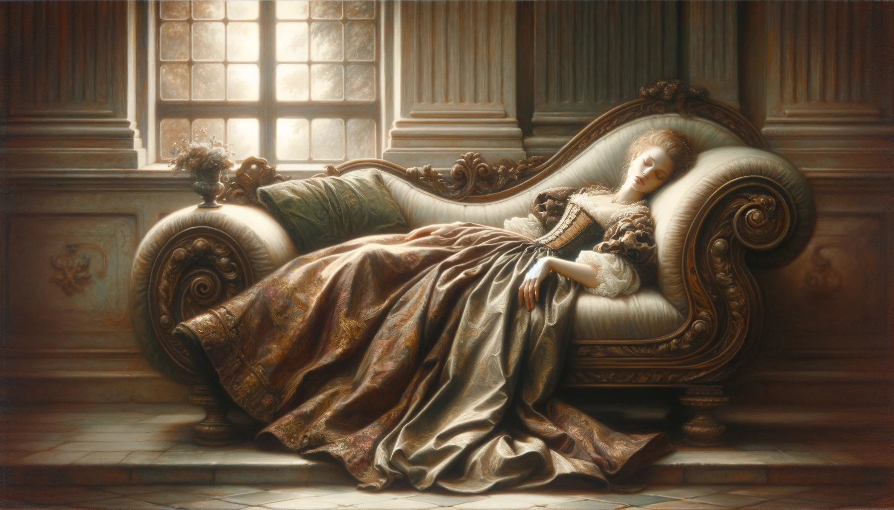

# 【生命⋅修行】睡觉睡觉睡觉

最重要的事情，必须说三遍！

前两天，应该是已经过了晚上10点，或许是10点半吧，一整天过去，一直没能抽出时间来完成当天的写作练习。

我把孩子们送进卧室，准备自己回到客厅里打开电脑写点文字。大宝说：

> 一天不写也不会死。

我说：

> 晚睡一会儿也不会死。

……

可是，接下来，我意识到。其实，看起来都是「不会死」的两个不同选择，但其实，这两句话背后，我们俩的分歧在于：

她认为，睡觉是最重要的事情！

而我认为，每天坚持写作是比睡觉更重要的事情！

可是，我这想法真的对吗？

我发现，似乎，我有举着「坚持写作」的借口，把睡觉不当回事的嫌疑。而这背后，意味着自己对身体健康的不重视。

身都不修，心又如何修呢。

况且，如果我真的觉得坚持写作比睡觉重要的话，我同意可以凌晨提前一个小时起床，在每天的第一个小时完成这项任务啊。

但，实际上，最近早已经这么想过不止一次了，但早上温暖的被窝明显比「坚持写作」更有诱惑力。

所以，我晚上不睡觉，也并不是真的把「坚持写作」的优先级放在了「早点睡觉」这件事前面，相反，只是妥协于藏在背后的一种惰性而已。

想到这里，我合上电脑，放弃了这一天的写作，任公众号在这一天中断了发文。

**睡觉！睡觉！！睡觉！！！**

