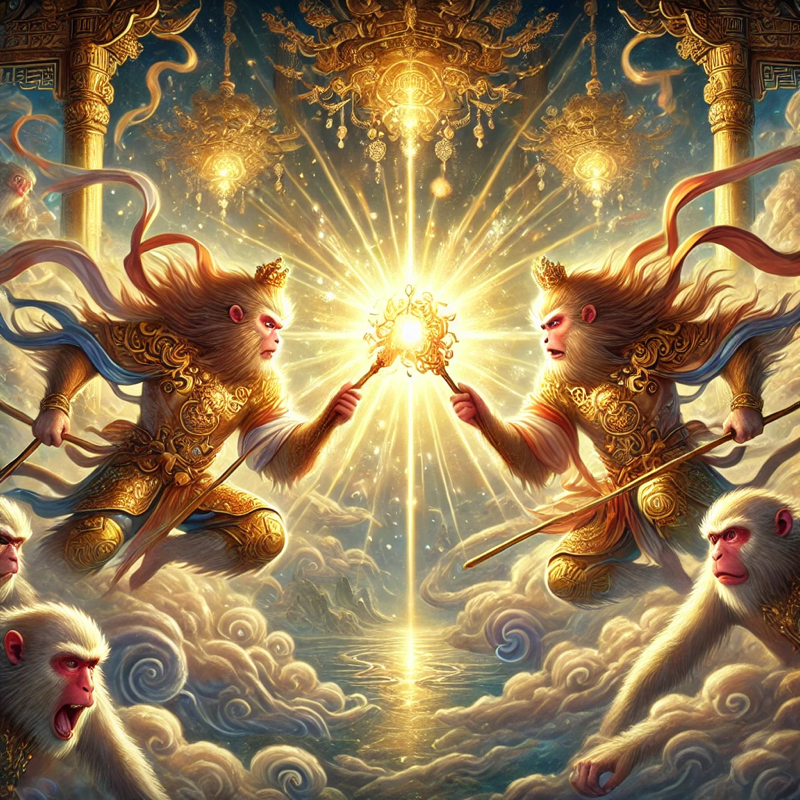

# 【生命⋅修行】一心一境真是难

昨天莫名被低落的情绪击中，从最开始的一点点心中的阴云，到后来竟然演变成动惮不得。

偏巧，到晚饭时间，大宝还做了许多美食，鲜美的怀山炖鸡汤，香喷喷的红烧排骨。我一面嘴里馋这满桌好吃的，想着一定要专心下来，好好享受晚餐；一面心里的低落情绪却始终摆脱不了。坐在那里，我虽然「努力」地在认真品尝，也确实被美食所诱惑着；但与此同时，心总被这低落情绪、以及背后可能的缘由所影响和牵动，开心不起来。

那些缘由也并不清晰，只是如乌云般绞在心里，挥之不去。

想起《西游记》里，真假美猴王打到灵山时，如来对一众菩萨罗汉说：

> 汝等俱是一心，且看二心競鬥而來也。

罗汉、菩萨都早已修得一心，然而我这凡人，想一心一境却真是难。

林世儒老师曾教我们用[「记得喝水」的方法来练习「一心一境」](https://www.samasati.org/%E7%A4%BA%E5%A6%82%E7%B6%B2%E8%AA%8C/%E7%84%A1%E5%AE%83%EF%BC%9A%E4%BA%8B%E6%83%85%E5%BE%88%E5%A4%9A%E4%BD%86%E4%B8%8D%E5%BF%99-241-%E6%9E%97%E4%B8%96%E5%84%92/)，也就是只专注在手头的一件事情上。可是，我从晚饭开始，到累得瘫在床上十多分钟，然后被阿宝叫起来看她画的画，然后收拾厨房，扔垃圾，又陪大鱼玩了一小会儿，但心却飘忽着，虽然不停地、努力地想要集中注意力到当下手头的事情，却总是陷落在不开心的情绪和思绪中出不来。

二心，甚至不止「二心」，许许多多的「心」撕扯争斗，正是普通人的常态。想要修成「一心一境」，似乎除了硬下功夫，似乎也没有什么捷径。

克里希那穆提说：

> 死亡每天都在发生……
>
> 让我们的全部所得、全部知识、全部记忆、全部的争取逐日死去，而不是把这些带给第二天，因为第二天有美的存在。那样的话，尽管有结束，也有重生。

可是，在那种低落的、晦暗的情绪中，过去与将来不停地撕扯着我，让我无法扔掉一切，纯粹的回到当下。真羡慕克氏那种干脆利落的决绝！

但，我，却只能在我自制的枷锁与桎梏中继续挣扎。

也许，和静坐面对各种痛苦感受时所能做的一样，在这样的情绪阴霾中，我所能做的，也只能是熬着，然后一点一点、一次又一次地试着把心转回当下。

既然情绪痛苦的信号灯正在闪烁，那么一点有什么想错了。

如果死活无法弄明白此刻「想错了什么」，那么还有一点，就是做事！

一边行动，一边等待自己「真正想明白的时刻」。

《西游记》里，[为真假美猴王这段写了一首诗](https://ctext.org/xiyouji/ch58/zh)：

> 人有二心生禍災，天涯海角致疑猜。
> 欲思寶馬三公位，又憶金鑾一品臺。
> 南征北討無休歇，東擋西除未定哉。
> 禪門須學無心訣，靜養嬰兒結聖胎。

看到这首诗，我意识到，自己的痛苦也逃不开「贪嗔痴慢疑」这五大心魔。

特别是一边贪，一边疑……

