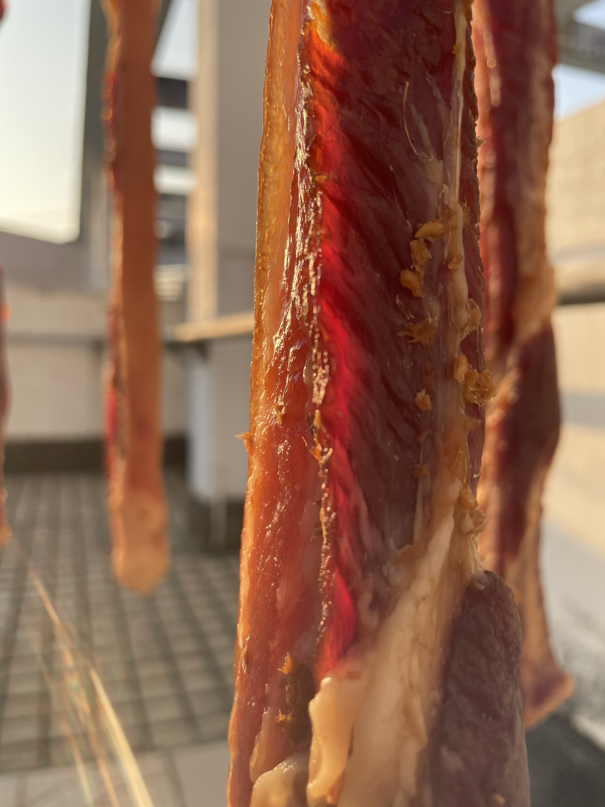
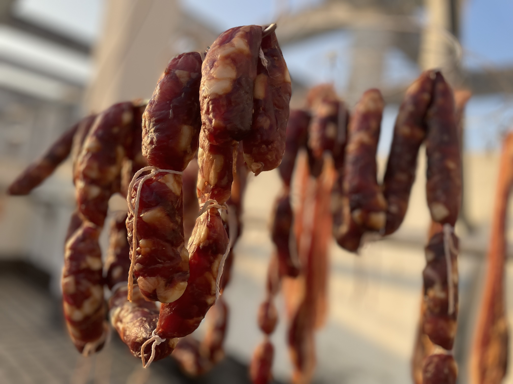

# 【随笔】冬天的好东西

降温那天，大宝看着天气预报，很是犹豫：

> 你说，要不要做香肠呢？看温度不够低，要不要等到下一次降温？

我问：

> 你想要做多少呀？

大宝说：

> 今年我想要做20斤呢！

我想了想，说：

> 要不，先做个10斤。下次又降温就再做10斤吧？

大宝被说服，愉快地出门买肉去了。那天忙了一整天，到晚上除了灌好10斤香肠，还做了吐司，烧了牛腩，炖了汤……

香肠挂在在阳台吹了一晚上，第二天早上，我听见阳台有鸟叫声，探头一看，一只戴着黑帽子的红耳鹎正站在阳台栏杆上探头探脑。我笑着叫大宝：

> 以前在偷吃你香肠的那种尖帽子鸟儿又来了！

……

连续几天，太阳都不错。每天早上，我都坐电梯到18楼，把香肠晒到天台的阳光中，等晚上再去拿下来。有一天傍晚，阿宝和我一起上天台收香肠，惊奇地发现，居然在我们的香肠旁边，又出现了一溜挂得整整齐齐的香肠。这时，太阳正好要下山了，阳光变得红彤彤的，斜斜地从远处的大楼顶上照过来，显得香肠晶莹剔透。

我和阿宝停下来，静静地看着好像脸盆般大小的巨大红日，倏地落了下去。不过两分钟时间，就完全消失在远处的大楼背后，只留下一抹红霞。

我们拿着香肠，从楼梯走下天台，正好遇到一个高个子的大叔走上来。见我们拿着香肠，爽朗地笑着和我们打招呼：

> 这可是好东西呀！

我感觉，他那兴奋的神情，就好像是见到了知音一样，莫非楼顶那另外一溜香肠，就是这位大叔的？

……

又一天晚上，我和阿宝收了香肠下来，在电梯里遇到一位黄袍快递小哥。他看了一样我们手里的香肠，也乐呵呵地对我们说：

> 这可是好东西呀！

我笑着点点头。阿宝忽然嚷嚷着要把她手里的香肠给我，我正要不耐烦。小哥说：

> 她可能拿不动了，看样子挺重的。

我赶紧接了过来，掂量掂量，确实还蛮重的。小哥接着说：

> 这个得小心别蹭着衣服。放阳台上，下面也得垫上纸，这几天的太阳，晒一会儿就得出不少油呢……

看来，这位快递小哥也是个会吃的讲究人哦。

……

天气一直不错，马上冬至了，大宝又做了几斤腊肉。至于香肠，似乎已经晒好了。晚餐大宝切了一根蒸熟，香得不行！

