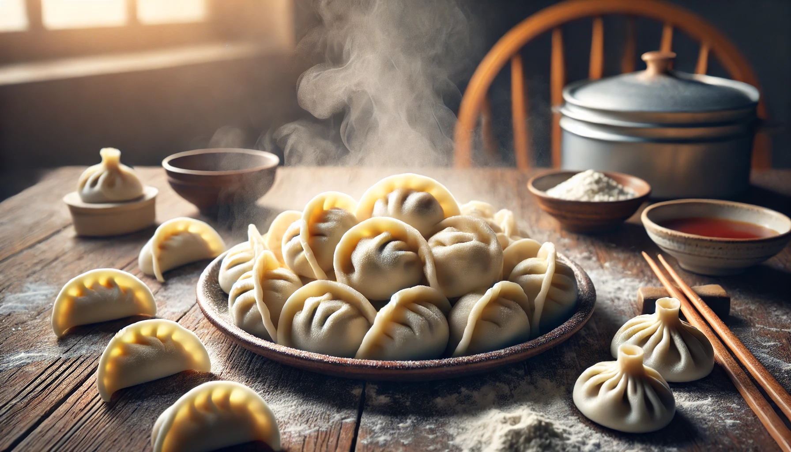

# 【随笔】冬至吃吃吃

记得小时候在武汉，冬至并不是什么大不了的事情，只有小学的自然课老师会强调，这是一年里白天最短，黑夜最长的一天。

如今网络发达了，似乎冬至也变得重要起来，早早就有各种个样教导我们该如何过冬至的文章和视频。据说，古代冬至是仅次于新年的重要节日，甚至有传说，周朝以前是以冬至为新年的。

反正，慢慢的，「冬至大过年」的说法变得深入人心。也慢慢知道了，原来，在北方冬至要吃饺子；而在南方，冬至要吃汤圆或糯米粑粑。

冬至前一天晚上，大宝就买了汤圆回来。冬至一大早，就给全家人煮上了一锅。有传统白色的芝麻汤圆，还有透明的五彩汤圆，绿的是抹茶馅儿，黄的是花生馅儿，紫红的是紫薯馅儿，黑的又是芝麻馅儿。本来刚起床时颇觉得有些寒冷，吃过一碗热气腾腾的汤圆，就浑身暖洋洋了。

接着，孩子们坚持说要去逛沃尔玛，嚷嚷着：

> 昨天不是说好了，今天要去沃尔玛的吗？

然后，我们骑着电动车去了附近的沃尔玛。大宝买了许多羊肉和羊骨头，还特许我们给自己挑一些零食。大人可以给自己买一样，小孩可以给自己买两样。我犹豫来犹豫去，拿起卫龙的魔芋丝又放下，拿起荞麦虾片又放下，最终给自己拿了一块没吃过，看起来还不错的三角巧克力。

孩子们更是在各个零食柜之间来来去去，挑得不亦乐乎。购物车里的零食被换了好几轮之后，以每个人都在散装柜台高高兴兴地称了一塑料袋告终！

回到家，大宝把羊肉剔出来，把骨头炖进汤锅，让我剁肉馅准备包饺子。

这好像还是我们第一次包羊肉馅饺子，食谱上说肉馅要切的最好。我实在不理解大块羊肉怎么做饺子馅，还是拿起了两把菜刀，「咚咚咚」把羊肉剁成了肉馅。反正记忆中，手工剁出的饺子馅比啥料理机弄得都好吃，想必羊肉饺子也一样吧。

依次把羊肉、胡萝卜都细细剁碎，大宝看我剁累了，便接过菜刀把大葱也剁成了碎末，然后给加了盐、蚝油等等配料，一大锅交给我负责搅匀。自己则和起面来。

很快，面和好了，两个孩子也兴奋起来，洗了手跑过来，嚷嚷着要帮忙。大宝给了我们一人一根擀面杖，于是乎，大鱼、阿宝和我负责擀皮，大宝负责包饺子，全家人都忙活起来。

我记得，老同学H在读高中时曾和我吹牛，说他一人负责擀皮，全家其余六口人包饺子都跟不上他的速度。

我也想试着快一点，结果发现，竟然还不如两个孩子们利索。最后，超过三分之二的饺子皮都是阿宝和大鱼擀出来的。

……

孩子们也很得意，饺子大大小小，他们也乐得哈哈大小。

新鲜包的羊肉饺子果然好吃，不需要蘸任何调料，白口咬一个照样满口生香。如果配上前几天大宝弄得油辣椒，更是别样的美味。

等吃完饺子，已经是下午三点多，我们决定赶紧出门，带着两只猫咪去公园晒最后两小时太阳。

……

冬至果然白天太短，晒不过一个小时，太阳就躲到了海边那一排高楼的背后。我们只好又带着猫咪们回到了家。

羊肉汤已经炖好了，羊肉香糯，白萝卜清甜可口。

中午的面团还有剩，我便拿其中一部分擀了个BiangBiang面煮了，配上油辣子、醋和蒜茸，大宝说，比外面餐馆卖的好吃太多了。

然后，大宝拿着剩下的面团，给孩子们做了个香蕉飞饼，居然味道也很不错。

……

没想到，冬至这一天，我们第一次自己做羊肉饺子，第一次做油泼辣子BiangBiang面，第一次做香蕉飞饼，竟然都成功了！

真是一个愉快的、「吃吃吃」的冬至！

