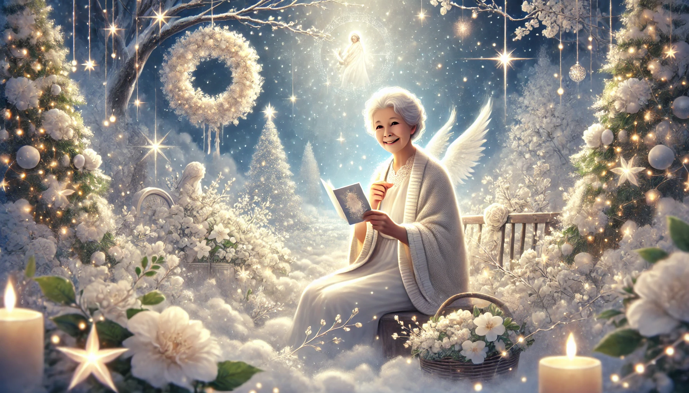

# 【随笔】圣诞快乐

曾经在我读书的时候，送圣诞新年贺卡是一件非常流行的事情。随着从小学升入中学，我们有了更多来自远方的朋友。圣诞节到新年期间给朋友们寄出厚厚一沓贺卡，再不停地从传达室收到一张张寄给自己的卡片，成了对所有人来说，都非常重要的活动。

随着慢慢长大，我知道了外婆是天主教徒。明白圣诞节对她而言，是真正重要的节日。我就开始每年都在圣诞节期间给外婆寄圣诞卡了。有时是专门买的最好、最贵的圣诞卡，有时是自己制作的，从读书一直到工作。

即便是工作很多年之后，我也依然会在圣诞节给外婆寄上圣诞卡，同时再汇上几百块钱。直到后来几年，邮局慢慢变得不再可靠，用快递寄过几次圣诞卡和礼物之后，就变成只是在圣诞节在手机上给小舅发个红包，请他送给外婆，然后视频问候一下了。

……

但是，

今年，

到了平安夜，

我忽然意识到，

外婆已经不再需要我给她寄圣诞卡，发红包和打电话、通视频了。

……

我似乎并没有什么伤感，可能觉得，世界就是这样，如大河一般川流不息地运转着，丝毫不因为我们的情感羁绊有些许停留。那些我们熟悉的亲人一点点变老，一点点淡出我们的生活。与此同时，孩子们也一天天长大，我们自己也变得更成熟、或者说更老……

可能也正是这个慢慢变老的过程，让我们面对和接受那最终的告别，变得更加容易一些。

想起杨绛的《我们仨》里，钱钟书、钱嫄和她之间，也是经历了一段漫长的告别历程。这可能算是一种相对幸福的常态吧。

……

我翻开之前整理的[《玫瑰经》](20240616【教程】如何诵念玫瑰经——为信奉天主教的亲人祈祷.md)，为外婆诵念了一遍，祝她在光明的天国里，快乐渡过这个圣诞！

