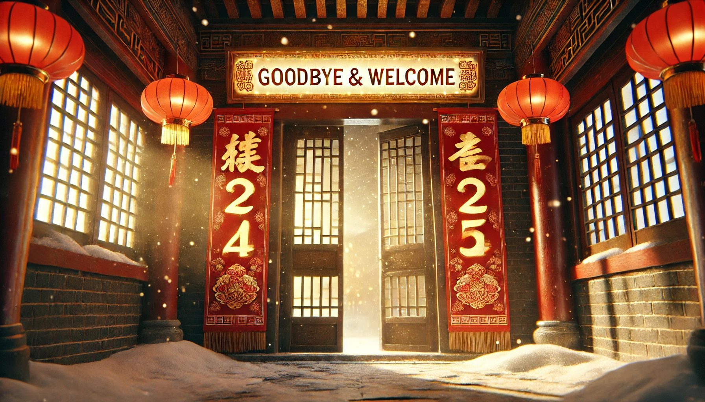

# 【随笔】告别2024

> 苟日新
>
> 日日新
>
> 又日新

虽说成汤在鼎上刻这字的意思是，每天都要能除旧迎新。

然而，日历翻到公历2024年的12月31日，这一年的最后一天，忍不住就会觉得这一次的除旧迎新，有那么点格外不同的意义。

早上醒来还没起床，就忍不住在被窝里构思龙年结束应该在门上贴什么春联。上联应该是龙，下联应该是蛇。最简单的应景的，恐怕就是

> 龙游四海辞旧岁
>
> 蛇舞九州迎新春

这一类吧……

就这么琢磨着，不禁又把这一年里想做的，未做的许多事情在脑子里过了一遍。2023算是AI元年，而2024则见证了中美各种大模型能力的迅猛发展。那些推理啊、编程啊、视频啊……各种能想到的具体问题与限制，不知不觉就都被攻克了。明年会怎样，到下一个龙年之前又会是怎样，谁也说不清。只觉得山雨欲来风满楼！

然而反观自己，这一年却还在大踏步地原地踏步着。

但是，其实不管是怎样蛰伏，活着就是胜利。

……

那天晚上，我告诉大宝说：

> 师傅说我调理身体第一要务是改变心态，把心放宽，我觉得好难做到。
>
> 一天之中，总是会有好几次，触发我心脏部位的紧张与不适。

大宝问我：

> 具体什么事儿呢？

我说：

> 比如白天在公园的时候，阿宝带着大鱼去玩。我去找了一圈看不到人，心就一紧。
>
> 然后，这种不舒服一直持续着，直到他们回来后过了一会儿，那种难受的感觉才消失。

大宝说：

> 那其他还有什么事儿呢？

我想了想，说：

> 其实有点说不清……
>
> 比如，我想用一年做12个项目，两个月过去了，一个还没有做完。
>
> 再仔细想想，可能都是发现答应你，或者阿宝、大鱼，再或者父母，乃至于对自己的一些承诺。一旦发现自己无法做到时，就会出现这样的情况。

大宝说：

> 可是，你仔细想想看，对于我来说，对于阿宝、大鱼，还有你父母来说。是不是你这个人本身更重要呢？你承诺的事情做不到就做不到嘛，你这个人，才是对我们来说最重要的。至于那些事情，你愿意去做，然后也尽力做了，没有做到，又有什么关系呢？
>
> 虽说两个月，一个项目没做完。有没有想过，这其实是现在的你，在纠结内耗后，尽所有心中余力才取得的成果呢？

听大宝这么说，眼眶深处竟不觉灼热起来。

是的，就是这样，好好活着就是对自己、对家人来说最重要的事情。

首先，好好活着，像任何一个哺乳动物一样——

睡好觉、吃好饭、再加上足够的运动；

接着，再做好一个活人应该做的——

总结过去，展望将来，立足当下；

……

年复一年，日复一日。

> 人生如寄，多忧何为，今我不乐，岁月如驰……

2025即将来临，又是美好而崭新的一年。

起床后，请GPT一起帮忙，把躲在被窝里做的那副对联修改了一下：

> 上联：**旧岁潜龙藏四海**
>
> 下联：**新春灵蛇现九州**
>
> 横批：辞旧迎新

