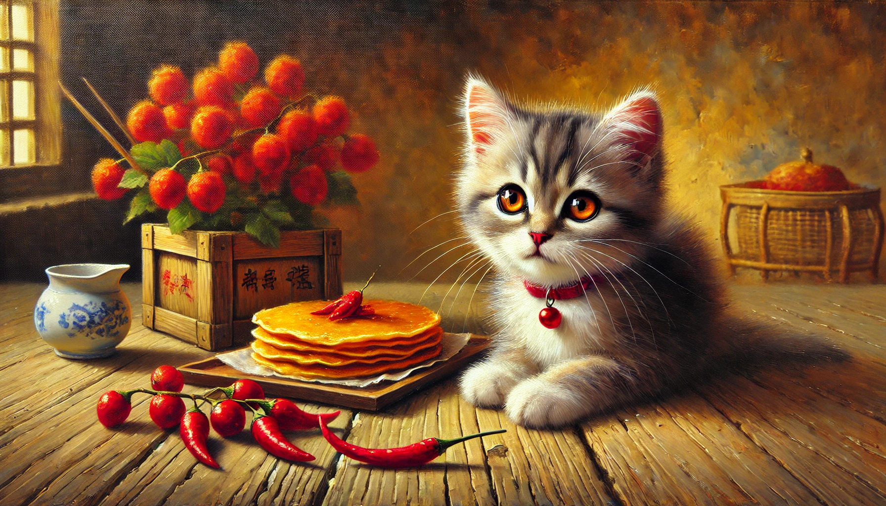

# 【生命⋅修行】心如猫抓

周末时，带着阿宝和大鱼去「火箭乐园」——一个有火箭造型滑梯的游乐场玩，出发时就答应了他们，到时候可以给他们买冰淇淋和果汁。

坐地铁过去是大约一个多小时的路程，到游乐场没多久就接近中午了。我在靠近火箭滑梯公园边缘的台阶坐下晒太阳，路边就是几个卖小吃的三轮车，一个卖臭豆腐的，一个卖山东杂粮煎饼果子的……

我想，当时自己一定是很有些饿了，看着不远处卖煎饼果子的小车，脑海里不停地浮现出那薄脆的果子（果篦 / 薄脆），以及那咔嚓咔嚓咬起来酥香松脆的口感。

> 给自己买一个吧？
>
> 算了，不浪费钱了！

内心斗争了许久，终于决定放弃。打开手机，仔细搜索着有没有肯德基的优惠券，终于找到一份团购的套餐，除了有冰淇淋、果汁，还能再选两样食物。于是，我给自己买了一对儿辣鸡翅，给孩子们加了一份鸡块。

没多久，孩子们享用着鸡块、冰淇淋和果汁，我三下五除二把鸡翅吞进了肚子。

嗯，那油炸过、变得酥脆可口的外皮也相当解馋。只不过，两个炸鸡翅，实在太不经吃了。我擦着手，又开始犹豫：

> 要不再买俩个？
>
> 或者……

我抬头再次看向街边卖煎饼果子的三轮车，车边围着好几个穿校服的学生。我猛地吞了几次口水，心里如猫抓一般……

最后，我把这猫抓般的诱惑强忍了下来，但是，这样因为食物而心痒痒如上瘾般的感觉，实在太过难忘了。这之后好几天，依然忘不了。

不过，很快。我又经历了两次！

2025年的第一天，送走了来深圳看望大宝的好友和她的女儿，两个孩子跑去商场的波波池玩，于是得空和大宝两人逛了一趟盒马。

路过卖水果的摊位时，我再次被那一大瓶一大瓶鲜榨的、色彩鲜艳的果汁，以及五颜六色被切得漂漂亮亮、摆得整整齐齐的水果切诱惑到了。口水不停、心如猫抓，脑子里不停地想象着那冰、甜、爽的口感。

然而，按师傅的说法——我不应该再吃生冷的玩意儿，这些食物会严重影响我的消化、睡眠以至于健康状况。大宝总说我对自己的健康实际上不太在意，不能像师傅那样，知道自己先天体寒，就能坚持不吃生冷，香蕉最多都只吃半根。

而我……冰爽的果汁、水果，还有冰淇淋对我的诱惑实在是太大了！

最后，我终于忍住，什么也没拿，跟着大宝到了自助收银台。我告诉她说：

> 真的是看到就流口水呢，和上次看到煎饼果子一样难熬……

大宝说：

> 我就不会对这些流口水。

然后，她拿起一盒尖辣椒在机器上扫了扫条码。

> 看到这个，我才会流口水！

……

这天晚上，不知何故，全家人都睡着啦，我又睡不着。我悄悄来到客厅，想找拍痧板，看能不能把身上那种烦躁难耐的「气」拍散掉。可是，到处都找不着。

心里再度如猫抓般「痒痒」起来，我打开冰箱，没有任何酸奶、果汁之类，餐厅里，除了一个刚刚送来的大释迦果，再没有任何其他水果。

> 要是有橘子就好了！

我心里这么想着，却在客厅发现了一瓶百事可乐——那是大宝买了准备做可乐鸡翅的原材料！

> 喝一点？
>
> 不能喝！

这次，内心里的「清教徒」终于失利了。我悄悄打开瓶盖，倒了一些在杯子里，咕咚咕咚喝了下去。虽然是常温，但依然是那甜甜的、凉凉的滋味。喝完，还没来得及犹豫呢，舒舒服服打了两个嗝。太爽了，干脆又给自己倒了半杯。

唉，没办法。终究还是败给了自己的欲望与人类高科技的联军。

……

人这个机器，实在是太玄妙，太难掌控了。我打开手机翻了翻，找到和菜头的《[人人都应该读的生活秘笈](https://mp.weixin.qq.com/s/rrWGJCBIP4xuus19hmfbfw)》，心想，应该把这[*Scarcity Brain*](https://www.amazon.com/Scarcity-Brain-Craving-Mindset-Rewire/dp/0593236629)找来读读吧。

但或许，这个「想要」和「应该」，依然是大脑关于欲望的小把戏呢？

