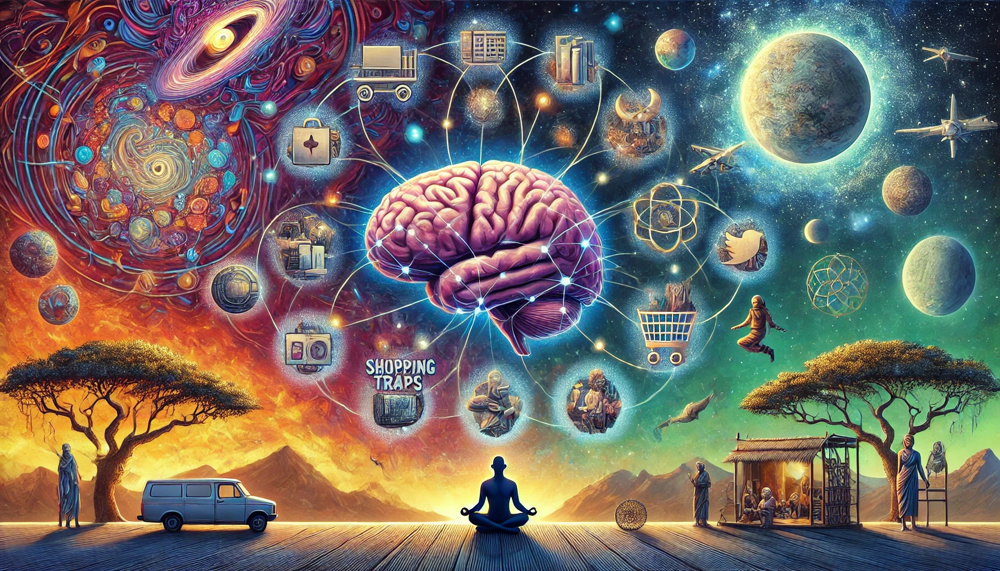

# 【随笔】关于匮乏大脑的机密

把[*Scarcity Brain*](https://www.amazon.com/Scarcity-Brain-Craving-Mindset-Rewire/dp/0593236629)花了几天读完了，从翻开这本书到把它读完，时间已经到了第五天。由于是找来的是电子版，这几天一度坐地铁时，都捧着笔记本电脑在读它。这个电子版不知是哪个大模型翻译的，中文有些地方有点生硬。好在是双语对照版，看看原文就明白了，反而更觉得作者文笔幽默。

前几天刚看了开头和网友评论时，还在犹豫要不要推荐这本书来着。结果往后面看，发现自己内心里不止一次地想要驳斥[那位网友的评论观点](https://www.goodreads.com/review/show/5533797338)。在那篇评论里有几个主要观点：

1. 相比其它脑科学书籍，作者没提出什么新的、有价值的东西。
2. 不应该去采访哪些游于世外之人（比如宇航员、生存主义者、僧侣等），而忽视普通人。
3. 没有提出解决方案
4. 不满最终导向的宗教方案

说实话，第一条那位网友或许是对的。虽然我并没有读过太多最新脑科学、大脑黑客的书来印证。但这本书至少没有像《跨越不可能》那样，在书后提供一个详细的引文列表。从这一点看，它更像是一本普通的畅销书，而不是科研的结晶。

然而，作者采访那些「游于世外」之人，正是他寻找「解决方案」的奥妙之处。正因为我们陷在这「俗世」制作的各种「稀缺陷阱」中无法逃脱，才需要在其它的地方寻找解药。

通常来说，钥匙不会呆在锁住的门锁上，不是吗？

正是那些宇航员、原始部落的成员、生存主义者们给出了线索，为那些看似无解的问题，提供了解决方案。

并且，作者巧妙地用自己——这个依然混迹于俗世的知识分子为例，证明了这些方案，对于「困在朝九晚五工作中的普通人」而言，在实践上的可行性，以及理论上的可能性。

当然了，作者是男的，且没有孩子。也许这就是那位三个孩子的母亲所不能为之信服和满意的重要原因吧。

至于最终的宗教方案——我虽然不是任何一个宗教的信徒，但我却真的认为，那各种流传至今的宗教中，都潜藏着指向终极答案的线索。关于这一点，可能更是见仁见智吧。

#### 好看：🌟🌟🌟🌟 四颗星

作者冒险前往巴格达的访问历程，成为趣味横生并贯穿全书的引子。一次次对不同人物的访谈，让那些枯燥的学术问题，玄妙模糊的解决方案变得妙趣横生，并与我们日常生活息息相关。

我们为啥刷刷刷、买买买、吃吃吃根本停不下来呢？因为我们的大脑就是在数十万年、历经匮乏时代之后淬炼出来的。

*机会→不可预测的奖励→快速重复性*

上面这样的一个稀缺循环定势，根植于我们的大脑之中，一旦被触发就运转不停。而现代企业，则更是拿着这些科学理论，精确地在各处布下陷阱，处心积虑地把我们网罗其中。

诺奖得主Hinton不是这么说嘛：

> 我们目前的局面是：拥有旧石器时代的大脑*、*中世纪的制度，以及类神的技术。

解决方案是什么呢？跟着作者，听他和待在外太空的宇航员、原始部落的村民、穿梭丛林的女生存主义者、修道院里的僧侣聊一聊，或许你就有答案了。

#### 启发：🌟🌟🌟🌟 四颗星

既有深刻的洞见，也有能够立即放在日常生活中应用的妙招。除了那个稀缺循环定式，作者也介绍了好几个对他有用的小妙招，比如：

1. 想要正确还是快乐？
2. 从长远看，什么是最容易坚持的饮食习惯？
3. 单一成分的食物、锻炼、减少而不是增加压力。
4. 装备，而不是东西。
5. 60秒法则：每当你发现自己花了超过一分钟的时间来做决定时，你很可能正在试图为做出不必要的决定寻找理由。——购买或保留不必要的东西（信息也是一样）

#### 总而言之，🌟🌟🌟🌟 四颗星

推荐你也读一读这本书！

