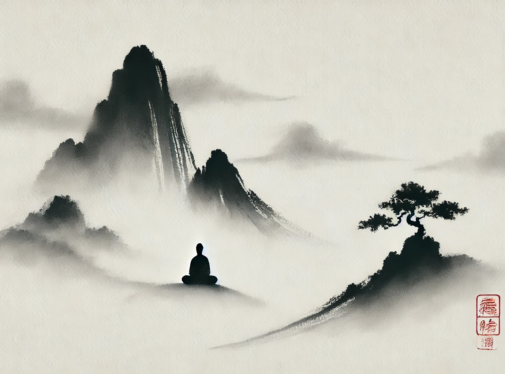

# 【生命⋅修行】什么是最重要的事情

[麦克尔·罗奇格西](https://zh.wikipedia.org/wiki/%E9%BA%A5%E5%8F%AF%C2%B7%E7%BE%85%E5%8D%80%E6%A0%BC%E8%A5%BF)在《[当和尚遇到钻石](https://book.douban.com/subject/1319893/)》这本书里，介绍「六时书」的修行方法，曾建议每天都要思考什么是最重要的事情。

于是，根据这条，我在自己的笔记本个人修行目标这一页里这么写着：

> 每天花时间、平静、专注地思考生命中什么是真正重要的，优先级是否井然有序，无论死亡何时来临。

……

然而，最近这一个月，我停下了用Time Boxing和六时书的方法计划与记录每天的工作生活。有意识地抛开这些所有的计划方法之后，我渐渐又拾起很多年前刚开始学习完「内观」之后的一点感悟：

每一分、每一秒、每一刻都要全身心地投入！

有人曾经问萨古鲁：

> [如何总是知道该做什么？](https://mp.weixin.qq.com/s/znqcxeym1VhMawmb6CyhYQ)
>
> 在我的人生中，不管是商业谈判，或甚至是婚姻，或甚至是育儿，或是职业选择——要怎么知道什么才行得通呢？

萨古鲁回答说：

> ……只要做这一件事：**停止区分什么重要，什么不重要**。要是你能对每一件事都投入相同程度的全然关注，你会发现，知道什么是该做的事是非常自然的过程。但要是你已经决定了什么重要、什么不重要，你要如何进化到知道做什么是恰当的呢？半个世界已经被放弃了，因为被认定为不重要。你只会关注……甚至只在某人对你有某种用处时，你才正眼看他们。不，我全然地看待每一个人、每一个生命、每一件事、每颗小石头，发生在地球上、在环境中的每个片刻，一切一切，不是作为一种研究，只因为我有双眼。

萨古鲁所说的，不就是在内观练习中一直强调的——「平等心」吗？

仔细分辨，那许多带给自己苦恼情绪的念头，几乎都是源自类似这样的认知

> 自认为重要、有价值的事情没有做；
>
> 正在做的事情自认为不重要、没价值。

就在这样的忧愁和焦虑中，真正重要的当下又悄悄地滑落不见了。

一定要追寻什么「意义感」，不过是人类大脑的小把戏。

然而，生命如此短暂又精彩，全情投入活着的每一刻，不就是最最重要的事情吗？

