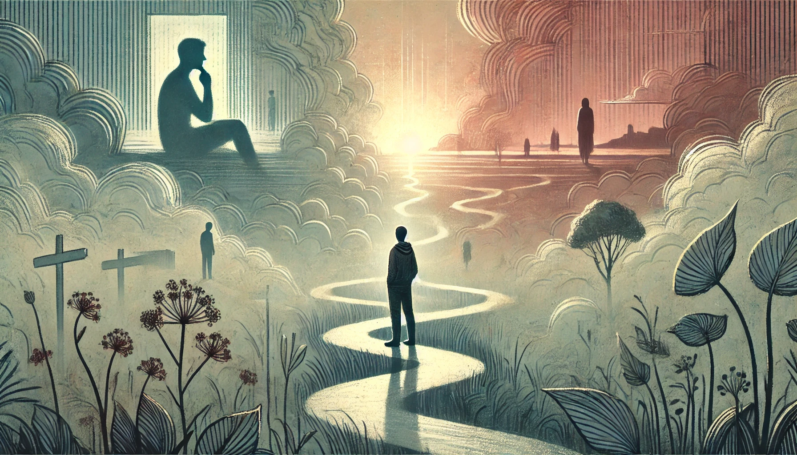

# 【生命⋅修行】其实我们一直不知道真相是什么

前天约莫到下午的时候，接到了一个电话，被告知因为种种原因，公司决定不再与我续签合同。意料之外，却又情理之中。

当时我就告诉自己，这其实是一件好事，旧的一段历史就这样正式结束了，我可以藉此全然地迈向新的人生阶段。然而，理论归理论，实际上我用了整整一天，还和大学同学U见了一面，聊了许久。直到昨天晚上，才真正地把心放松了下来。

当我开始哼着歌刷牙时，我猛然意识到，此时此刻的放松，和前一天理论上应该乐观看待这个「变故」，完全是两种状态。

而就在这时，我收到一个好兄弟给我发的微信，说以前在U 公司的老同事W找我。紧接着没多久，我就收到了 W的微信。这才知道，他早就到了菊厂，更在3年前就从机关调到了阿联酋。我去年夏天孤独地在阿联酋工作的那几个月，他一直就在那边。甚至我常去的客户那栋楼，也是他曾经常去的地方，只不过之后由于某些原因，不再去那边办公了而已。

从现在回头看过去，其实去年夏天时我所看到、感受到的一切，与我当时实际所处的境地根本就是两回事。有些明显的事实，我当时因为各种原因，自己就是无法看到。于是乎，会错过与老同事异国相聚的机会……

那么，换个角度，看我现在所处的世界。我所见、所感的一切——与此刻真正环绕我身边的事实与真相，肯定也不是一回事。不仅会有遗漏的部分，同样也会有扭曲的部分。

所以，其实我们一直不知道真相是什么！

无论过去、现在、将来！

