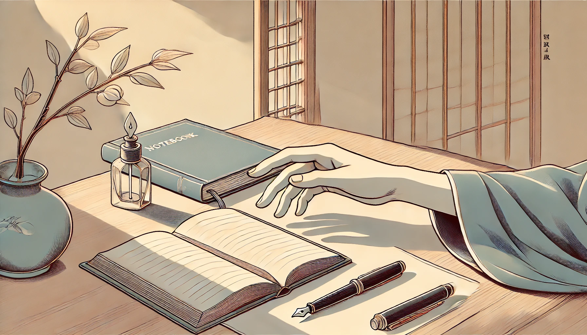

# 【生命⋅修行】硬生生打破惯性

准备和大宝带着孩子回湘西老家。

收拾行李的时候，我拿起TN的笔记本和钢笔，却到处找不到那个便携的钢笔墨水瓶。正在家里团团转呢，大宝说：

> 别带了吧，回家就好好休息，放下一切，睡觉和休息是唯一最重要的事情。

我想也是，尤其过去一个月里，其实我既没有用Timeboxing 的方法做计划，也没有记录六时书。这个TN的笔记本实际上根本就没有打开过。未来一个月，更是过年的时间，本来就想着，回家去帮爸爸妈妈干点活，背背柴。白天多干体力活，然后晚上早早睡觉，真正的休息一下。

于是乎，我决定不带笔记本和钢笔了。

但没想到的是，一想到不带着笔记本出远门，内心里死活安定不下来，以至于肉眼可见地变得郁郁寡欢起来。大宝看到，忍不住说：

> 要不你还是带着吧，为了这么个东西，不开心成这样！

我想了想，摇了摇头，说：

> 不带了。是真的用不上。
>
> 只不过，内心里克服不了这惯性，才会变得这么闷闷不乐。
>
> 但是，我决定，这一次，要硬生生打破这个惯性。

……

终于，我把本子留在了家里。不过，临走时，又忍不住把《跨越不可能》塞进了包里。人这一生，积累到这个年龄，真的是有不少的惯性。难怪说，其实无所谓「好习惯」或「坏习惯」。

只要是习惯，就意味着需要用觉察来对治。

被习惯牵着走，就意味着「真正的主人」没有做主。

像这样，有意识地硬生生打破一次惯性，挺好！

