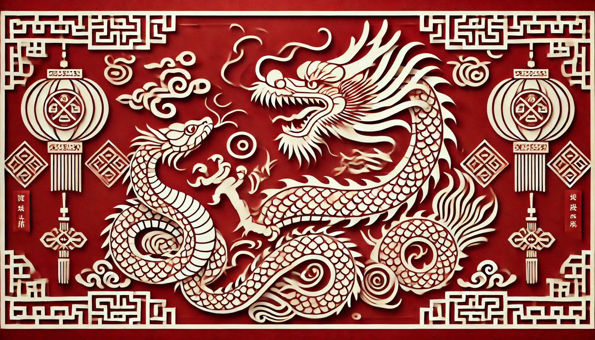

# 【生命⋅修行】将往事翻篇

看了看今天的日期，不知不觉2025年也过去了20天，哪怕按农历算的龙年，所剩也不过七八天了。

一不留神，连着三天没有写任何东西，总算将上一份工作主要遗留的事情清理了个七七八八。

三年弹指一挥间，本想在产品管理领域深耕个三、五年，却不曾造化弄人，一年后就不得不放下这些事情，转战海外市场的拓展。回头看去，还是自己没能抓住AI爆发前夜的一线机会，说服公司的管理层，真正地聚焦、真正地精兵投入到这个最有希望的领域。

当然，即便当时聚焦投入了，也未见得能成功；但没能汇聚资源投入自己所看到的方向，毕竟颇为遗憾。

过去除了做To C的营销工作，还从来没做过To B一线销售的活儿，最近两年也算是近距离感受了一下。不能落实到具体事情上就要和人打交道，对我而言还挑战挺大的。然而，这点挑战给我带来的兴奋感，远远不能弥补在一旁眼见着AI 席卷各行各业，风起云涌，自己却不能完全投入其中的焦虑感。

虽然海外的客户言必称AI，但其实还没有多少能落到实处的具体想法；而谈及那些常规的需求时，却依然沿用着老旧、已用过数十年的软件、系统需求方法论。

倒是我写文档，写邮件时，已经越来越离不开ChatGPT这样的工具了。

这种落差，让我有着强烈地感觉，软件工程领域的巨变，或许正在揭幕的边缘。而我正在告别的前东家，看起来是没什么希望抓住这机会了。

这三年工作，不管是金钱还是经验，算起来收获都不大。唯独内心经历了巨大的波澜，没有被这波涛吞噬，或许就是这几年最大最大的收获了！

借用那句老话——

**一切过往，皆为序章！**

这三年的往事，就此翻篇。抓住龙年的尾巴，好好蛰伏修养一下，待蛇年再折腾吧！

过去是「潜龙勿用」，来年该「见龙在田」了！

