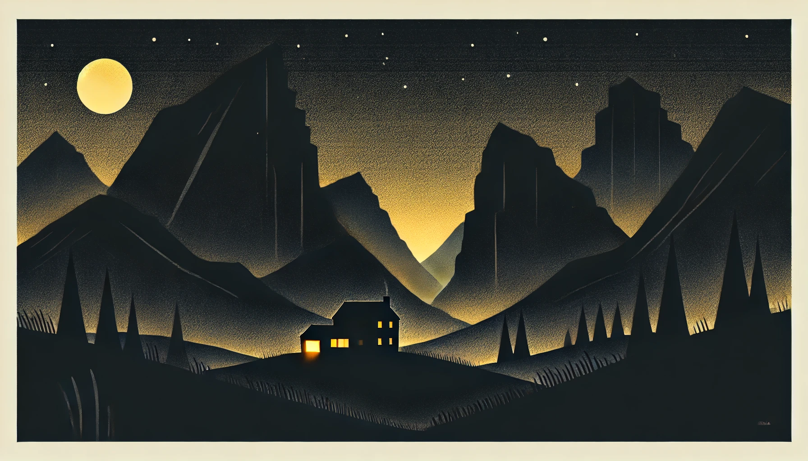

# 【随笔】何事与我相干

这几天待在山里，想着只管背柴、烧火、看娃。

但依然忍不住会掏出手机来，刷一刷天下大事。

原来，Tiktok的难民已经涌入了小红书，巴别塔一夜修成，东西方网友开始对账；

原来，特朗普和老婆双双发币，圈钱几百亿美金，政圈与币圈双双震惊；

可是，这些事情，与这大山里的我们毫无关系。

山里时而晴天，时而阴天，小鸟们在枝头没完没了地唱着歌；隔壁的公鸡追着母鸡上蹿下跳，不时飞过篱笆来寻东西吃；岳父家养的一只母羊难产，两只小羊羔没能活下来，母羊难过地独自待在一边病倒了；然后两只、两只、三只小羊羔陆续出生，在羊圈里「咩妈～咩妈」叫个不停，又变得喜气洋洋起来；

我努力地背了一天柴，歇了两天，然后又背了两天柴，正得意呢，却忘记山里气温变化飞快，不小心着凉病倒，躺倒了一整天。还连累被我一起带出去玩、刚刚恢复大鱼重新病倒。

郁闷地是，我竟然忘记了大宝的生日。既没有给她买礼物，也没有给她庆祝，在她生日这天，还得让她照顾生病的大鱼和我……

她有些难过，我则颇为愧疚！

……

这样的事情，之前从来没有发生过。我不太明白，这次自己为什么会忘记。如果说，之前是因为工作的事情，自己一门心思完全被绕进去。到了前天想要把过往都放下翻篇时，怎么也会没想起来呢？我那时还打开了万年历呢！！！

明年，要给她买两份生日礼物，答应了她的，千万别忘记了。

……

不用太久，冬天就会过去，春天就会回到山里，然后是热闹的夏天，收获的秋天。

日复一日，年复一年！

真正重要的事情真不多，千万不要再迷糊了！

