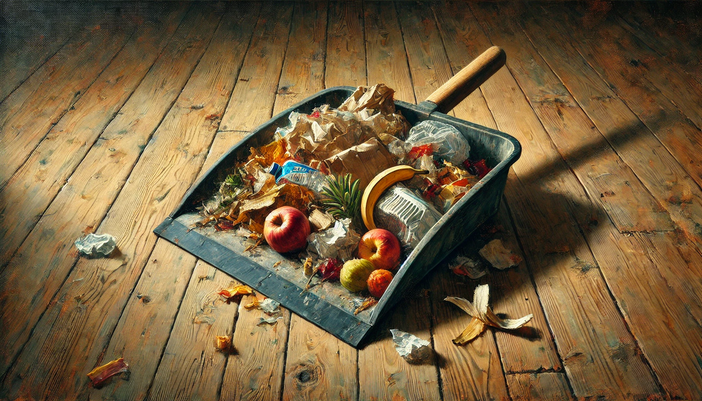

# 【生命⋅修行】承受污垢才能作主

许久没翻开青墨老师的讲课语录了，可巧昨天看到了这篇《[受垢](https://mp.weixin.qq.com/s/IeJIa9euZpQ3FGYZLxKL4g)》，讲的是《[道德经](https://zh.wikisource.org/zh-hans/%E8%80%81%E5%AD%90_(%E5%B8%9B%E6%9B%B8%E6%A0%A1%E5%8B%98%E7%89%88))》中这段：

> 受邦之诟 
>
> 是谓社稷之主 
>
> 受邦之不祥 
>
> 是谓天下之王

脑海中不由得想起很多年前，读到《[论语](https://ctext.org/analects/yao-yue/zh?searchu=%E6%9C%95%E8%BA%AC%E6%9C%89%E7%BD%AA%EF%BC%8C%E7%84%A1%E4%BB%A5%E8%90%AC%E6%96%B9%EF%BC%9B%E8%90%AC%E6%96%B9%E6%9C%89%E7%BD%AA%EF%BC%8C%E7%BD%AA%E5%9C%A8%E6%9C%95%E8%BA%AC%E3%80%82)》中类似一段话时，内心的那种震撼与感动。那句话应该是这句：

> 朕躬有罪，無以萬方；萬方有罪，罪在朕躬。

那时的我，算算时间，应该正在前一段婚姻的某段痛苦之中。当时被这「天下之主」承担所有罪过的气概所感动，大约是感动到泪光闪烁的程度。那时我责问自己，怎么就不能把小小一家的「错」与「过」，也勇敢地都承担在自己身上呢？

……

距离那一刻的感悟，想必已经超过十年。此时此刻再度回想起来，才看明白自己那时的「感动」背后，其实隐藏着多么深重的傲慢！

——承担家人的所有「过错」……

那是把自己悄悄放到怎样的道德高地上供着了哟！毕竟错都是别人犯的，自己是那个承担「罪责」的「圣人」。

……

其实，先别说这个小家了。终究是要从自己做起，从自己这颗心做起。

反观一下，自己能够坦然容下自己的那许多「垢」与「不祥」么？

我的身体、我的懒惰、我的拖延、我的小里小气、我的啰里八嗦、我的矫情，等等等等……

我能够在看到自己那种种毛病之后，还继续坦然地爱着自己，舒舒服服地继续投入自己的生活吗？

就好像静坐观息时发现念头飞跑之后，内心对着自己微微一笑：

> 喔，心又跑掉了哈……

然后继续轻松愉快地回到呼吸上那样。不苛责、不评判，只是轻轻地把自己引回到正途吗？

甚至，熟悉了知自己的各种习性、特点之后，还能好好地把这些「特点」用到「当用」之处？

首先要做到的，真是要能够受己之垢、受己之不祥，然后才能做自己的主人吧！

先搞定自己，再说身边的家人，乃至其他人与物吧！

今日小年，宜扫除！