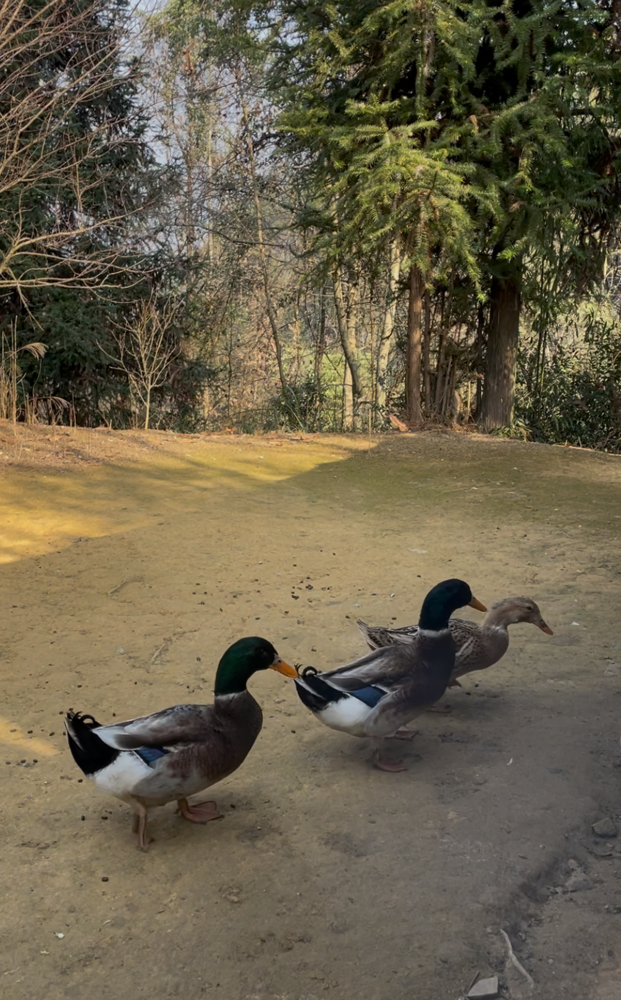
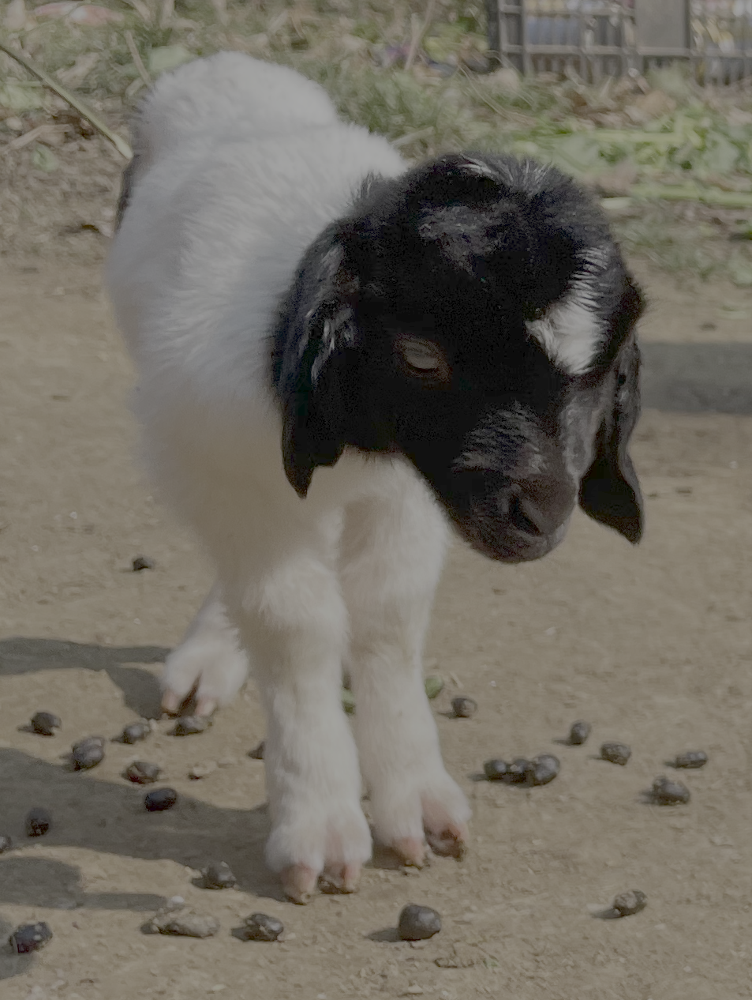
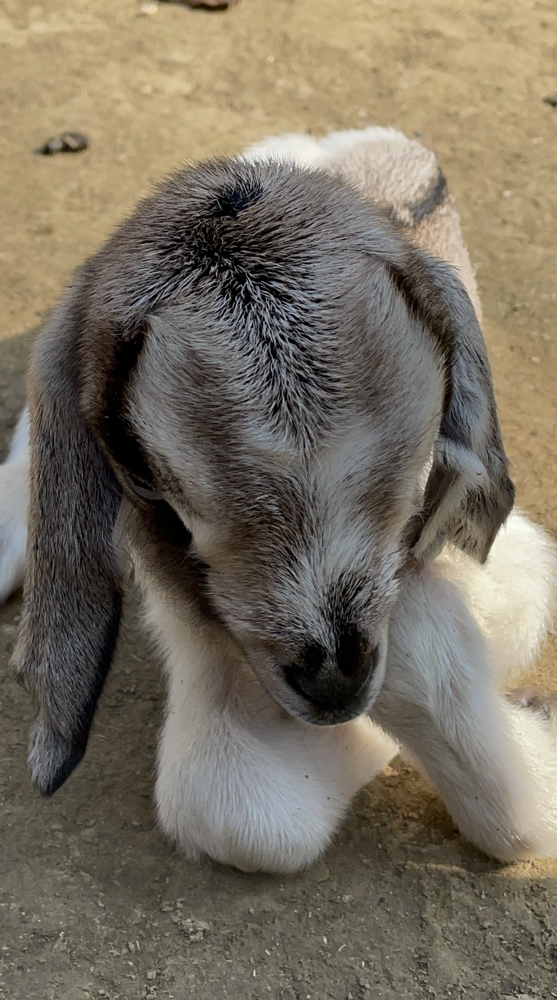

# 【随笔】意外死亡的麻鸭

山里一下雨就变得特别冷。好在昨天已经把遇到路边的一车柴都搬到了屋里，院子也打扫过了。烤着火，颇有点无所事事过年的感觉。

不过，雨稍小，岳父大人就决定还是出门上山去放羊。大宝也跟着去了，说给小羊羔喂喂奶就回来。

过了好一会儿，大宝背着一个麻袋回来了。我们正纳闷她带了什么东西回来，她从袋子里倒出来一只鸭来，一只死掉的麻鸭。

前两天，岳父给大宝杀鸭过生日时，阿宝拦着不让杀这只母鸭，于是乎岳父杀了一只公的绿头鸭。谁曾想，这只母麻鸭，今天竟然死了呢？

我自顾自地念叨着：

> 难道，那天杀的绿头鸭是它……？

我忍住没说，大宝却听到了，接茬说：

> 老公？

我点头：

> 嗯！

大宝说：

> 它们又不是鸳鸯。
>
> 不过，我觉得这绿头鸭，长得挺像鸳鸯的。

我说：

> 我也这么觉得。可是，这麻鸭死得真奇怪啊！

大宝试着给麻鸭放血，已经放不出来了。她说刚去时这鸭还在鸭棚里喘呢，死了没多久，竟然血就放不出来了。

于是，我们一边烧开水，拔鸭毛，一边揣测这只麻鸭的死因：

被什么野物袭击了？毛都拔完了也没见什么伤口。

不小心吃了毒药？其他鸭和鹅却都没事。

吃了什么鸭骨头被卡死了？鸭脖子和肚子里也没什么看上去奇怪的东西。

鸭瘟？放杨在山里的鸡鸭，一向不容易出瘟，更何况总共就这么几只鸭和鹅。

鸭脖子有一处淤青，打架把脖子折断了？从来没见鸭子打架有这么大动静。

难道真是自己把自己脖子撞断自杀了？

真是个谜案。我说：

> 可惜它死了，也没法问它！

大宝笑我：

> 它就是没死，你又能问出它什么吗？

我点着头，表示确实如此。然后，忍不住又伤春悲秋起来，说：

> 这些小东西的命运，还真是难测。
>
> 前两天阿宝专门留了它一命，不曾想，它也没能多活过三天。

……

不止鸭如此，小羊也是。前几天出生时可爱得像猫咪一样的两只小羊羔，一只黑白羊羔，一只麻羊羔。

结果，昨天，那只黑白小羊羔死了。我去羊圈给小羊羔喂奶时，那只幸存的小麻羊围着人咩咩叫，就好像我是它羊妈妈似的。

今天，大宝告诉我，那只小麻羊也死了。

我说：

> 真可怜，是不是应该把它们俩带回来，在火坑边或许能好一点？

岳母在一边听到，淡淡地说：

> 没用的，它们太弱了，活不下去！
>
> 它们妈妈就瘦弱得不行，自己都活不下去的样子。

……

可能，在这寒冷的冬天里，这些小生命本来就是这么脆弱吧？

……

然而，大宝告诉我，又有一只小黑羊出生了，母羊和它看起来都健康得很，母羊个头虽小，但是有奶，自己把小黑羊照顾得好好的。