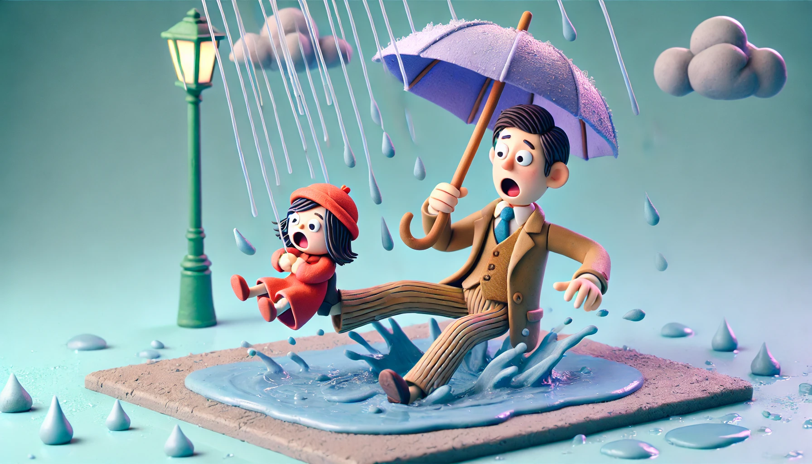

# 【随笔】摔了一跤

临要出门，偏偏雨下大了，只好找出伞来，先把大宝和大鱼送到了汽车里，又转身接阿宝。

我想着阿宝穿着棉鞋，不如抱着她走，反正就几十米的路程。便让她帮我拿着伞，把她抱起来从老屋前的小路往左边走。经过二家婆屋门前的台阶时，我对阿宝说：

> 爸爸每年都会在这里摔一两跤，不过通常都是下雪的时候。

记得以前摔跤时，这里的几节台阶都是古老的青石板做的，下雪天时上面的雪会很快变成冰，滑得不行。现在，这条路被村里重新修过，但依然是用的石板。一到雨天，依然很滑。自己的那双运动鞋，偏偏也是只适合在城市里的水泥路上行走，在水中一点防滑效果都没有。

和阿宝说呢，一边小心地下完了那几节台阶。走在下坡的石板上，我突然感觉左脚往前滑行了10公分。我心想，哎呀，差点滑倒呢。还没来得及说啥，又一只脚往前滑了过去。这次，可没有停止，两只脚全都失去了控制，我一屁股坐在地上，右手撑了一下地，弄得右手腕生疼。

好在阿宝并没有摔到，她稳稳地站在地上，一面把自己手中的雨伞交给我，一面捡起落在地上的饮料瓶，检查看摔坏没有。

我被摔得有点懵，除了手腕疼，发现尾椎骨也痛得不得了，真不想爬起来。可是，瞬间就发现，自己的腿已经被地上的积水浸湿了，感觉冰冷冰冷的。我连忙爬起来，拍了拍身上的泥水。

抬头看，小汽车就在前方不远处。我的第一个念头就是，不知道大宝看见我摔跤没有呢？

试了试胳膊腿，似乎走路没啥问题，我便牵着阿宝上了汽车。我坐上驾驶座，把雨伞放在一边副驾驶。忍着屁股湿漉漉冰冷的不适，寄上安全带。然后，对大宝说：

> 刚刚我摔了一跤，摔了个屁股蹲。

