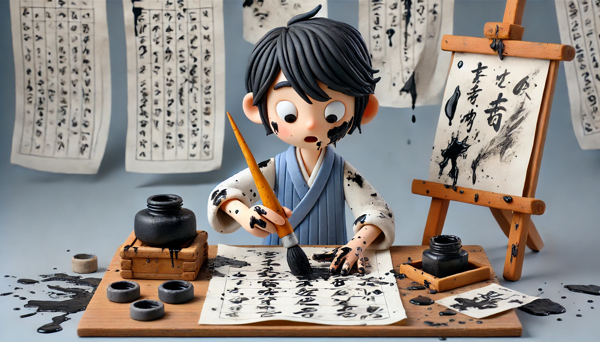

# 【随笔】一本中学时就该读的好书

这本书叫[《文章例话》](https://weread.qq.com/web/reader/b17320705d0243b174303f0)，又叫叶圣陶的二十七堂作文课。在我的Kindle里已经躺灰好几年了，前几天终于翻开读了起来。

叶圣陶先生在序里说：

> 凡是好的文章，必然有不得不写的缘故。自己有一种经验，一个意思，觉得它跟寻常的经验和意思有些不同，或者比较新鲜，或者特别深切，值得写下来作为个人生活的记录，将来需用的时候还可以供查考：为了这个缘故，作者才提起笔来写文章。否则就是自己心目中有少数或多数的人，由于彼此之间的关系，必须把经验和意思向他们倾诉：为了这个缘故，作者就提起笔来写文章。前者为的是自己，后者为的是他人，总之都不是笔墨的游戏，无所为的胡作妄为。

这几天疯狂玩了一阵子DeepSeek，更是深深地感觉到：

人与 AI 最核心的区别，恐怕就在这「不得不写」的关键之处。DeepSeek文字技巧再精妙，却离不开人类给它的一个「场景和目的」。

一切文字技巧，终究要建立在作者有那么一点特别的经验和感受，以及随之而来的创作冲动之上。

我一面读叶圣陶这本书，一面忍不住想，如果把叶圣陶先生选择的这几篇范文，扔给DeepSeek，让它也分析分析，会怎样呢？虽然这么想着，还是忍住了。

因为我发现，DeepSeek强大的文字技巧，已经给我带来了一个巨大的副作用。那就是，打开电脑，面对这屏幕，脑子里却是一阵又一阵的空白。想要说的话，到了指尖，却觉得根本无法表达自己内心的想法，会忍不住想要问问AI：

> 我想要说啥啥啥，你觉得怎么表达才好？

这种感觉，就好像习惯用GPT4之后，每逢遇到需要写英文的场合，一旦不能打开GPT，就根本不敢动笔一样。

没想到，现在写中文，竟然也遇到了类似的情况。还是被技术束缚住了，要想办法解决才好。

毕竟，一切技术，终将变成艺术。

写作看来也一样，在AI的文字能力突飞猛进的情况下，继续练习手工书写，终将会和书法一样，变成一件真正只是关乎自己的事情。

书还没读完，忍不住先推荐一下。等读完后，再仔仔细细写篇书评罢……
