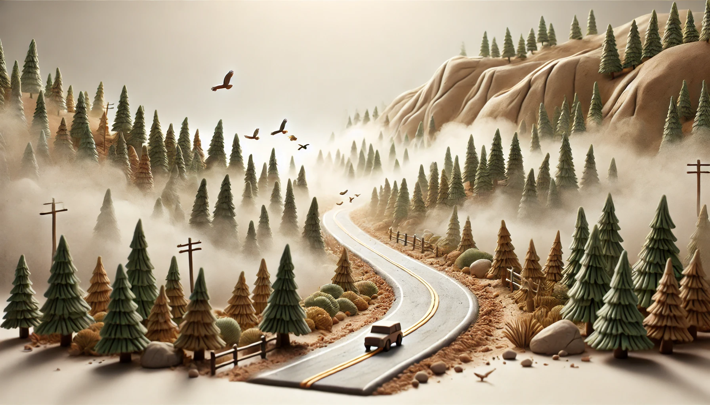

# 【随笔】最美的风景在哪里

有一天早上，大鱼有点闹腾。大宝让我开车带他出门转转，免得在家里总是打扰阿宝做作业。

大鱼是个爱坐车的家伙，听说要坐小汽车出门，乐颠颠儿地跟着我走了。雾正浓，我打开雾灯，打算慢慢开，开到哪里算哪里。

我问大鱼要开车去哪里？他想了半天，反问我：

> 往左会到哪里？会开回来吗？
>
> 往右会到哪里？是下街吗？然后呢？

到了村寨大门口，大鱼还没决定。他说：

> 爸爸，我想去风景好的那边。

我说：

> 我也不知道那边风景好，你自己感觉一下。
>
> 你觉得那边风景好，我就往哪边开。

他终于做出了决定，让我往左边开。

……

出了村寨大门往左，是往另一个镇子上的路。全是弯弯曲曲的下山路，我一面踩着刹车，转着方向盘，一面心想，不知道这里的山路，相比秋名山会如何呢？

不多时，开到了山下河滩边，山下的雾已经散开了。我记得那是以前夏天曾经带着大宝和阿宝玩过的地方。我问大鱼暑假时有没有在这里玩过，他摇摇头。我问他要不要在这里玩玩，他告诉我要继续开。

于是，我们又一路往前，一头黑黑的大水牛悠哉悠哉地站在马路正中间，我不敢惊到它，减慢速度，尽量悄悄地从它身边开过。

再往前，是一座大桥。过了桥，又需要选择前进的方向。我再次把选择权交给了大鱼，他说要去看看右边的大坝。

这是一座水电站的大坝，叫碗米坡水电站。经过大坝后，公路依旧沿着酉水河蜿蜒，左手边是红褐色美丽的石山，右侧则是平静的水库湖面。

我一面开车，一面问大鱼，这里风景如何？

他开心地点头，让我继续前进……

于是，我们经过了一个镇子，一个公园，再次开上了盘山公路。

大鱼终于说：

> 爸爸，我们回去吧。

我说：

> 那得找个地方掉头哦？

他说：

> 好，那你掉头吧。

我又往前开了一阵子，找了个空地掉头，准备往回开之前，我打开导航看了一眼，原来也才开出20多公里，我这一路开得慢，按高德的估计，其实只不过35分钟车程。

回程时，我惊奇地发现，山下的梨花已经开了，雪白的花儿一树又一树。路的另外一边，是金灿灿的迎春花。

原来，虽然只是立春后的第一天，但春天已经毋庸置疑地来到了这里。

……

回程上山的路上，大鱼说想要快点回家，于是乎，每次刚出弯我就一脚油门，好好享受了一把山路驾驶的乐趣。

几个连续的S弯下来，大鱼忽然开口：

> 爸爸，慢一点！

我问：

> 咋了？

他说：

> 我晕车了。

我笑他：

> 你这个爱车小子也会晕车？

我慢了下来，这时，已经回到了村寨门口。

驶进村寨大门，山上的雾还依旧，公路在松树林中的雾气蜿蜒着。阳光依稀从雾气后透过树林，几只小鸟被我惊起，从雾中飞出，横穿过公路，又消失在右侧的薄雾之中……

我不禁感叹，原来，这一路寻来，风景最美的地方，竟然是在家门口。

