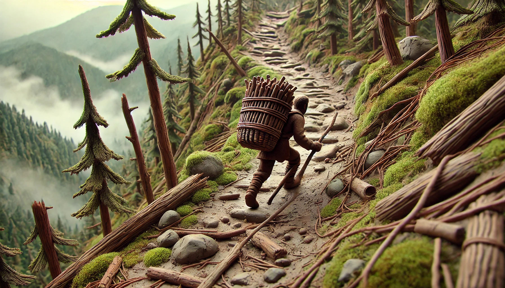

# 【生命⋅修行】终将结束的假期

再长的假期，终究也有结束的时候。

给爷爷的生日过完，我们就得动身离开老家了。

爷爷生日那天，大姑做了一个牛头火锅带过来，一家人在院子里架起一个小火锅，在锅边围坐成一圈，边吃边聊天。

爷爷和我们算了算他的年纪，已经86岁了。我忍不住想，我们此时此刻经历过的那些喜悦、伤心、苦恼、焦虑，爷爷在他86年的生涯里，一定也同样经历过。虽然形式不同，但内心的感受想来没有什么本质的区别。

我们的未来也一样，不论此刻有着怎样的焦虑、压力，希望、梦想，如果老天赏脸，终将会走到爷爷这般年纪，然后会更老，直到死去。

DeepSeek 说得不错，我总是忍不住去思考生命与死亡这样的哲学问题。但无论我想还是不想，生命总是毫不停留地一天又一天划过。内心总是充满着各种莫名其妙的波澜。

本想着帮岳父大人多背点柴，结果算起来总共也没背过几次。岳父在山里码好的许多柴垛，我和大宝一垛都没能背完。

那条山路滑得很，路上还有许多砍剩小半截的短树桩。我每次上下都低着头，小心翼翼、总担心摔倒，没想到现在闭上眼，那一段段小路，竟然清晰得像电影一样历历在目：

从大路下来，就有一道沟，沟中间放了一块儿大石头。经过那里，我每次都会先用长长的、当作登山杖的木棍撑住沟底，然后再踩上去以免摔倒。

翻过这道沟，就是一个陡坡，下去后路的正中间有一株尖尖的小树桩。得小心绕过，不过我每次背柴上来时看到它就会开心地想：「呼～到终点了！」

小路上，有许多被踩扁的小树苗。但是我记得有一株紫色树叶的小苗子，因为它漂亮的叶子，我每次路过，都可以躲开它，希望它能多活几天，也不知最终它能长到多大。

山路中间有一块巨石，我第一次背柴从那里过就走错了路，陷在荆棘从中几乎出不来。后来记住了，上到这块巨石边就要转弯，从它的右侧绕过去。

还有一处陡坡，不知谁（大概率估计是岳父大人）在那里横放了许多厚厚的松针，因此不会太滑，撑着木棍常常能轻松走过。

大部分枯死的松树都已经被岳父砍到劈成木柴，整整齐齐地码放在山路间。只剩下柴垛旁还有一株，树干和成年人腰身一般粗细，上面长满了木耳，树叶全都枯黄了，大约已经没了生气。

这样想想，那些能存活几百上千年的古树真是不容易。首先得躲过人类的刀斧，其次还得从过去常常会有的山火中幸免，最后还得自己本身能活那么长。

世外桃源般的假期时光，说结束就结束了。

在那安静的自然环境里，想要纯粹地静心啥也不干，都没那么容易做到。

虽然还没回到深圳，莫名其妙的各种压力居然就已经汹涌而来。

等真的回到都市里，想要「心定」，想必更是挑战了。

在这尘世中「修行」，还真是不容易啊。

