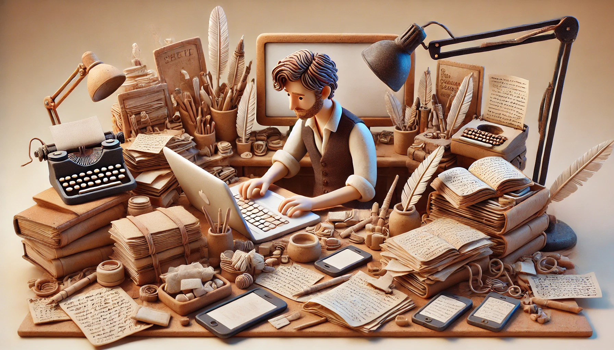

# 【随笔】论古法纯手工写作

自从发现对AI产生依赖性之后，比如昨天，标题和结尾我都忍不住求助了DeepSeek。

但同时，我也越来越觉得，坚持古法纯手工写作，其实是一件非常重要的事情。

回到了《写出我心》中所建议的那种方法——不管三七二十一，打开笔记本（或者在电脑上新建一个文档），写下一个字再说。然后下一个字，再下一个字，下一行，再下一行。

就当作是堆肥。

是的，不管是什么形式的肥料，堆着就好。

写的时候，或许又会想起一些学过的技巧或方法，读过的书或文章，见过的人或事；抑或什么也想不起来，想起什么就写什么，找不到合适的文字，就先用那些不太合适的文字。

写作和画画一样，是创作的过程，这里就必然有两种东西存在：

1. 首先是创作的冲动——要表达或需要记录的欲望、以及那欲望背后的那点主观的东西（念头，想法，感受，等等……）；
2. 其次是运用工具的技巧——文字本身就是最底层的工具（画面或视频当然是另一类底层表达工具），然后在这之上是纸、笔、电脑、AI大模型和相关的各种工具等等。

这些工具，也是一层一层叠加起来的，对应着的，其实是人类的五感或六识，所谓：

**眼耳鼻舌身意**

或者说：

**色声香味触法**

文字，可以算是「意」的抽象或压缩，有了文字的存在——「意」或者说「思想」就能够走得更远。

也许这是我的幻想，也许这是我此刻的执着：

能继续坚持古法纯手工这样，一个字一个字的输出，用着最靠近底层的工具，距离「纯白不备、神生不定、道所不载」的歧途，终究会更远一点点吧？

当然，若要更细究起来，用钢笔、毛笔和纸张是不是更「古法」一些呢？

但我以为，那些属于输出和承载「文字」的工具，与电脑、手机是一个范畴，和「文字」本身并不是同一类型的工具呢。

一个字一个字的用「古法手工」坚持写下去，不管将来自己会坚持多久，至少，今天先这样！

另外，还有一点。目前人类积累几千年的文字已经几乎被大模型「吃」完了。从现在开始，人类用「纯古法手工」输出的文字，只会变得越来越稀少呢。

虽然，稀少不一定等于稀缺。但是，到底会怎样，谁知道呀！你说呢？

