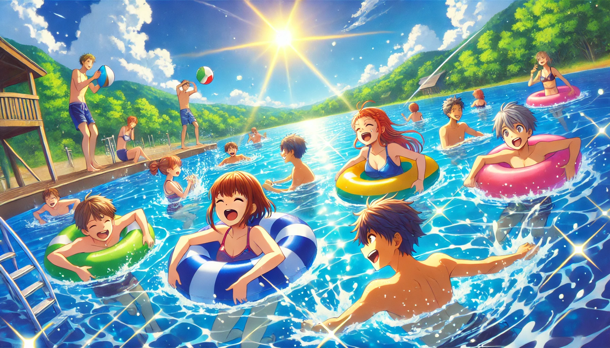

# 【生命•故事】（127）中考以及初中最后一个暑假

原以为，过去的事情会像一根绳子上的蚂蚱一样，提起来就是一串。现在却发现，许多事情已经变得模模糊糊的了。

中考就是这样。

当年的中考非常重要，除非能考上重点高中，否则上大学的机会极其渺茫。与此同时，有些好的中专分数也非常高。但我已经记不清，是在考试前填写志愿，还是在考试后了。

反正，我第一志愿报的是武昌区一所有历史的著名高中，记得班上同样成绩不错的女孩T则选择上中专。我的好朋友ZK选择继续读东湖中学，和我一起算「诸葛神数」的L发挥不太好，没能上他心仪的重点高中，也只能继续在东湖中学就读。

我也记不清，中考的考场是在哪个学校。依稀记得好像坐了大巴去，我的头发还被车窗的风吹成了奇怪的造型，搞得几个人问我是不是专门吹了头发。

似乎，路上我好像还特意和陌生人聊了聊天，事后好像班上有个女生还惊讶地夸奖我，弄得我得意了好一会儿。但也可能那是小升初考试时发生的事情。

但不管咋样，中考结束，去哪里读书的尘埃落定，初中最后一个暑假开始了。

好友ZK、ZB和L常常邀着我一同去东湖游泳，通常我们还会叫上另外几个女孩一起，其中女孩Z，就是之前和ZK因为谐音梗闹过大红脸的那个女孩子，家住梨园医院。我们最后一站一般是去到她家里接上她，同时带上她家那个巨大的汽车轮胎，有时还要带上一个西瓜。然后一起去九女墩附近的东湖室外泳池游泳。

记得有一次到她家时，她妈妈让我们在客厅等着，说她还在洗澡。不一会儿，就听见她在浴室大叫妈妈给她拿衣服。我们笑她没长大，她却白我们一眼，说：这有什么大不了的。

……

读高中后，有一次遇到ZK。他神秘兮兮地和我说：

> 嘿，你知道吗？Z有男朋友了！

我不以为然地哦了一声。

他又贱兮兮加上一句：

> 我觉得，那个男的不如你。

我嘴里依旧只是「哦？」了一声，但心里却忍不住想起那个炎炎夏日里，初中的最后一个暑假来了。

只要闭上眼，就能重新看到那夏日里闪闪发亮的阳光……

