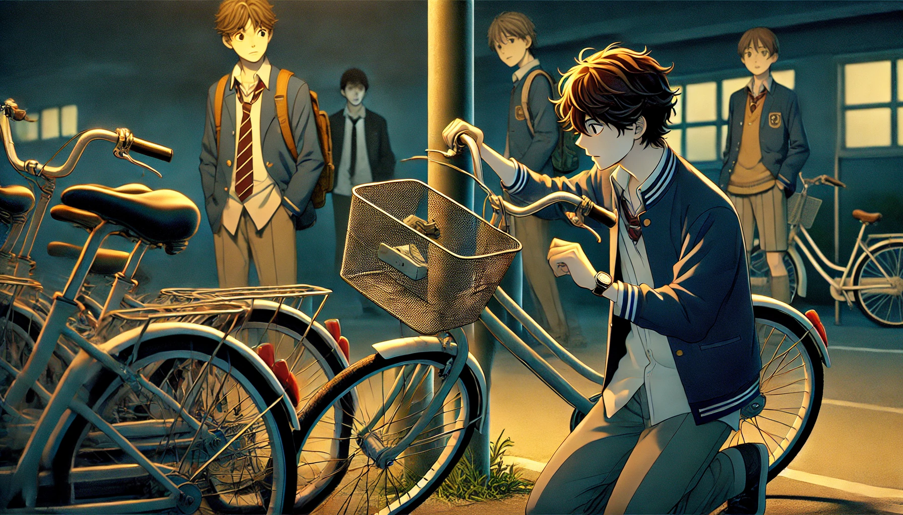

# 【生命•故事】（129）自行车筐

办信用卡送到小自行车到了，居然还配了一个小小的，安装在车龙头前的小行李筐。

记得刚开始读初中的时候，我是骑着小姨送我的那辆小自行车上学的。有一天，在学校的时候，好朋友ZK借了我的自行车骑。

结果回来时候，他抱歉地告诉我说：

> 车筐被我不小心撞坏了，回头我陪你一个。

第二天还是第三天，他告诉我说，找到可以赔我的车筐了。

我跟着他过去，发现他是找到了一个其他同学的，安装在自己自行车上的可折叠式自行车行李筐。样子很精致，也很好拆。于是他偷偷地把那个车筐拆了下来，安装在了我的自行车上。

这不是「偷」吗？

但是，「偷」东西的是他，我只是接受他的赔偿而已——我在内心里这么安慰着自己。

没想到的是，这一幕被班上另一个同学 H 看到了。

H 比我们年纪大许多，坐在班上最后一排，很有时候凶巴巴的，我有点怕他。

等到下课，H 悄悄跑去把我自行车上那个行李筐拆了下来，放到自己课桌里。

有同学看到了，赶紧告诉我，我跑去找 H 理论。他眼睛一瞪：

> 你们不也是偷别人的吗？

我一是理亏，二是他凶得不行，即便是我的好朋友ZK也不愿意和他发生正面冲突。

于是乎，等到下一次下课，他在外面玩的时候。我悄悄到他座位处，想把他藏在课桌里的自行车筐拿出来。还没得手，他就发现了。咋咋唬唬地从教室外冲过来，一把把我推开，重新把自行车筐塞进自己课桌，小心地收好。

一整天，他都看得严严的，再也没给我机会拿到自行车筐。

等放学，他就把那个筐带回家去了，再也没拿回过学校。

ZK表示：

> 我已经赔了一个车筐给你了，又被 H 抢去，他也没办法。

我也只好放弃，不过。没有保留这个偷来的东西，心里却轻松了不少。

……

记得ZK 曾经和我们悄悄聊起过H，说：

> 我经常看他坐在最后一排，悄悄拔自己长出来的胡子。
>
> 我要是长出胡子来了，才不会拔胡子呢。我会弄一把刮胡刀，悄悄地刮胡子。那才有意思嘛！