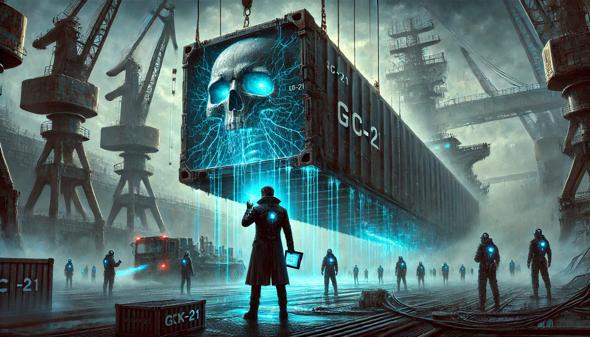

# 【随笔】末日筹码：21号方舟 - No.001 幽灵集装箱

# 末日筹码：21号方舟

## 第一回 幽灵集装箱



咸涩的海雾裹着柴油味渗进林河的鼻腔，他右腿的液压关节在潮湿空气里发出细微嗡鸣，像是某种困在金属牢笼里的蜂鸟。探照灯扫过3号装卸区时，他左眼突然刺痛——那只琥珀色虹膜泛起诡异的波纹，仿佛有活物在瞳孔深处游动。

GC-21集装箱在阴影中蛰伏。林河举起电子扫描板，红色警告框在暴雨前夕的静电干扰中扭曲变形。

"量子锁认证失效1825天？"他的声音被远处起重机的轰鸣吞没。

工头老王的后颈反射着青紫荧光，那是二十年前海底打捞留下的放射性疤痕。这个瘸腿的老男人正用军靴猛踹集装箱："贵宾货要用老式磁卡，别他妈多事！"

林河摸向腰间磁卡时，Zippo打火机从工装裤口袋滑落。弯腰瞬间，他瞥见箱底缝隙渗出蓝色粘液，那些胶状物正逆着重力向上攀爬，在锈蚀的金属表面留下枝状结晶。

"等等！这箱子在..."

银质烟嘴突然抵住他后颈，靛蓝色烟雾蛇一般缠上他的左眼。黑风衣女人的声音像浸过冰水的刀片："该看不见的，最好永远看不见。"

剧痛从视网膜炸开。林河踉跄后退，视野里浮现出骷髅图腾。那个图腾他在母亲溺亡的噩梦里见过——十年前的暴雨夜，母亲拍打舷窗的手在玻璃上留下同样形状的水痕。

"你父亲打捞过鲸落舱。"黑风衣男的手指抠进他肩章缝合处，三道金线渗出细小的血珠，"现在，签收。"

集装箱突然剧烈震动。某种尖锐物从内部刮擦金属，频率精准得令人发狂。林河握笔的手颤抖着，电子签字笔在暴雨前的低气压中爆出电火花。

老王布满疤痕的后颈突然抽搐，义眼闪过红光。这个曾与林河父亲并肩作战的老打捞员，此刻却像闻到血腥味的鲨鱼："小兔崽子，想像你爹一样喂鱼？"

吊机钢索发出垂死的呻吟。GC-21集装箱在探照灯下缓缓升起，投出的阴影竟化作衔尾巨蛇，正将整艘邮轮吞入腹中。林河左眼的刺痛达到顶峰，他看见集装箱表面爪痕状的凹陷正在渗血——那些抓痕的间距，与人类手掌完全吻合，却足足大出1.5倍。

咸雾里突然冲出个流浪汉。那人的指甲缝里嵌满黑色鳞片，枯爪死死扣住林河手腕："别碰蓝血！他们在船底养..."话未说完，男人瞳孔骤然扩散。林河掰开他僵硬的手指，腕内侧电子刺青正自我销毁：💀21→GC。

午夜钟声恰在此时敲响。十二声轰鸣震得集装箱嗡嗡作响，某种类似胎儿心跳的震动频率穿透钢板。林河的后背渗出冷汗，他忽然意识到那震动正与自己左眼的脉动同步。

"签字。"黑风衣男将电子板拍在他胸口。暴雨终于倾盆而下，反重力雨滴悬浮在半空，每颗水珠都映着母亲溺亡时扭曲的面容。

当林河被迫按下指纹时，集装箱门缝突然迸裂。蓝色粘液如箭矢般喷射，在他手臂伤口处凝结成发光的血管网络。那些黏液在地面蠕动，拼出歪斜的"HELP 林"——母亲出嫁前的姓氏。

"欢迎登船。"黑风衣女吐出的烟圈在空中凝结成骷髅。在她身后，所有塔吊工人整齐划一地转头望来，他们的眼眶里跳动着与林河左眼相同的琥珀色光芒。

电子板突然自动解锁。《关于林厚生在鲸落行动中接触GC级污染物的处置意见》的档案页在雨中翻飞，泛黄的全息照片里，父亲穿着防护服跪在某个巨大舱体前，手中捧着团蓝色荧光物——与此刻集装箱渗出的粘液一模一样。

林河摸出Zippo打火机。火苗窜起的瞬间，他看见GC-21集装箱表面浮现出无数手掌印。那些掌印正随着心跳频率涨缩，就像十年前困在沉船舱室里的母亲，用最后的力气拍打永远无法开启的救生窗。

暴雨中的邮轮响起汽笛。当集装箱被送入最底层的黑暗时，林河左眼突然流出蓝色液体。在他扭曲的视野里，整艘"珠穆朗玛"号的轮廓正在变异——钢筋铁骨褪去，露出森森白骨，二十根巨型肋骨环绕着跳动的心脏，而那心脏的形状，分明是枚染血的蓝色筹码。

----

手记：

DeepSeek的文字能力，勾起了我之前写科幻小说的欲望。我把5年前写下的片段扔给它，让他帮我扩充设定，写人物小传，起草提纲。

然后，让它开始给我书写。本来想让他每次写上个3000字，但没想到，第一次它只给我吐出来500余字。我再次强调字数，没想到它虽然自顾自逼逼叨说要写3500字：

``` 
好的，我需要帮助用户完成第一回《幽灵集装箱》的小说内容，要求3000到3500字，并且用户建议的小说名字是《末日筹码：21号方舟》。用户之前已经提供了详细的大纲、人物设定和场景细节，现在需要根据这些信息扩展成一个完整的章节。

首先，我需要回顾用户提供的所有材料，确保不遗漏任何关键元素。用户提到希望名字改为《末日筹码：21号方舟》，这需要将标题调整，并在内容中适当呼应这个标题。第一回的主要出场人物包括林河、工头老王、黑风衣男女和神秘流浪汉，每个人物都有详细的小传和隐藏线索。

接下来，我需要将现有的草稿扩展至要求的字数。现有的草稿大约1000多字，需要再增加2000字左右。扩展的部分需要更详细的场景描写、人物互动、内心活动，以及埋设更多的伏笔和线索。同时，要确保节奏紧凑，每段结尾有钩子，吸引读者继续阅读。

用户提到如果一次难以完成，可以分多次完成。但根据用户当前的请求，可能需要一次性完成整个章节。因此，我需要高效地组织内容，确保每个场景都充分展开，同时保持故事的连贯性和紧张感。

需要注意的几个关键点：

1. 林河的液压关节和左眼虹膜异色，这些特征需要在适当的地方描写，增强人物形象。

2. GC-21集装箱的异常现象，如温度差异、爪痕、蓝色粘液，需要详细描述，营造悬疑氛围。

3. 黑风衣男女的神秘身份和他们的对话，要透露出他们的目的和背后的组织。

4. 流浪汉的出现和死亡，留下的电子刺青线索，需要自然过渡，并暗示后续情节。

5. 工头老王的前史和隐藏设定，如右眼义眼和放射性疤痕，需在对话或动作中体现。

6. 结尾的钩子，如蓝色粘液拼出的“HELP 林”，电子档案的弹出，以及所有工人的异常反应，需要处理得扣人心弦。

在扩展过程中，可以增加更多环境描写，比如码头的潮湿、咸雾的质感、机械的声音等，增强场景的真实感。同时，通过林河的视角，展示他的内心活动和记忆闪回，比如父亲的过去和母亲的死亡，加深人物深度。

对话部分需要更自然，带有潜台词，比如黑风衣男女的话语中暗含威胁和暗示，工头老王的态度显示出对过去的阴影。动作描写要具体，比如林河被抓住手腕时的疼痛，集装箱震动时的紧张感。

需要确保所有隐藏线索都被合理布置，如GC编号、电子刺青的符号、蓝色粘液的成分等，这些在后续章节中会有解释，但在本章中要引起读者的好奇。

最后，检查是否符合用户要求的风格，即紧凑的节奏、影视化笔法，以及每章结尾的悬念。确保语言流畅，避免冗长，同时细节丰富，画面感强。
```

但结果，依然只能写出上面那1000多字来。或许，这就是所谓大部分大模型的1000字魔咒吧。无奈……