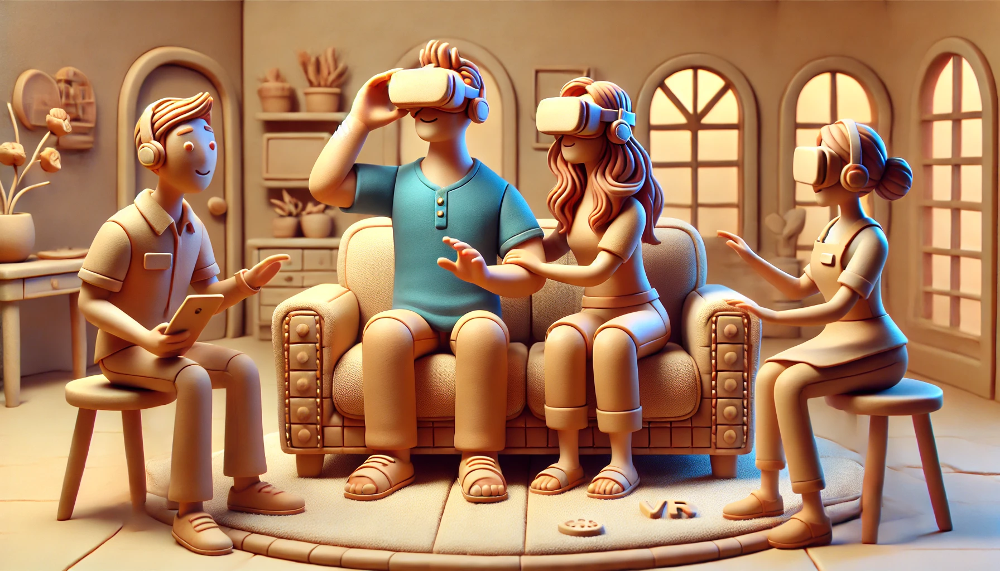

# 20250216【随笔】后知后觉体验VisionPro

情人节那天，和大宝一起去了苹果店，想问问摔裂屏幕的老iPad Pro还能不能修复。结果到了那里忽然发现，那里摆着一桌子Vision Pro。

一问，现场预约体验，只需要等待几分钟。

想起去年刚在上市发售时，曾经心心念念要找地方体验来着，后来一直没抽出合适的时间。

没想到，现在竟然这么容易了。

于是乎，大宝去一边「天才吧」排队咨询维修的问题，我留在Vision Pro的柜台，给我们俩各自都预约了一个体验活动。

不到5分钟，店里的工作人员就过来找我，说现在可以体验了。让我先去商店正中间的那一圈沙发处坐下。工作人员拿了我的眼镜测量度数，我坐下来四下环顾。一共四个座位，对面有一个女士正戴着 Vision Pro，似乎正在认真地把玩。我旁边的位置是留个大宝的，斜对角的座位刚好空下来，不知是不是很快就会有其他顾客来体验。

正瞅着，工作人员拿着一副Vision Pro走了过来，放在我身边的小桌板上，开始和我介绍最基本的三种操作方法，全都是只需要用眼神注视 + 手势就行，而且不管手放在哪里都行：

1. 轻捏手指——点选
2. 捏住手指拖动——拖动
3. 双手捏住合拢或拉开——缩放

然后，就开始了！

可能是我从来没有怎么真正使用过VR/AR设备的原因，那种进入一个虚拟空间，整个视野就是大屏幕的感觉实在震撼。

接着工作人员帮我把空间调成全虚拟，我环顾四周，发现自己就好像真的坐在了一个沙滩上一模一样。

后来播放那几段空间视频的时候的沉浸感更是让人惊叹，尤其是那段生日蛋糕的视频，让人忍不住想象，假如自己家人那些值得纪念的片段，也能这样重现，那该是多么令人难忘啊！

于是乎，后面的游戏我都没兴趣多玩。只是自顾自想象了一下，如果小红书和抖音的视频全都变成了这种空间版本，那简直要逆天了。

之后，体验时间临结束前，我在虚拟空间里打开了几个软件窗口，摆放在那里想象了一下，用Vision Pro + 一个蓝牙键盘，来替代自己工作时的屏幕和键盘，会是怎样的感觉——呼！前所未有的大屏幕，确实太爽了。

我的体验结束后，坐在一边的大宝还在那里玩，于是我坐到她旁边去听工作人员继续介绍。

闹了半天，用iPhone 15 pro就可以拍摄Vision Pro上可以观看的空间版视频。

可是，显然，听工作人员的语气，并不觉得这个Vision Pro是值得购买的东西，或许，他们也觉得这玩意儿太新、太贵了。目前也太沉、太不方便了。

……

只不过，回家后，大宝和我拍了好几段空间版的视频。期待着将来，在VR 设备上重现他们的那一天。

