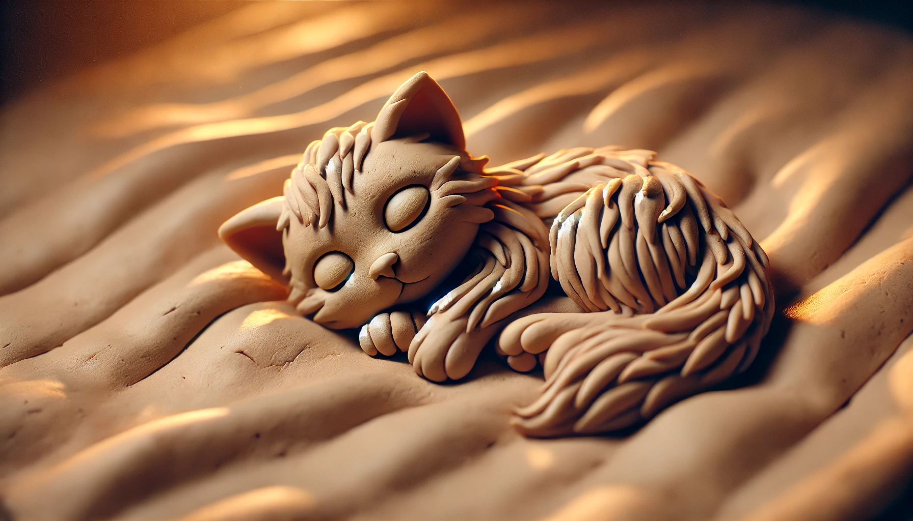

# 【生命⋅修行】睡觉睡觉睡觉

重要的事情，不得不一而再，再而三地提醒自己。

前几天晚上的熬夜，让我不得不再次正视这个事实：自己在睡觉这方面还需要更加重视。

没睡好的后果是显而易见的：

1. 第二天甚至更长时间持续地效率下降。
2. 更加暴躁易怒，容易吼孩子。
3. 更容易不开心，包括陷入责怪自己的情绪。
4. 心脏部位的不舒服感变多、变频繁。

记得那天和老同事聚会吃饭，老领导S在饭桌上一直聊着身体问题，忽然他说：

> 有好多人都是心梗死的……

话音刚落，饭桌上几个人都苦笑着捂着胸口：

> 你不要除了吓自己，还吓我们好不好？
>
> 听你这么一说，瞬间心脏就不舒服起来了！

然而，熬夜和心梗的密切相关性，就我所知是确确实实存在的。为了避免自己想当然，写到这里，我又去找GPT o1验证了一下，它巴拉巴拉说了一堆，最后总结说：

> **简而言之**，最新的医学证据认为：熬夜与心梗之间存在较明确的关联性，主要通过交感神经、内分泌、代谢、炎症等多维度的干扰来提高心血管事件风险。长期稳定地保证高质量睡眠，是预防心血管疾病和心梗的基础生活方式之一。

而DeepSeek R1开篇也给出了这么一个看起来的确权威的最新研究结论：

> 1. **风险显著提升**
>    - 多项前瞻性队列研究和Meta分析指出，长期睡眠不足（每日<6小时）的人群，心梗风险增加约20%-30%（2021年《European Heart Journal》研究）。
>    - 夜班工作者因昼夜节律紊乱，心梗发生率比正常作息者高23%-41%（2020年《JACC》研究）。
> 2. **急性风险证据**
>    - **《Nature》子刊（2022）研究**发现，急性睡眠剥夺（如连续24小时不睡）可导致内皮功能障碍和动脉僵硬，短期内升高心血管事件风险。

显然，哪怕是单纯从我优先级为0 的最高目标来看，睡觉也是极其极其重要的事情。

==健康快乐地和一家人一起生活，越长久越好==

快乐、健康、长久——这几乎全都和睡觉密切地正相关。

所以，说回到睡觉，我认为菜头在这篇《[长新冠和睡眠问题](https://mp.weixin.qq.com/s/AYspoJqKZjPUowOVFRoMnw)》里最后总结的三点，其中两点对我来说都很适用：

1. 是不是在遭受缓慢的压力影响？如果自己身上的确有压力，得想办法释放压力，或者是终止压力，多少感受一下放松是怎样的一种状态。
2. 不要脸的心态：睡不好就睡不好吧，睡不着就起来看两页书，睡不好就起来带着猫咪扮夜游神...... 

至于辅酶 Q10 （CoQ10），我总觉得，人体自己能合成的东西，考虑从外界补充的方案时，需要更小心一点。至少，类似的另一个明确对睡眠有改善作用的玩意——褪黑素——我就一直不敢吃。

怕的就是，万一外来摄入量太大，结果干扰了人体自然合成的机制，造成药物依赖就得不偿失了。

更何况，我的心跳并没有像菜头那样，在新冠后出现动辄100的情况，应该属于相对正常的状态。

那么，我还是以自然调节为主吧，首先做好以下三点：

1. 早上定点起床，晚上定点上床。
2. 白天多晒太阳，晚上避免蓝光。起床后及睡前1～2小时谢绝电子设备。
3. 白天加大身体锻炼的强度与时间（坚持金刚功，加上囚徒健身，得空就拉伸 + 练太极），有机会就多走路、爬山。

其次嘛，争取能够做到睡前打坐冥想个几分钟到半小时。另外，万一睡不着也正好趁机观呼吸，就当作老天专门赐予的，让我练习内观的时间。

再就是一些其他辅助的手段咯，不必勉强，顺势而为，比如：

1. 中午时间允许就睡个半小时午觉，或者只是静坐也行。
2. 健康饮食：晚餐少吃点，晚餐可选择富含色氨酸的食物（如牛奶、燕麦、核桃），白天补充维生素B6和镁（香蕉、杏仁与黑巧克力）。

总而言之，好好睡觉！！！

