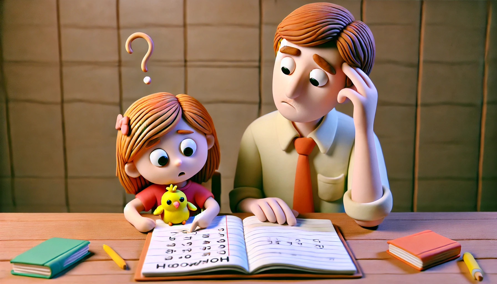

# 【生命⋅修行】鸡娃不如鸡自己

晚上，我猫在卧室里敲着电脑，阿宝跑了过来，小小声地和我说：

> 我有道题不会。

我暗自想着，要不先给她讲讲吧，便说道：

> 那你拿过来吧？

她开心地跑出去，不一会儿，拿着自己的作业本又跑了回来，指着翻看那页最下面的位置：

> 就是这道。

我一看，原来是一道思考题。她已经做完了前两小题，最后一题空着。我便问她：

> 这题目是什么意思知道吗？

她鼓着眼睛，露出一副奇怪的表情，摇着头。我按耐住性子，说：

> 你再读一下题目，告诉我，你觉得这道题目是什么意思？

她使劲儿把自己的表情弄得更加奇怪，看着我，摇着头说：

> 不知道！

我有点想发火，说：

> 我读给你听，题目说：
>
> 「如果大车和小车同时用，你有什么乘车方案？」
>
> 你想想看，这是在问什么问题？

她手里拿着弟弟的玩具，一边玩，一边继续摇头说：

> 不知道！

一问三不知，还不专心，我怒气瞬间被点爆！我一把从她手中抢过弟弟的玩具，扔给在一旁的弟弟，语气已经是按耐不住的暴躁：

> 你动脑筋想一想啊！想都不想，还不专心！！！
>
> 不专心，不想做，就空着好了。
>
> 反正明天老师会教你们的。

阿宝的眼泪唰地就涌了出来，说：

> 不要！

我又觉得有点过意不去了，再次把满腔的怒火憋了回去，耐着性子重新问：

> 那你说，你需要爸爸直接告诉你答案，还是教你怎么做这道题？

阿宝用手指在作业本上画着圈，嗫嚅着：

> 教我做……

好吧，我心想，至少她还愿意听「怎么做」。我深深吸了一口气，想了想应该怎么组织语言，从哪里拆解起，然后重新开口：

> 这样吧。这个题目的意思是，25个游客，大车能装7人，小车能装4人。如果你同时用大车和小车，问你需要用几辆大车，几辆小车？
>
> 你明白了吗？

没想到，阿宝忍住眼泪，看着我，继续摇了摇头，说：

> 不知道。

我差点再次绷不住，强忍着，指着她已经完成的前两小题，问她：

> 那我问你，你已经做出来的这一题，说最少要用几辆大车，是什么意思？

她瞪大了眼睛，看着我，又来了一句：

> 不知道。

我再次爆发了：

> 这也不知道？那你怎么做出来的？
>
> 你有没有在思考我问你的问题？

阿宝再次哭出了声音。大宝在外面听见了，赶紧过来解围，说让她先去刷牙洗脸，等我忙完了，再给她讲这一题。借此，把阿宝领了出去。

……

等我忙完手上的活儿，走出卧室，来到阿宝的房间。见她已经几乎收拾完了书包，桌面上还放着笔盒，还有那本摊开着的，没有完成的作业本。

她见我进来，扔给我一根铅笔头：

> 爸爸帮我削！

我之前和她说过，爸爸最喜欢削铅笔了，所以她每次都乐得我帮她削。于是，我接过铅笔，帮她削好。又打开她的铅笔盒，挨个把铅笔都削尖。这时，我瞅见桌上玩具盒子里放着的数数棒。我灵机一动，把数数棒拿了出来，数了数，正好超过25根。于是，我数好25根小木棍，递给阿宝，说：

> 你数一下，是不是25根，我们假装这是25名乘客。

她开心地数了起来，然后告诉我确实是25。我从桌上顺手拿了一个盒子，一块橡皮，假装是大车和小车，再次给她讲解起这道题目来。终于，她明白了这道题问什么问题，该怎么算，以及答案是什么。只不过，她还是没有动笔。

我问她为什么不写，她说：

> 不知道！

我有点纳闷地问她：

> 你已经知道这个题目在问什么了，也会做，知道怎么计算了对吗？

她点点头，说：

> 是的。

我说：

> 那没关系了。作业的目的是检查和练习你应该学会的内容。你已经会了，作业写不写完不重要。

一向乖乖听老师话的阿宝又有点着急起来。我看她又想哭，赶紧说：

> 你今天先睡觉，明天一早我教你怎么写上去就好。

她终于同意了。

我转身去卫生间刷牙洗脸，她进卧室前转过头来对我说：

> 爸爸，赶紧进来和我们一起睡觉啊！
>
> 要躺在我身边！！！

我心里一暖：

> 唉，你怎么也知道，爸爸最喜欢全家人在一起的感觉。
>
> 你才八岁不到，二年级而已……我为什么要对你这么不耐心呢？

……

卧室门「砰」地一声关上，我赶紧拿出手机，问DeepSeek：

> 一给孩子讲作业她就哭哭啼啼怎么办

DeepSeek洋洋洒洒给我传授了许多招，最后说道：

> **关键原则**：将“完成作业”的目标暂时后置，优先修复孩子对学习的情绪关联。通过降低威胁感、提升掌控力，逐步重建信心，才能长期改善作业态度。

修复「情绪关联」？

如果说，重点首先是情绪问题，那么我所知道的，最重要的方法，不是要帮助她做什么，而是家长自己在同样、类似情况下的一遍又一遍「身教」。

说到自己的情绪问题，我不得不羞愧地低下头。

我希望阿宝能在面对困难和压力时，依旧稳稳地，保持淡定，相信自己，坚持行动，绝不放弃。

可我自己呢？

阿宝用哭泣来面对压力与困难，这是她现在的模式。

而我自己，也有我自己面对压力与困难的模式。

而且，具体到这个写作业的场景，引来「情绪」入场的根本原因，不正是我一边在辅导阿宝的同时，一边还惦记着「下一件事情」吗？

想要孩子更好，身为父母，没什么可以或者需要特别去做的事儿。

唯一可行的方向，就是对着自己开刀：

* 要觉察，不要陷入自己那些不应景的模式中，任自己被情绪把控。
* 要一心一境，不要面对一个人，做着一件事，心里却还惦记着下一件，乃至许多件事情。

至于孩子，会在这样的环境下，成长为什么模样，那是她自己的生命历程。我们有幸近距离参与这个过程，付出爱，给她自由，在她真正需要时尽自己所能地提供帮助，然后满怀着感激与欣喜地期待开会结果，不就好了吗？

==鸡娃，毕竟不如鸡自己！==

