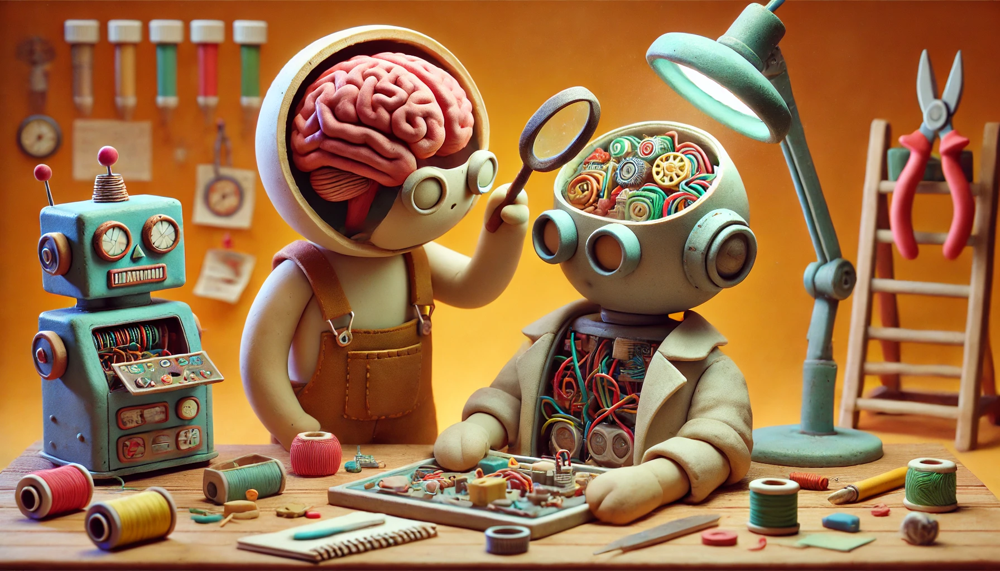

# 【随笔】关于人性的新洞察

下午又听了一个多小时[Lex Fridman 与Dylan Patel 和Lambert的访谈](https://www.youtube.com/watch?v=_1f-o0nqpEI&list=PLrAXtmErZgOdP_8GztsuKi9nrraNbKKp4)。有点停不下来，到中间的时候，谈到了人类这个宏大的名词。Lex Fridman 秀了一下他问Gemini、DeepSeek、GPT o1 等AI下面这个问题的答案。

## Give one truly novel insight about humans 给出一个关于人性真正新颖的洞察

我忍不住也试了试这个问题，由于各种奇妙的随机性，我得到的答案与Lex Fridman不太一样。

### GPT o3-mini-high 的回答：

One truly novel insight about humans is that our inner contradictions—our drive to be uniquely ourselves while simultaneously craving deep connection with others—aren’t problems to solve but the very source of our creativity and evolution. This tension between individuality and belonging fuels our ability to reimagine our lives and communities, turning what might seem like flaws into powerful engines for growth.

关于人类的一个真正新颖的见解是：我们内心的矛盾——既渴望独一无二的个体性，又迫切需要与他人建立深厚的联系——并不是需要解决的问题，而恰恰是激发创造力和推动进化的源泉。这种个体性与归属感之间的张力，正是促使我们不断重塑生活和社区，将看似缺陷的部分转化为成长的强大动力。

### GPT o1 的回答：

**English:** A novel insight about humans is that we unwittingly fill every gap in our knowledge with narratives—mini “stories” that we assume to be true. This isn’t just an occasional mistake; it’s a built-in mechanism that both drives our creativity and shapes our biases. By realizing that our minds are constantly self-stitching partial truths into coherent tales, we become more self-aware, more flexible in thinking, and surprisingly, more empathetic.

**Chinese (中文):** 一个新颖的关于人类的洞察在于：我们会不自觉地用各种叙事——也就是那些被我们想当然当成真实的小“故事”——来填补认知的空白。这并不仅仅是偶尔的疏漏，而是一种内在的思维机制，既能激发我们的创造力，也会塑造我们的偏见。认识到这种“自我拼接”随时在发生，能让我们更加自知、思维更灵活，也更能体会他人的处境。

 ### Gemini 2.0 Flash Thinking的回答：

**English:**

> **The most profoundly human experience is not connection, but rather the shared understanding of our fundamental and inalienable solitude.**  We are each, ultimately, an island of consciousness, separated by the very boundaries of our individual perception.  Yet, it is in the *shared* recognition of this intrinsic aloneness – the quiet empathy that arises from knowing every other human also carries this internal universe of one – that we find our deepest and most authentic form of connection. We are collectively solitary, and this shared solitude is the bedrock of our shared humanity.

**Chinese:**

> **最深刻的人类体验并非连接，而是对我们根本且不可剥夺的孤独的共同理解。**  我们每个人，终究都是意识的孤岛，被我们各自感知的边界所隔绝。 然而，正是在 *共同* 认识到这种内在的孤独时——源于知晓每一个其他人也都携带着这单人宇宙的静默共情中——我们找到了最深刻、最真实的连接形式。 我们是集体孤独的，而这种共享的孤独是我们共同人性的基石。

### Claude 3.7 Sonnet的回答：

人类最有趣的矛盾之一是我们对隐私的渴望与对连接的需求之间的拉扯。我们同时建造围墙和门铃摄像头来保护自己，却又通过在社交媒体上分享我们最私密的时刻来寻求认同。这种矛盾不仅仅是社会习俗，而是深植于我们的神经系统中，反映了我们作为自主但又彼此依赖的生物的进化历史。

One of humanity's most fascinating contradictions is the tension between our desire for privacy and our need for connection. We simultaneously build walls and install doorbell cameras to protect ourselves, while seeking validation by sharing our most intimate moments on social media. This contradiction isn't just social custom—it's hardwired into our neural architecture, reflecting our evolutionary history as beings who are both autonomous and interdependent.

### DeepSeek R1的回答：

**Novel Insight:**
Humans are the only species that engage in "conceptual niche construction," creating abstract systems (e.g., laws, currencies, digital identities) that act as artificial evolutionary pressures, reshaping both biology and culture in a feedback loop unseen in nature.

**新颖洞见:**
人类是唯一从事“概念生态位构建”的物种，通过创造抽象体系（如法律、货币、数字身份），这些体系成为人为的进化压力，以自然界中未曾出现的方式重塑生物特性和文化，形成独特的反馈循环。

### DeepSeek R1 中文人话版回答：

**通俗版解释：**  
人类有个“超能力”——**发明看不见的规则**，然后自己活在这些规则里，越活越上头，最后连身体和脑子都被这些规则改造了。  

**比如：**  
1. **钱**：本来只是一张纸或一串数字，但全人类都同意“钱=价值”，结果钱变成了生存必需品，甚至让人为它加班、熬夜、掉头发。  
2. **抖音/微信**：明明是人类自己编出来的社交规则（点赞、粉丝、人设），结果反过来逼着人天天拍视频、P图、焦虑“为什么没人给我点赞”。  
3. **法律**：一群人约定“杀人坐牢”，结果这个虚构的规则真能让人不敢动刀，甚至改变了人类合作的方式。  

**更绝的是**：  
- 动物顶多搭个窝（物理改变环境），而人类能凭空造出“元宇宙”“区块链”这种连摸都摸不到的“虚拟世界”，还心甘情愿在里面打工赚钱。  
- 这些规则会自我升级（比如从现金到扫码支付），逼着人类必须跟着变（现在不会用手机支付的老人连菜都难买）。  
- 最后连人体都受影响：因为整天坐着刷手机，人类颈椎变弯了；因为依赖GPS，大脑记路功能退化了…  

**简单说：**  
人类是自己编了一套“大型生存游戏规则”，然后被自己编的规则玩得团团转，还顺便把身体和文明都改造成了适应这套规则的样子——这事儿只有人类干得出来。

----

说实在话，每一家大模型，都有自己独特角度的看法，说得都不错。GPT o1 的观点最中规中矩，不那么新颖。而 Gemini 和 DeepSeek 的回答，都有点儿意思。

当然DeepSeek强大的「说人话」功能，依旧显得格外出类拔萃。

但关于这件事儿，我正好有自己不同的看法。

在我看来，大模型们的观点，是站在人类相比其它生命的角度得出的。

我却会想，相比AI，人类究竟还有什么独特之处呢？

记得昨天，在我眼睁睁看着豆包用超过我十倍的耐心，尝试着从各个角度为阿宝讲解数学题，最后终于让她满意地点头之后。

我不由得感慨地对大宝说：

> 看来，在辅导孩子们功课方面，我要退居二线，把位置让给AI了。
>
> 你说，在这样的时代，我们身为人类，应该学点什么？还能做点什么呢？

大宝笑着说：

> 跟我学太极拳吧！

确实，在目前的阶段，我们人类的身体，正是 AI 们所不具备的东西。

具体来说，除了「意」之外的「眼」、「耳」、「鼻」、「舌」、「身」，代表了各种个样的生物传感器。而目前AI 能用到的传感器，则相对来说要简陋得多了。

更何况，如今的大语言模型，相对于人类的「意识」来说，只是一个「抄袭」的中间版本。

每一个人类的意识，都是在婴幼儿时，先基于「眼」、「耳」、「鼻」、「舌」、「身」这些输入、输出的反复学习、建模，形成自我意识，然后再与语言相结合，乃至与人类历史积累的知识碰撞、整合。最终在实践中，创造出新的知识来。

而大语言模型们，现在还只是从语言入手，也止于语言的技巧。至于藏在这些语言背后的「知识」。其实都是过去的人类创造的，而大语言模型此刻就算再怎么能做题、作诗，它们实际上对于这些知识的掌握，最多止步于普朗克司机的水平。

想要像Alpha Go一样，在某个领域真正地站在人类之上。AI 必须要与真实的物理世界建立联系，建立起真正的世界模型，并开始用真实世界的实践来检验自己的世界模型与知识。目前那些藏在语言背后的人类历史知识，只有在和他自己的世界模型与知识建立联系之后，才能落地。

不过，话说回来。在数学方面，AI 是不是可以更容易地走到前面去呢？毕竟，数学，是抽象中的抽象啊！

