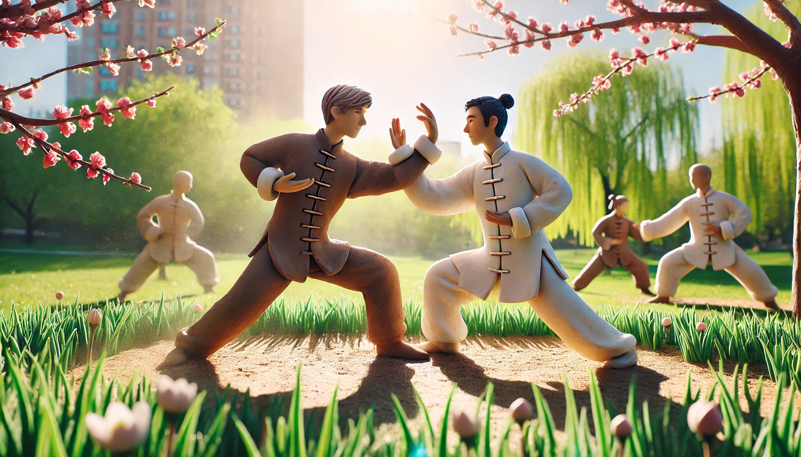
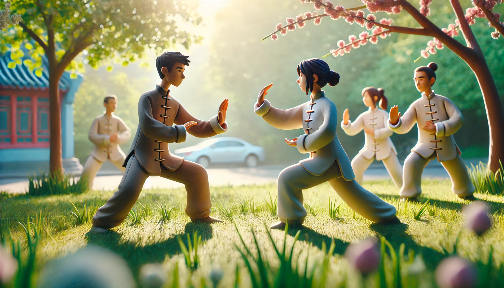

# 【随笔】被阳光驱散的回南天

天气预报说，回南天要来了。

到了周三晚上，地面就开始变得湿漉漉起来。周四早上，空气明显变得更暖、更加湿润，天也阴沉沉的，一副要捏出水来的样子。

大宝说要去拳场练拳，正好我也没啥特别的事情，便一块儿跟了过去。

临出门拿水的时候，我在门口看见大宝平时去练拳时用的背包，遮阳帽和干净的T恤都在里面。

心思动了一下，心想要不要拿上她的帽子和T恤呢？抬头，从走廊的窗户看出去，天依然阴沉沉的，满是铅灰色的云朵。于是我想，算了吧，应该用不上。便用一个小手提纸袋装上两人的水壶，出门了。

谁曾想，出了世界之窗地铁站的时候，太阳就从云层中探出头来。

全身上下的毛孔都能感觉到，空气中的水蒸气在阳光的照射下，迅速地消散着，空气也渐渐变得更加热乎乎起来。

我和大宝打趣儿：

> 自己的「气听法」终究还是没有练成啊，早上曾经心思一动，想要拿你的帽子来着。
>
> 但是，最终还是没能听明白「老天爷」给我的信号。
>
> 看样子还得多多修炼，把心中的各种杂念都去掉，这些来自「老天爷」的呼唤，才能更容易被听见和识别出来吧。

出门时，我的薄羽绒服都还在身上，在阳光下运动了一会儿，就发现其实穿个T-恤就足够了。

我把汗湿的运动夹克扔在阳光下的木板上晒着，可是大宝没有带T-恤，只好继续穿着外套练拳。

终究，练了个酣畅淋漓。

……

很久没有痛快地对抗过了，今天早上醒来，发现骨头缝都是酸痛酸痛的。

看来，真正地推推手，哪怕只是定步推手，锻炼强度都会超过囚徒健身。

今天，阳光更好了！

原本要造访深圳的回南天，似乎已经消失得无影无踪。

