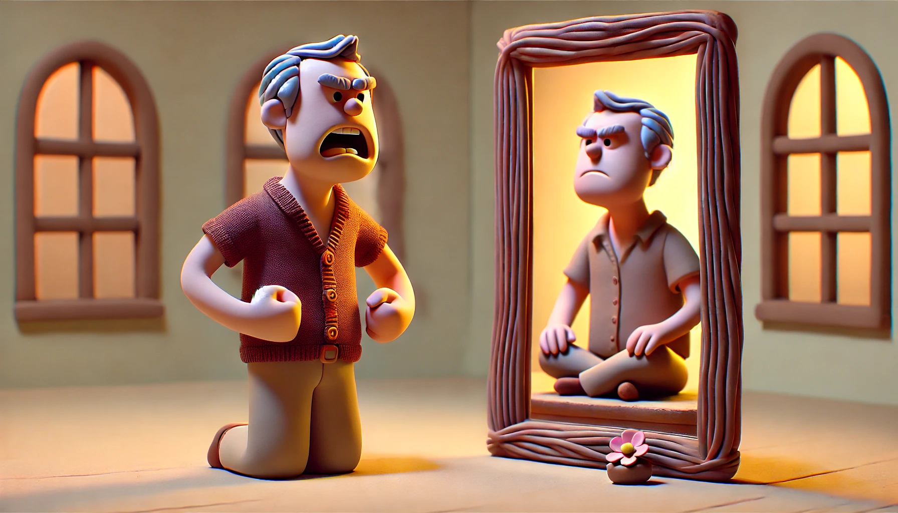

# 【生命⋅修行】顺变

一些意想不到的事情，总是会突然发生……

本来正在和几个老朋友在奈雪喝着茶，热烈地探讨着各种「搞钱」途径。

忽然，接到大宝的电话，说大鱼发烧了，让我快回来。

于是乎，改变计划，等回到家时，大鱼已经在床上睡着了。

吃晚饭，陪阿宝做了会儿她的功课，便早早陪阿宝上床睡觉了。

然而，没过多久，大宝一声尖叫把我从床上叫了起来。

大鱼侧躺在床上，两眼发直，小拳头弯在身前，握得紧紧的……

> 怎么办？

不敢耽搁，我们赶紧换了衣服，把阿宝也叫了起来，打了辆车就直奔最近的医院。

虽然大鱼的抽搐并没有持续太久，但这是头一次出现这种情况。而且，用DeepSeek 和小爱同学搜到的各种文章都建议：

> 小孩子发烧第一次由发烧引起的抽搐，要立即送去医院。

我们一到医院，我还在这边挂号，那边护士就已经把大鱼接过去，安排到病床上了。他检查了一会儿，告诉我们说：

> 现在已经恢复，不需要抢救了。
>
> 医生马上来，估计要立刻安排住院。

医生过来，立刻给我开了住院单，我拿着转身去缴费，等回过头来，大宝已经被护士领着，带着孩子们去了住院部。

至少5试管血被抽出来，意味着一系列的检查，然后打滞留针，上心电、血氧监控。

看着一切慢慢稳定下来，大宝留下来在医院照顾大鱼，我则带着阿宝回家睡觉。

……

小家伙在住院部怎么也休息不好，问过医生，确认大概率就是纯热性惊厥，我便要求带孩子出院了。

不过，我们还是听医生的，让大鱼在医院待满了24小时，等到第三天上午才开始办理出院手续。

护士开始和我交代，如果再次发生惊厥时，我们应该怎么护理：

> 1. 让小孩子侧卧，或者头偏向一边，不要让他受伤，注意有没有口鼻分泌物，不要堵住呼吸道。
> 2. 小孩子可能会咬到舌头，拿个硬东西，不会被咬断的，比如不锈钢筷子从大牙那边穿过去。不要用会被咬断的木头筷子。
> 3. 惊厥时不要动他。保证安全就好，立即送到最近的医院，或者叫救护车。

我听着，听着，不由得有些走神，接着胸口竟然开始发闷。

明明已经知道2～5岁的小孩子，因为发热引起惊厥的概率，只不过2%～5%；其中可能继发癫痫的概率又只有5%。

但还是闷闷地，怎么也无法开解自己。

回到家是这样，一天后还是这样。

然而，大鱼已经一天又一天的开始恢复了。

……

唉，我这容易多想的性格，真是让自己难受。

……

……

想起之前有一天，大宝很开心的时候。她问我开不开心，我说：

> 还行。

她问我：

> 有什么事情不开心吗？

我说：

> 其实也没有，除了对未来有些担忧。

她问我担忧的是什么，我说：

> 两件事：
>
> 一个是担心，这个世界最终会变成电影《终结者》里的样子。
>
> 另一个是担心，我的内心总是斗争得一塌糊涂，最终会变得完全崩溃。

但，正如大宝之后和我说的那样。

第一个担心，我其实什么也做不了；

第二个，似乎我可以做点什么，但是我应该做点什么呢？

……

……

……

让心去顺应这世间一切变化，说来容易，做起来却难上加难。

不知不觉地，因为大鱼这次突如其来地生病，四天过去了，除了勉强地带着阿宝，我几乎都没有办法做任何其他事情，稍微空下来就头昏脑胀地只想睡觉。

今天打算捡起中断三天的写作练习，辅导阿宝作业时想要收个尾，但一心二用的后果就是把阿宝吼到眼泪汪汪。

……

……

……

……

……

总是和这世界犯顶，真难受！

知道要顺变，想要学会顺变，咋就那么难！

仔细想想，一定是有什么结构导致的这个结果吧？自己大脑的结构，日常作息的结构，到底有哪些不对的地方，又可以怎么变化？从哪里入手改变呢？

