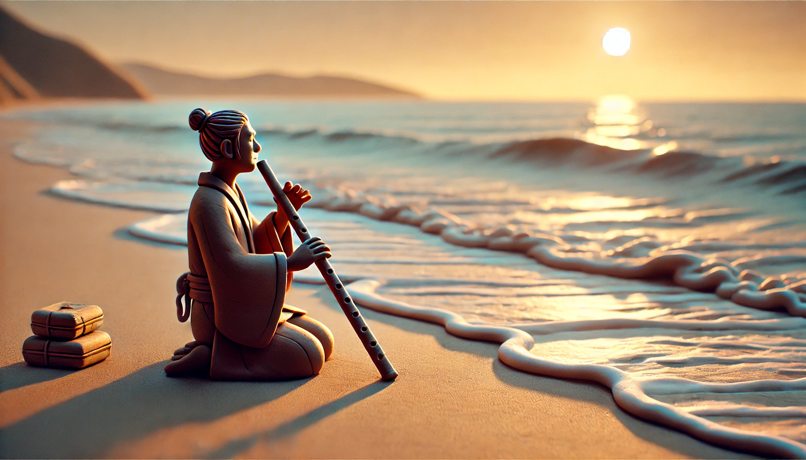

# 【随笔】吹不响的尺八

这一个多星期，不仅没怎么锻炼，连尺八也没怎么摸过了。

早上晾衣服时，看见阳光从云层后探出头来，赶紧叫上大宝，带着孩子们出了门。

而我，顺手就拿上了搁在门口鞋柜上，却已过多星期没吹过的尺八。

阿宝上过了她的攀岩课，又和大鱼一起在公园里玩了起来。

大宝练着太极，我则比划了几下金刚功之后就开始吹尺八。

果然是三天不练门外汉，前一阵子明明可以熟练地吹出筒音的共鸣，现在却控制不好了。

要么共鸣声出不来，要么就飙到甲音去了。

……

吃过午饭，阿宝想要去深圳湾公园海边的沙滩玩。

我继续拿着尺八，在他们玩耍的海边沙滩上支起野餐凳，想要继续练习。

然而，更奇怪的事情发生了：

坐在海边，竟然吹不响了！

太阳躲在云层后面，海风有些大，我戴上连帽衫的帽子，背对着风。

脑子里不由得浮现出《尺八•一声一世》里龚琳娜说的话：

> 尺八里摇头吹奏出来的那些音，就好像海风和海浪的声音……

然而，我对着歌口吹气，尺八却只发出「呼呼」的声音。

我调整了几次角度，依旧如此，只是「呼呼呼」的，竟然完全吹不响了。

我很有点纳闷，不明白究竟是什么原因，于是更加静不下心来了。

……

我把尺八横放在腿上，闭上眼睛，海风依旧。

几只小鸟从头顶啾啾叫着飞过，我仔细听过去，才发现不止这几只鸟，其实远处的树林里，有更多小鸟在唱着歌。

沙滩上，许多孩子们愉快地笑着、叫着，盖过了大海的波浪声。更远的一处海边工地，则传来隆隆的打桩声。

我拿起尺八，又试了试，

呜～～～

这次竟然吹响了！

……

或许，学尺八也应该去找个老师了，自己再这么瞎练下去，在弯路上走得太远也说不定呢……

