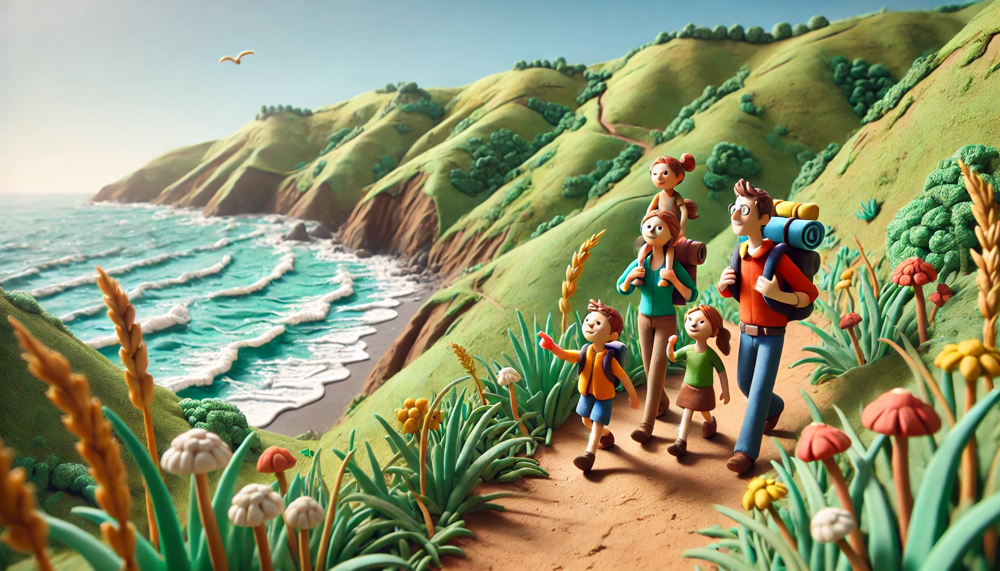
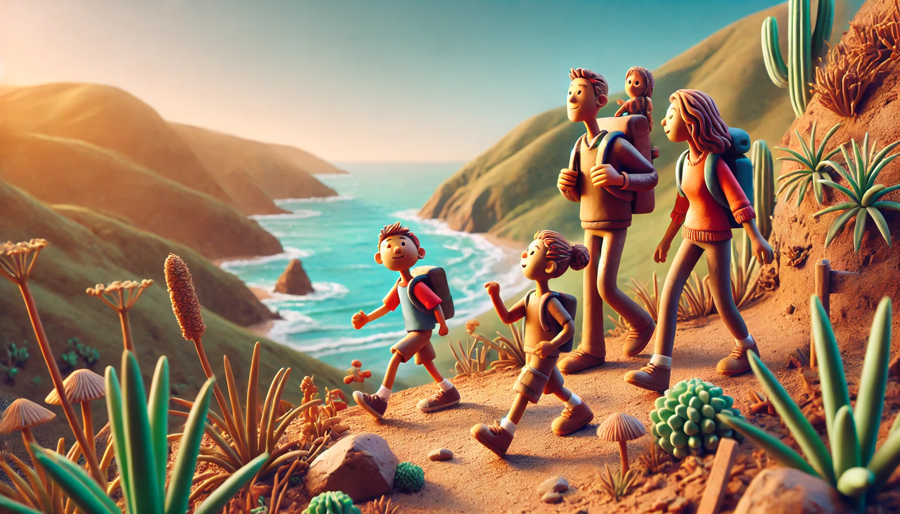

# 【随笔】终于又爬山了

翻看手机的运动记录，今天竟然走了2万多步，上一次超过2万步的记录，还是2月14情人节的时候，陪大宝从海边一直走到沙河创下的。再往前翻，那都是去年10月份的事情了。

今天本来的计划，只是带着两个孩子骑自行车去外面随便遛一圈。到了四海公园，池塘里的蝌蚪已经出来不少，许多小孩子趴在池塘边抓蝌蚪。出乎意料的是，保安明明就在旁边，竟然也不管了。

于是乎，孩子们嚷嚷着要回家拿网兜，尤其是阿宝，恨不得让我立刻回家给她把网兜拿来。

大宝不许，说今天没有计划要抓蝌蚪的。然而，过了一会儿，她又想出一个妥协的主意：

> 让爸爸给你抓一个蝌蚪，然后我们就出发去南山。

阿宝同意了。本来坐在池塘边草地上晒太阳、吹尺八的我，只好放下尺八，来到池塘边。

水蛮清的，我伸手试了试，发现只要有耐心，用一片树叶，就能把那些小小的，游得慢的蝌蚪抓上来。大宝又用橘子皮给两个孩子一人做了一个小碗，于是，我给他们每个人都抓了三只蝌蚪。

玩了一会儿，他们终于满意地把小蝌蚪放回了池塘，跟着我们出发去南山了。

想着大鱼很久没运动，我们本来没指望爬太高，可是大鱼和阿宝惦记着我们答应他们爬到山顶就给他们买烤肠，自己再爬下山就给他们买薯片，竟然一路坚持着登顶，又一路自己走下了山。然后还要再折回出发地点去拿自行车，中途还要去甜品店吃双皮奶。等回到家，已经是晚上快8点钟了。

这一趟下来，真的是把我们两个大人都累坏了。

如果能经常坚持这样的运动量，对我们全家的健康应该都不错吧？

或许，不用多久，哪一天两个小家伙都能跟着我们轻松走个15～20公里。我们就可以带着他们尝试一下各种徒步绿道，乃至香港的麦理浩径呢……

