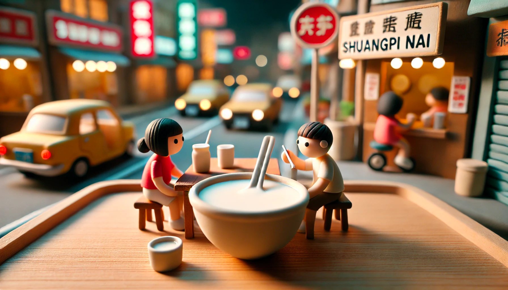
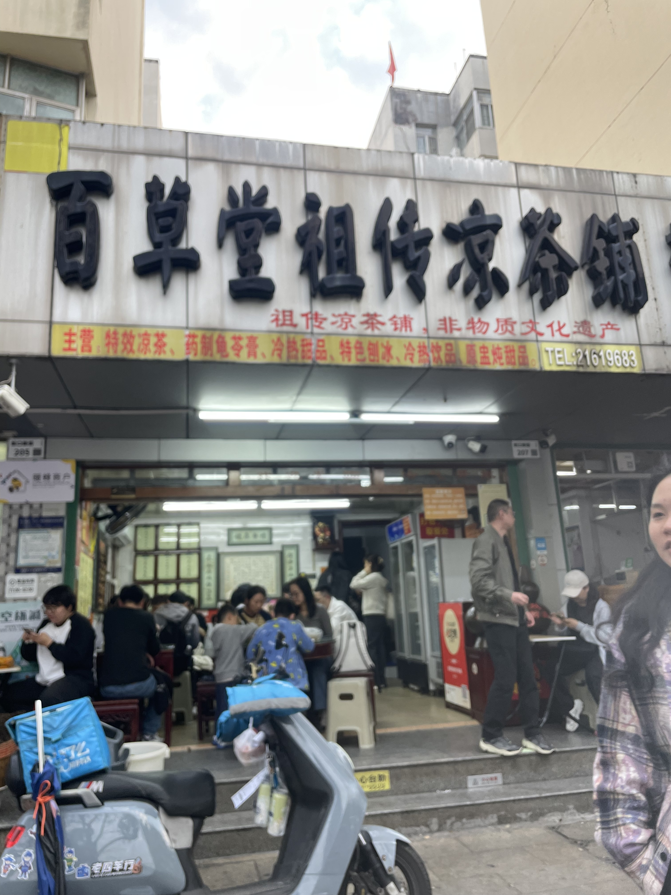

# 【随笔】最好吃的双皮奶

这个「最」字，真不敢随便说。哪怕是像美食这种，几乎纯粹是主观的感觉，也怕自己因为各种偶然因素，做出了不准确的评判。

然而，到了昨天晚上，当我再一次坐在他家门口，将就着几张塑料小凳，一张简易折叠桌，面对着马路上的滚滚车流，忍受着一旁等位置的食客们焦灼的目光，风卷残云地干完一碗热乎乎、香喷喷、奶香味浓郁的双皮奶时，我还是决定，再写随笔时，就把这家店的双皮奶册封为我们家吃过的——

**最好吃的双皮奶！**

不止是我这么认为，大宝、阿宝、大鱼一致都这么认为。

昨晚从南山下来，路过一家写着老字号、彪炳着「水牛奶」、现做「姜撞奶」与双皮奶的甜品店时，小家伙们就嚷嚷着要来一碗双皮奶。

等两个小家伙一人端着一碗双皮奶各来了一口，我们就问道：

> 好吃吗？你们觉得哪一家的最好吃？

阿宝悄悄摇了摇头。大鱼则点头说：

> 好吃，所有的双皮奶都好吃。
>
> 嗯，不过，那家甜品店的，要更好吃一些……

我心想，是吗？好奇地拿过大鱼的勺子，舀了一勺放进自己嘴里。

> 味道很好呀！
>
> 香甜，嫩滑，好吃着呢……

我使劲回忆最近吃过的其他家双皮奶的味道。比如顺德逢简水乡小镇上那两三家，还有深圳蘩楼的，其它甜品店，以及大宝和孩子们所推崇的那家甜品店……

很遗憾，我几乎想不起来其它家的味道是啥样子的。看来，我就是一个业余水准的吃货。脑子里没有「绝对音准」，估计像所有业余玩家一样，只能把两样放在一起比较时，才能区别出高下来。

于是乎，当孩子们念叨着还要再去「那家甜品店」吃好吃的双皮奶时，我欣然同意了。

看看距离，蛇口新街离我们所在的地方，走路应该不会超过15分钟，这么短的时间内，即便是我这样的业余选手，应该也能尝出区别来吧！

果不其然！

就是这家「百草堂」，不愧让孩子们一致惦记着，最近几个月，吃过不下十家不同的双皮奶，甚至包括「源产地」顺德的街边小店，每一次PK，赢家都是他！

而且，只要10元一碗，好像还是所有这些甜品店中，最最便宜的一家，真是好吃又实惠呀！

对了，他们家隔壁铺面也是他们租下来的，靠着甜品，撑起两家铺面，在当下这个年代，还是有点真功夫呢！

对了，孩子们一致认为第二好吃的「双皮奶」也非常值得期待，那是大宝自己亲手制作的。

上次是她第一次出手，就能赢得这么高的排名，可惜我只吃了一口。期待着下一次她再大显身手！