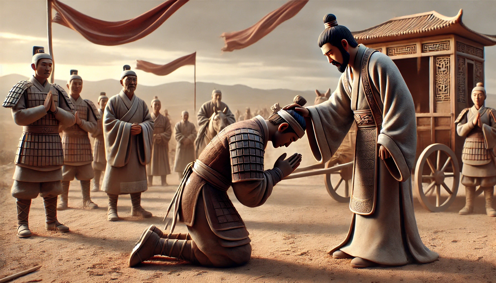

# 【随笔】降将和降将有啥不一样

汉光武帝刘秀是个脑子极其清楚，并且宅心仁厚的皇帝。他几乎是孤身一人到河北，打天下的团队、根据地全靠收编。

在前期，大约只要是投降，在他这里好赖都能封个列侯。除了王朗、刘盆子这类曾经举大旗和他争天下的人，因为被框死在「对手」这个位置上，最多只能留条命在。

然而，更始帝刘玄手下有两个能人，后来都降了刘秀，待遇结局却大不同。为什么呢？《资治通鉴》里的原文是这样的：

> 鮑永、馮衍審知更始已亡，乃發喪，出儲大伯等，封上印綬，悉罷兵，幅巾詣河內，帝見永，問曰：「卿眾安在？」永離席叩頭曰：「臣事更始，不能令全，誠慚以其眾幸富貴，故悉罷之。」帝曰：「卿言大。」而意不悅。既而永以立功見用，衍遂廢棄。永謂衍曰：「昔高祖賞季布之罪，誅丁固之功；今遭明主，亦何憂哉！」衍曰：「人有挑其鄰人之妻者，其長者罵而少者報之。後其夫死，取其長者。或謂之曰：『夫非罵爾者邪？』曰：『在人欲其報我，在我欲其罵人也！』夫天命難知，人道易守，守道之臣，何患死亡！」

鮑永和馮衍有什么不一样呢？

乍一看，都是有本事，且固守臣子本分的老实人。然而，细品他们两人所讲的故事，我却发现了其中的区别。

鲍永和馮衍讲了当年汉高祖刘邦用季布、斩丁固的故事，想要告诉馮衍不必担心：刘秀和刘邦一样是明主；而且形势也和高祖当年一样，正要从争夺天下的当口，走向坐稳天下的局面；你我这样的本分能干的老实人，正是刘秀要用的人才，要树立的标杆。

馮衍却讲了一个类似，但更加「三俗」的故事。说的是，过去有个人勾引邻居老王家的老婆，被对方年长的大老婆骂了一顿，倒是对方年轻的小老婆对他投桃报李。后来，老王过世，这个人却娶了那个骂过他的大老婆。别人问他为啥，他说：这还不简单吗？形势不同了呀！当年我是勾引人妻，当然喜欢人家红杏出墙、投桃报李；现在我是要娶老婆，当然是要娶那个能把偷人者骂个狗血淋头，直接赶走的人啊！

馮衍说，这天命如何，我哪里算得明白，我还是守我的「人道」，该干嘛，就干嘛！

馮衍和鲍永讲的是同一个道理，但这背后的「人情」却大不相同。对人情把握比计算机还精准的刘秀，怎么可能品不出这其中的区别来呢？

一个尊天子为明君，自谦地认定，自己这人设，正是明君在不远的将来，马上就会需要的标杆；

另一个则傲娇地尊自己为「明白人」，自忖管它时局变化，我就是一个干事儿的人，你用我是你聪明，你不用我是你的损失。

如果说鲍永遣散部队，几个人只身投降刘秀，已经让刘秀心里咯噔不爽，那这傲娇的馮衍，就成了这不爽之气的出口。

> 你不是NB吗？我就不用你，咋了？

都是聪明本分人，只是另一个「傲」了那么一丢丢～

翻看[冯衍](https://zh.wikipedia.org/wiki/%E9%A6%AE%E8%A1%8D)的生平，说他幼有奇才，九岁能诵《[诗](https://zh.wikipedia.org/wiki/詩經)》，二十岁博通群书。

唉，看来，小时候享有聪明的盛名，反而是个拖累啊！

