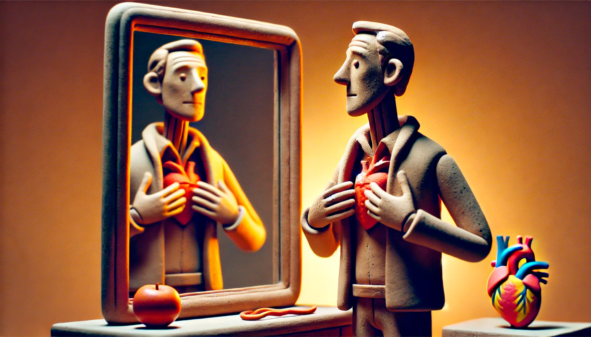

# 【生命⋅修行】八风吹不动

> 稽首天中天，毫光照大千；
>
> 八风吹不动，端坐紫金莲。

传说苏轼写下这首诗后，让人拿去给佛印和尚看，满怀期待，以为会收获心心相印的点赞一枚。谁知道，只收到了「放屁」两个大字。苏轼一怒之下，跑去找佛印理论。

结果，佛印给他来了一句：

> 八风吹不动，一屁打过江！

想起这个故事，实在是发现早上从梦中醒来开始，内心就被各种个样的事情扰动。

昨天的事，今天的事，孩子的行为，大宝的话语。自己的心，就像是汪洋大海中的一片树叶，被风啊、浪啊打得滴溜溜乱转，一刻不能停息。

「利」，「衰」，「毁」，「誉」，「称」，「讥」，「苦」，「乐」，这四顺四逆八件事儿，没有哪一样不会扰动人心的。

而且，我发现人的这颗心啊，越来越像一个长满倒钩刺的大毛球，所有经过的事儿，几乎都会被它狠狠抓取一把，挂住许多毛，最终简直看不清这颗心原来的模样。

连刮个胡子，脑子里都会想起无数有关刮胡子和刮胡刀的过往片段，其实人生才经历这么短短几十年而已，一颗心却被那么多事情影响过，又留下了那么多痕迹。

难怪，人终究要老要死，实在是那颗心要装的东西太多，再也装不动了。

……

还是苏轼厉害啊！这一生波折困扰，最终都化作了他内心成长养分。

还有张至顺老道长也是，他一生90多年所经历过的苦痛、伤害、背叛，与我所经历过的事情相比，恐怕就像大江大湖与小鱼塘的区别一样。然而，老道长最后却依旧如赤子一般。

……

真希望，有一天我能和他们一样，拥有真正的人生智慧，拥有那颗如如不动的心啊！

只不过，此时此刻，这颗心还是会因为或顺或逆的外境跌宕起伏。

可是，虽然「心」会动，「我」又何必跟着呢？

