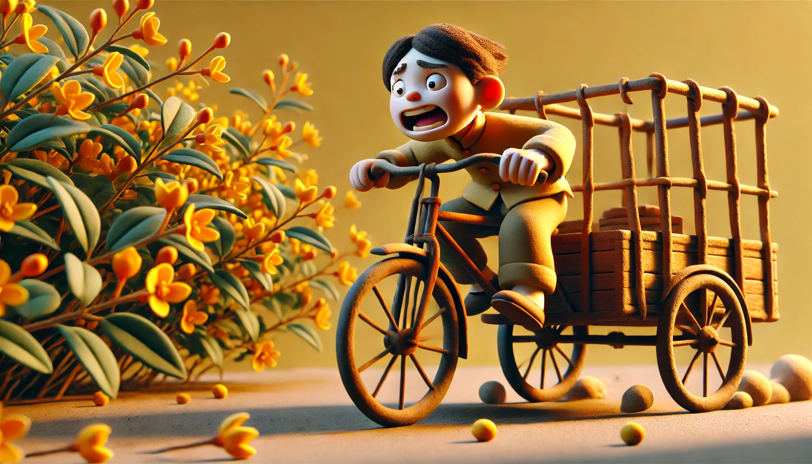

# 【生命•故事】（130）自行车、三轮车、粮店及其他

继阿宝学会骑自行车之后，大鱼也开始想要学自行车了。

但很显然，虽然大鱼已经能熟练地骑扭扭车和平衡车，但重新骑上带辅助轮的自行车之后，我发现他原来骑平衡车所掌握的技巧与本能，反而成了「障碍」。带着辅助轮的自行车，本质上和三轮车一样，需要的技巧和骑自行车、平衡车完全不同。

记得教阿宝骑自行车时，她羡慕别人不需要辅助轮，然后我们着急，把辅助轮拆了。没想到那种不平稳的感觉，立刻就把她吓坏，过了几年不肯骑车。

直到后来长高，在脚能够到地的时候，又重新买了一辆。

我告诉她，摔100跤之后，就能完全学会骑车了。

然后，还扶着她，让她从迪卡侬，沿着沙河一路骑回家。这才算是基本学会了，后来还继续让我保护了好一段时间，才能越来越多地自己上路。

记得我小时候学骑自行车可不是这样子的。

所有的小孩子开始学骑车时，都没有自行车高。家里的自行车矮一点也至少是26吋的，更多的则是二八大杠。那时候，我们学车基本遵循大人教的四步法：

1. 学推车：能双手扶龙头推稳车辆。更进一步可以只扶着座椅推，感受车往那边倒，龙头往那边歪就可以回正的车感。
2. 单脚滑行：双手扶着龙头，左脚踩在脚蹬上，另一只脚蹬地面后，站直了靠在自行车上滑行。
3. 踩三角：在熟练单脚滑行之后，把右脚从三脚架的空隙里伸过去，踩住右边的脚蹬。一上一下地蹬脚踏前进。我曾经见过一个小男孩，骑一辆二八大杠。人还没车高，只能踩三角，居然也能够大胆地踩整圈，还骑得飞快。真的是厉害。
4. 真正的骑行：这一步必须等长到足够高之后才行。有时候有些小孩子着急，才刚刚长过横杠的高度，就学着从前面抬脚跨过去。还够不着座椅，于是就跨坐在横杠上，脚不够长踩不了整圈，就先一上一下地踩半圈。呼～现在想想那场景，都觉得蛋疼。

我反正怕摔，但也摔了不少跤，最后还是用小姨的女式自行车，在小学5、6年级时才彻底学会骑车的。

……

家里有一辆父母用来拖货物的三轮车，爸爸进汽水啤酒时都要用到，通常是他骑车，妈妈在后面推。我也想要学会骑，然后才能帮忙。

于是空闲时，妈妈就会带着我，到工厂的道路上练习。

学会自行车后再骑三轮车，真是又别扭又危险。这种感觉，恐怕和大鱼第一次跨上带辅助轮的自行车时是一模一样的。虽然在正常情况下，三轮车并不会倒。但是路会不平，车身总会略略向路边倾斜。这时，骑自行车养车的条件反射，会让我们轻微地把龙头向着车身倾斜的方向扭过去。自行车会因此恢复平衡，但三轮车并不会。于是我们会不由自主地继续向着一边拧龙头。

结果就是，车身没恢复平衡，车子先冲到路边去了。

厂区道路一旁种着迎春花，我不止一次地一头扎进花丛中。

最后，终于明白了，必须要坚信三轮车不会倒！然后才车身歪斜时拼命对抗自己的本能反应，不管三七二十一地握紧龙头，不论车身如何颠簸，都要对准前进的方向。

不过，遇到大坑时，真的还是会翻车的。

终于，扎进迎春花无数次，还翻车若干次之后，克服了骑自行车的本能反应，我还是学会了骑三轮。

于是，我也可以骑着三轮车，和妈妈一起去进货了。

学会骑车之后，又多了几件家务事都可以干了。除了帮父母进货需要用到三轮车，其他事情自行车就可以搞定。

其中之一，是去粮店买米。其实，在学会推车后我就去买过。粮店里有一个巨大的，镀锌铁皮做的定量斗。我付过粮票后，把米袋子放在斗下方的金属秤上，店员拉动开关，米就「沙沙」地从斗中「淌」出来，快到时，店员会把开关合上，看着秤，再稍微留一点缝隙，确保足秤后才「咔哒」一声关紧。

然后，我把米袋子口扎上，放到自行车后座，慢慢推车回去。

我记得，那时候让我去买米通常都是买30斤米，偶尔还会同时再买一斤油回来。

回家后，把米袋子里的米再「沙沙」地倒进厨房那个陶做的米缸里。米缸有一个木头做的盖子，但是很奇怪，似乎有时候老鼠有能力打开米缸盖子，在米缸里留下不少老鼠屎。

需要动用自行车的，还有煤气罐。妈妈制作了一个大铁钩，放在自行车后座上，正好可以把煤气罐挂在一边，稳稳的。家里的26吋自行车挂上煤气罐时，骑起来颇要点技巧，稍微往右偏，煤气罐就会擦到地面。尤其是挂上装满气的煤气罐时，自行车需要微妙往左歪一点才能保持平衡。

灌满气后，我反正只敢推着回家。煤气罐在我心目中，简直和炸弹一摸一样，真的害怕那玩意儿在地上一摩擦就爆炸了！

……

米和油是在粮店里买，可是酱油、醋和糖就需要去副食店买了。

那时候，真的是去打酱油。

我会拿着空瓶子去到家附近那家副食店，店员阿姨会笑呵呵地接过我的瓶子，放在柜台里面的台子上，再往上面放一个大漏斗，接着用一个大勺子从一旁的酱油缸里打出酱油来灌进我带去的空瓶子里。

记得有几次，我偷偷溜进柜台，往那个酱油缸里看了一眼。只见深色的酱油中，一些白色的蛆使劲儿甩着尾巴游来游去。不过，好像并没有人觉得有什么不妥，我和父母说过，他们也不以为然。似乎酱油缸里有蛆，是天经地义的事情……

